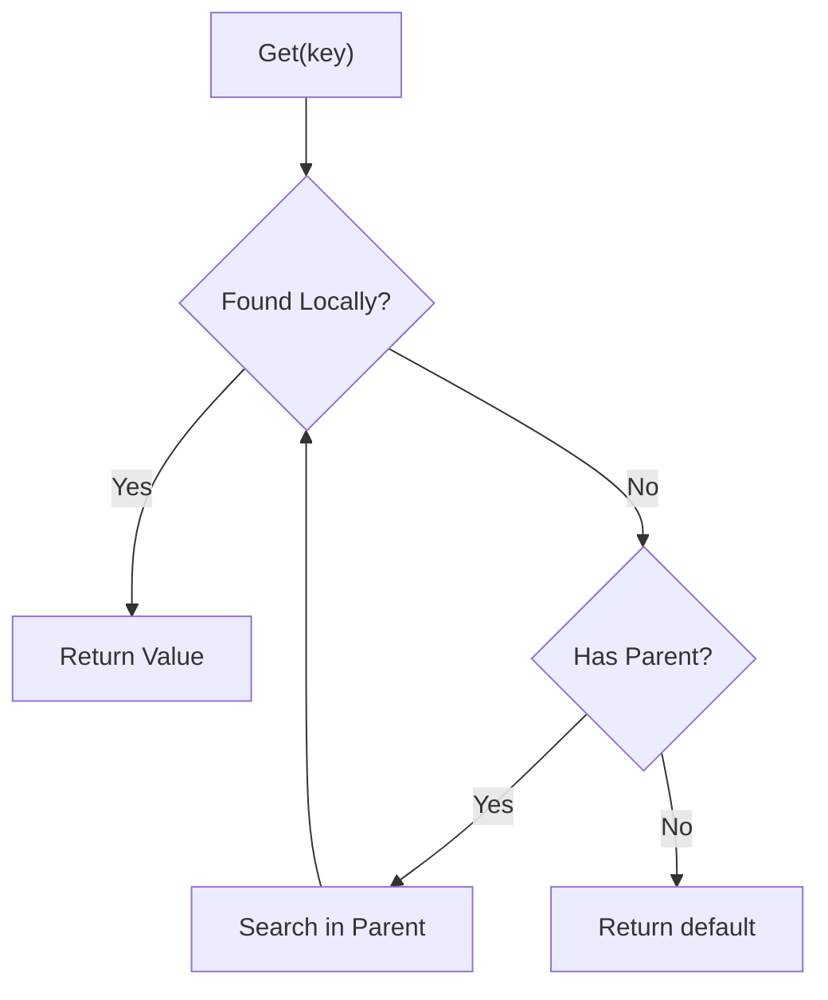
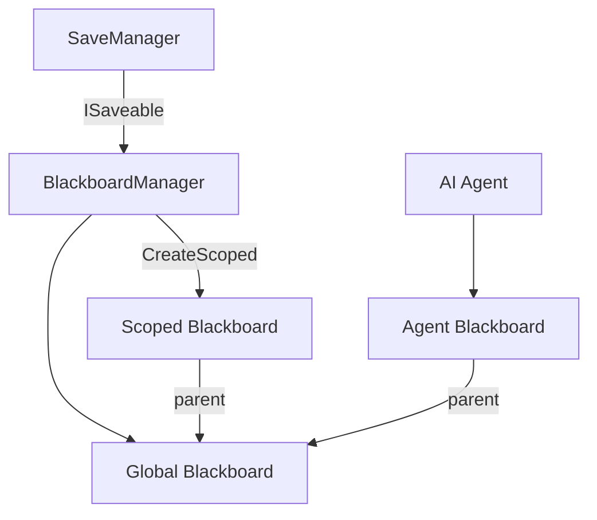

# Blackboard Service

The Blackboard is a hierarchy-aware shared data container. It allows different systems to share and override data in a decoupled way, supporting global, scoped, and per-entity contexts.

---

## Table of Contents

1. [Features](#1-features)
2. [Architecture](#2-architecture)
3. [Quick Start](#3-quick-start)
4. [Scoped Blackboards](#4-scoped-blackboards)
5. [Change Listeners](#5-change-listeners)
6. [Persistence](#6-persistence)
7. [API Reference](#7-api-reference)

---

## 1. Features

- **Hierarchical Scoping**: Blackboards can have parents; missing keys search up the hierarchy
- **Type-Safe**: Generic `Set<T>` and `Get<T>` methods with type checking
- **Thread-Safe**: Optional thread safety controlled by `PackageRuntime.IsThreadSafe`
- **Reactive**: Global and key-specific change listeners
- **Serializable**: Full JSON serialization for editor and save system
- **Persistence**: Global blackboard auto-persists with `SaveManager`

---

## 2. Architecture

### 2.1 Hierarchical Lookup



### 2.2 System Overview



---

## 3. Quick Start

### 3.1 Access the Global Blackboard

```csharp
using UnityEngine;
using Eraflo.Catalyst;
using Eraflo.Catalyst.Core.Blackboard;

public class GameManager : MonoBehaviour
{
    void Start()
    {
        // Get the global blackboard
        Blackboard bb = App.Get<BlackboardManager>().Global;
        
        // Set values
        bb.Set("PlayerName", "Hero");
        bb.Set("Score", 0);
        bb.Set("IsGameOver", false);
        
        // Get values
        string name = bb.Get<string>("PlayerName");
        int score = bb.Get<int>("Score");
        bool gameOver = bb.Get<bool>("IsGameOver");
        
        Debug.Log($"Player: {name}, Score: {score}");
    }
}
```

### 3.2 Basic Operations

```csharp
using Eraflo.Catalyst;
using Eraflo.Catalyst.Core.Blackboard;

public class BlackboardExample
{
    void Example()
    {
        Blackboard bb = App.Get<BlackboardManager>().Global;
        
        // Set
        bb.Set("Health", 100);
        
        // Get with default if not found
        int health = bb.Get<int>("Health");      // 100
        int mana = bb.Get<int>("Mana");          // 0 (default for int)
        
        // TryGet for safe access
        if (bb.TryGet<int>("Health", out int hp))
        {
            Debug.Log($"Health: {hp}");
        }
        
        // Check existence
        bool hasHealth = bb.Contains("Health");  // true
        bool hasMana = bb.Contains("Mana");      // false
        
        // Remove
        bb.Remove("Health");
        
        // Clear all
        bb.Clear();
        
        // Get all keys
        List<string> keys = bb.GetAllKeys();
    }
}
```

---

## 4. Scoped Blackboards

Create child blackboards that inherit from the global one. Useful for AI, level contexts, or temporary states.

### 4.1 Creating a Scoped Blackboard

```csharp
using UnityEngine;
using Eraflo.Catalyst;
using Eraflo.Catalyst.Core.Blackboard;

public class AIAgent : MonoBehaviour
{
    private Blackboard _agentBlackboard;
    
    void Start()
    {
        BlackboardManager bm = App.Get<BlackboardManager>();
        
        // Create a scoped blackboard (inherits from global)
        _agentBlackboard = bm.CreateScoped();
        
        // Set agent-specific values
        _agentBlackboard.Set("Target", transform);
        _agentBlackboard.Set("AlertLevel", 0);
    }
    
    void OnThreatDetected(Transform threat)
    {
        // Local override - only affects this agent
        _agentBlackboard.Set("Target", threat);
        _agentBlackboard.Set("AlertLevel", 100);
        
        // Global values are still accessible
        string playerName = _agentBlackboard.Get<string>("PlayerName");
    }
}
```

### 4.2 Value Overriding

```csharp
Blackboard global = App.Get<BlackboardManager>().Global;
Blackboard scoped = App.Get<BlackboardManager>().CreateScoped();

// Set in global
global.Set("Gravity", 9.81f);

// Read from scoped (finds in parent)
float gravity = scoped.Get<float>("Gravity"); // 9.81

// Override in scoped
scoped.Set("Gravity", 1.62f); // Moon gravity for this context

// Now scoped returns local value
gravity = scoped.Get<float>("Gravity"); // 1.62

// Global is unchanged
gravity = global.Get<float>("Gravity"); // 9.81
```

### 4.3 Custom Parent Hierarchy

```csharp
// Create custom hierarchy: agent -> team -> global
Blackboard teamBlackboard = new Blackboard();
teamBlackboard.SetParent(App.Get<BlackboardManager>().Global);

Blackboard agentBlackboard = new Blackboard();
agentBlackboard.SetParent(teamBlackboard);

// Agent can access team and global values
teamBlackboard.Set("TeamObjective", "CaptureFlag");
string objective = agentBlackboard.Get<string>("TeamObjective"); // "CaptureFlag"
```

---

## 5. Change Listeners

### 5.1 Global Change Listener

```csharp
using UnityEngine;
using Eraflo.Catalyst;
using Eraflo.Catalyst.Core.Blackboard;

public class BlackboardDebugger : MonoBehaviour
{
    private Blackboard _bb;
    
    void Start()
    {
        _bb = App.Get<BlackboardManager>().Global;
        
        // Listen to ALL changes
        _bb.OnValueChanged += OnAnyValueChanged;
    }
    
    void OnDestroy()
    {
        if (_bb != null)
            _bb.OnValueChanged -= OnAnyValueChanged;
    }
    
    void OnAnyValueChanged(string key, object oldValue, object newValue)
    {
        Debug.Log($"[Blackboard] '{key}' changed: {oldValue} -> {newValue}");
    }
}
```

### 5.2 Key-Specific Listener

```csharp
using UnityEngine;
using UnityEngine.UI;
using Eraflo.Catalyst;
using Eraflo.Catalyst.Core.Blackboard;

public class ScoreDisplay : MonoBehaviour
{
    [SerializeField] private Text _scoreText;
    
    private Blackboard _bb;
    private Action<object, object> _scoreListener;
    
    void Start()
    {
        _bb = App.Get<BlackboardManager>().Global;
        
        // Lambda for cleanup
        _scoreListener = (oldVal, newVal) =>
        {
            if (newVal is int score)
                _scoreText.text = $"Score: {score}";
        };
        
        // Register for specific key
        _bb.RegisterListener("Score", _scoreListener);
        
        // Initialize display
        _scoreText.text = $"Score: {_bb.Get<int>("Score")}";
    }
    
    void OnDestroy()
    {
        // Always unregister
        _bb?.UnregisterListener("Score", _scoreListener);
    }
}
```

---

## 6. Persistence

### 6.1 Automatic Save

The `BlackboardManager` implements `ISaveable`. The global blackboard is automatically saved/loaded with the game state.

```csharp
// Set values that will be persisted
Blackboard bb = App.Get<BlackboardManager>().Global;
bb.Set("CurrentLevel", 5);
bb.Set("UnlockedAchievements", new List<string> { "FirstBlood", "Unstoppable" });

// When SaveManager.SaveGame() is called, these are persisted
// When SaveManager.LoadGame() is called, they are restored
```

> [!IMPORTANT]
> Values must be JSON-serializable. Complex types may need custom JsonConverters.

### 6.2 Supported Types

- Primitives: `int`, `float`, `bool`, `string`
- Unity types: `Vector2`, `Vector3`, `Color` (via built-in converters)
- Collections: `List<T>`, `Dictionary<K,V>` (if contents are serializable)
- Custom classes: Must be `[Serializable]` or have JsonConverter

---

## 7. API Reference

### BlackboardManager (Service)

| Member | Description |
|--------|-------------|
| `Blackboard Global` | The global blackboard instance |
| `CreateScoped()` | Create a new blackboard with Global as parent |

### Blackboard

**Properties:**

| Member | Type | Description |
|--------|------|-------------|
| `OnValueChanged` | `Action<string, object, object>` | Event: (key, oldValue, newValue) |

**Methods:**

| Method | Description |
|--------|-------------|
| `Set<T>(key, value)` | Set a value |
| `T Get<T>(key)` | Get value or default |
| `bool TryGet<T>(key, out T value)` | Try get with success bool |
| `bool Contains(key)` | Check if key exists (including parents) |
| `bool Remove(key)` | Remove a local key |
| `void Clear()` | Clear all local entries |
| `List<string> GetAllKeys()` | Get all local keys |
| `Dictionary<string, Type> GetKeysAndTypes()` | Get keys with their types |
| `void Rename(oldKey, newKey)` | Rename a key |
| `Blackboard Clone()` | Deep clone the blackboard |
| `void SetParent(Blackboard)` | Set the parent blackboard |
| `void RegisterListener(key, callback)` | Listen to specific key changes |
| `void UnregisterListener(key, callback)` | Stop listening to key |

---

## See Also

- [Service Locator](ServiceLocator.md): Accessing `BlackboardManager`
- [Persistence](Persistence.md): Save system integration
- [Behaviour Trees](../BehaviourTree/README.md): AI using blackboards
