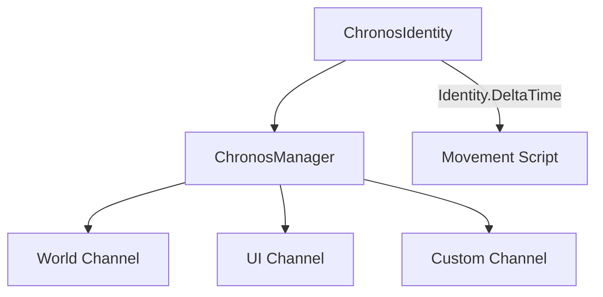

# Chronos Manager

The **Chronos Manager** module provides advanced time control, allowing for global time-scaling, localized "time channels" (Matrix-style slow motion), and smooth transitions using Easing functions.

## Features

- **Global Time Scale**: Syncs `Time.timeScale` and `Time.fixedDeltaTime` automatically.
- **Time Channels**: Isolate time effects to specific groups (e.g., "Enemies", "Projectiles", "UI").
- **Smooth Transitions**: Transition any channel over time with professional Easing curves.
- **Unscaled Channels**: Channels like "UI" can remain functional (using `unscaledDeltaTime`) even when the rest of the game is paused.

## Architecture

At its core, `ChronosManager` manages multiple `TimeChannel` instances. Each channel has its own scale factor. 

> [!NOTE]
> **GlobalScale** directly controls Unity's `Time.timeScale`. Channel scales are local multipliers.
> A channel's final scale is `GlobalScale * ChannelScale`.

Game objects use a `ChronosIdentity` component to consume the correct delta time for their assigned channel.



## Usage

### 1. Attaching ChronosIdentity
Attach the `ChronosIdentity` component to any object that needs localized time support. In your scripts, replace standard delta time calls:

```csharp
public class MyMovement : MonoBehaviour {
    private ChronosIdentity _chronosIdentity;

    void Start() => _chronosIdentity = GetComponent<ChronosIdentity>();

    void Update() {
        // Instead of Time.deltaTime
        transform.position += transform.forward * speed * _chronosIdentity.DeltaTime;
    }
}
```

### 2. Controlling Time Scale
Access the `ChronosManager` via the Service Locator to trigger effects:

```csharp
var chronos = App.Get<ChronosManager>();

// Slow down the World channel over 0.5s for a stylistic effect
chronos.SetTimeScale("World", 0.1f, 0.5f, EasingType.QuadOut);

// Put it back to normal
chronos.SetTimeScale("World", 1.0f, 0.2f, EasingType.SineIn);
```

### 3. Pause & Resume
The manager provides a clean way to handle game pauses while keeping the UI responsive:

```csharp
// Pauses global time (scale = 0), but characters on the "UI" channel
// will still receive unscaled delta time.
chronos.PauseGame();

// Resume
chronos.ResumeGame();
```

## Setup & Configuration
`ChronosManager` is registered with a priority of **40**, ensuring it updates its scales before most gameplay systems execute their `Update` or `FixedUpdate`.

### Default Channels
- **"World"**: The default channel for most objects. Affected by `GlobalScale`.
- **"UI"**: Unscaled by default. Useful for menus and cursors that must work during pause.

## Integrations

### 1. Timer System
Timers can now be linked to Chronos channels. If a channel is slowed down, the timer will slow down accordingly.

```csharp
// The timer will take twice as long if "SlowMo" scale is 0.5
Timer.Create(5f, () => Debug.Log("Done"))
     .SetChannel("SlowMo");
```

### 2. Networking
Transitions are automatically synchronized from Server to Clients.

**How it works:**
1. The Server calls `SetTimeScale`.
2. `ChronosNetworkHandler` intercepts the transition event.
3. A `ChronosSyncMessage` is broadcasted to all clients.
4. Clients apply the same transition locally, ensuring perfect visual synchronization.

> [!TIP]
> This synchronization is "fire-and-forget". Late-joining clients will receive the current state if they request a full state sync upon connection.
