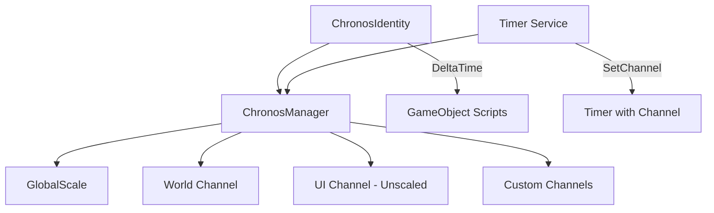
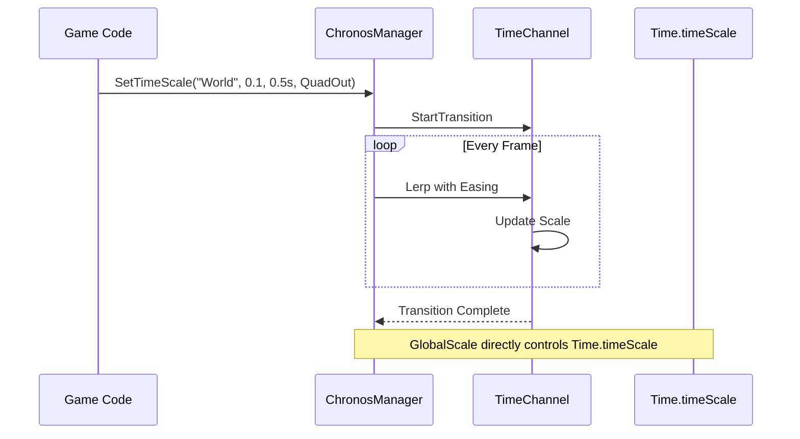

# Chronos Manager

The **Chronos Manager** provides advanced time control with global time-scaling, localized "time channels" (for Matrix-style slow motion), and smooth eased transitions.

---

## Table of Contents

1. [Features](#1-features)
2. [Architecture](#2-architecture)
3. [Quick Start](#3-quick-start)
4. [ChronosIdentity Component](#4-chronosidentity-component)
5. [Time Channels](#5-time-channels)
6. [Pause and Resume](#6-pause-and-resume)
7. [Integrations](#7-integrations)
8. [API Reference](#8-api-reference)

---

## 1. Features

- **Global Time Scale**: Syncs `Time.timeScale` and `Time.fixedDeltaTime` automatically
- **Time Channels**: Isolate time effects to specific groups (e.g., "Enemies", "Projectiles", "UI")
- **Smooth Transitions**: Ease any channel to a target scale over time
- **Unscaled Channels**: UI channel stays functional even when game is paused
- **Application Time**: Track unpaused game time via `AppTime`

---

## 2. Architecture





---

## 3. Quick Start

### 3.1 Get Delta Time for a Channel

```csharp
using UnityEngine;
using Eraflo.Catalyst;
using Eraflo.Catalyst.Core.Chronos;

public class EnemyMovement : MonoBehaviour
{
    [SerializeField] private float _speed = 5f;
    [SerializeField] private string _timeChannel = "Enemies";
    
    private ChronosManager _chronos;
    
    void Start()
    {
        _chronos = App.Get<ChronosManager>();
        
        // Register custom channel if needed
        _chronos.RegisterChannel(_timeChannel);
    }
    
    void Update()
    {
        // Use channel delta time instead of Time.deltaTime
        float dt = _chronos.GetDeltaTime(_timeChannel);
        transform.position += transform.forward * _speed * dt;
    }
}
```

### 3.2 Trigger Slow Motion

```csharp
using UnityEngine;
using Eraflo.Catalyst;
using Eraflo.Catalyst.Core.Chronos;
using Eraflo.Catalyst.EasingSystem;

public class SlowMotionTrigger : MonoBehaviour
{
    void OnPlayerDodge()
    {
        ChronosManager chronos = App.Get<ChronosManager>();
        
        // Slow down World channel to 10% over 0.3 seconds with easing
        chronos.SetTimeScale(
            id: ChronosManager.DefaultChannel, 
            targetScale: 0.1f, 
            duration: 0.3f, 
            ease: EasingType.QuadOut
        );
        
        // Return to normal after 2 seconds of slow-mo time
        StartCoroutine(RestoreTimeAfter(2f));
    }
    
    System.Collections.IEnumerator RestoreTimeAfter(float seconds)
    {
        yield return new WaitForSecondsRealtime(seconds);
        
        ChronosManager chronos = App.Get<ChronosManager>();
        chronos.SetTimeScale(ChronosManager.DefaultChannel, 1f, 0.2f, EasingType.SineIn);
    }
}
```

---

## 4. ChronosIdentity Component

Add this component to GameObjects that need localized time. It provides `DeltaTime` and `FixedDeltaTime` based on the object's assigned channel.

### 4.1 Setup

1. Add `ChronosIdentity` component to your GameObject
2. Set the `Channel` field (default: "World")
3. Use `identity.DeltaTime` instead of `Time.deltaTime`

### 4.2 Usage

```csharp
using UnityEngine;
using Eraflo.Catalyst.Core.Chronos;

public class ProjectileMovement : MonoBehaviour
{
    [SerializeField] private float _speed = 20f;
    
    private ChronosIdentity _identity;
    
    void Start()
    {
        _identity = GetComponent<ChronosIdentity>();
    }
    
    void Update()
    {
        // Automatically affected by the channel's time scale
        transform.position += transform.forward * _speed * _identity.DeltaTime;
    }
    
    void FixedUpdate()
    {
        // For physics, use FixedDeltaTime
        // Example: rb.velocity = direction * _speed * _identity.FixedDeltaTime;
    }
}
```

> [!NOTE]
> `ChronosIdentity.DeltaTime` = `Time.deltaTime * ChannelScale`
> This is different from `ChronosManager.GetDeltaTime(channel)` which also considers `GlobalScale` and unscaled channels.

---

## 5. Time Channels

### 5.1 Built-in Channels

| Channel | Constant | Behavior |
|---------|----------|----------|
| **World** | `ChronosManager.DefaultChannel` | Affected by `GlobalScale` |
| **UI** | `ChronosManager.UIChannel` | Unscaled (works during pause) |

### 5.2 Registering Custom Channels

```csharp
ChronosManager chronos = App.Get<ChronosManager>();

// Create scaled channel (affected by GlobalScale)
chronos.RegisterChannel("Enemies", isUnscaled: false);

// Create unscaled channel (immune to GlobalScale)
chronos.RegisterChannel("Timers", isUnscaled: true);
```

### 5.3 Time Calculation

| Channel Type | Formula |
|--------------|---------|
| **Scaled** | `Time.unscaledDeltaTime × GlobalScale × ChannelScale` |
| **Unscaled** | `Time.unscaledDeltaTime × ChannelScale` |

---

## 6. Pause and Resume

```csharp
using UnityEngine;
using Eraflo.Catalyst;
using Eraflo.Catalyst.Core.Chronos;

public class PauseMenu : MonoBehaviour
{
    private ChronosManager _chronos;
    private bool _isPaused;
    
    void Start()
    {
        _chronos = App.Get<ChronosManager>();
    }
    
    public void TogglePause()
    {
        _isPaused = !_isPaused;
        
        if (_isPaused)
        {
            _chronos.PauseGame();  // Sets GlobalScale = 0
            ShowPauseUI();
        }
        else
        {
            _chronos.ResumeGame(); // Sets GlobalScale = 1
            HidePauseUI();
        }
    }
    
    void ShowPauseUI()
    {
        // UI uses the "UI" channel which is unscaled
        // So animations and buttons still work during pause
    }
    
    void HidePauseUI() { }
}
```

> [!TIP]
> The "UI" channel is unscaled by default. UI animations and interactions work normally even when the game is paused.

---

## 7. Integrations

### 7.1 Timer System

Timers can be linked to Chronos channels. When the channel is slowed, the timer slows proportionally.

```csharp
using Eraflo.Catalyst;
using Eraflo.Catalyst.Timers;

public class TimerExample
{
    void CreateSlowableTimer()
    {
        Timer timer = App.Get<Timer>();
        
        // This timer will take longer if "SlowMo" channel is at 0.5 scale
        timer.CreateDelay(5f, () => Debug.Log("Done!"))
            .SetChannel("SlowMo");
        
        // Normal timer (uses default channel)
        timer.CreateDelay(3f, () => Debug.Log("Normal timer"));
    }
}
```

### 7.2 Networking

Time scale transitions are synchronized from Server to Clients via `ChronosNetworkHandler`.

```csharp
using UnityEngine;
using Eraflo.Catalyst;
using Eraflo.Catalyst.Core.Chronos;
using Eraflo.Catalyst.Networking;
using Eraflo.Catalyst.EasingSystem;

public class NetworkedSlowMotion : MonoBehaviour
{
    void TriggerSlowMotionOnAllClients()
    {
        NetworkManager nm = App.Get<NetworkManager>();
        
        // Only server can trigger synced time changes
        if (!nm.IsServer) return;
        
        ChronosManager chronos = App.Get<ChronosManager>();
        
        // This call is automatically synced to all clients
        // via ChronosNetworkHandler listening to OnChannelTransitionStarted
        chronos.SetTimeScale(
            id: ChronosManager.DefaultChannel,
            targetScale: 0.2f,
            duration: 0.5f,
            ease: EasingType.QuadOut
        );
    }
}
```

**Flow:**
1. Server calls `SetTimeScale()`
2. `OnChannelTransitionStarted` event fires
3. `ChronosNetworkHandler` broadcasts `ChronosSyncMessage`
4. Clients apply the same transition locally

> [!NOTE]
> `ChronosNetworkHandler` is auto-registered when `PackageSettings.HandlerMode = Auto` (default). No additional setup required.

### 7.3 Application Time

Track unpaused game time for game logic:

```csharp
ChronosManager chronos = App.Get<ChronosManager>();

// AppTime accumulates even when paused (based on GlobalScale)
float gameTime = chronos.AppTime;

// Use for gameplay timers, spawn rates, etc.
if (gameTime > nextSpawnTime)
{
    SpawnEnemy();
    nextSpawnTime = gameTime + spawnInterval;
}
```

---

## 8. API Reference

### ChronosManager

| Member | Type | Description |
|--------|------|-------------|
| `DefaultChannel` | `const string` | `"World"` - default scaled channel |
| `UIChannel` | `const string` | `"UI"` - default unscaled channel |
| `GlobalScale` | `float` | Controls `Time.timeScale` and `Time.fixedDeltaTime` |
| `AppTime` | `float` | Accumulated game time (respects GlobalScale) |
| `UnscaledTime` | `float` | Managed accumulator for unscaled app time |
| `OnChannelTransitionStarted` | `event` | Fired when a transition starts |

**Methods:**

| Method | Description |
|--------|-------------|
| `RegisterChannel(id, isUnscaled)` | Create a new time channel |
| `GetChannelScale(id)` | Get current scale of a channel (0-1+) |
| `GetDeltaTime(id)` | Get delta time for a channel (considers GlobalScale) |
| `GetFixedDeltaTime(id)` | Get fixed delta time for a channel |
| `SetTimeScale(id, target, duration, ease)` | Transition channel to target scale |
| `PauseGame()` | Set `GlobalScale = 0` |
| `ResumeGame()` | Set `GlobalScale = 1` |

### ChronosIdentity (Component)

| Member | Type | Description |
|--------|------|-------------|
| `Channel` | `string` | Time channel for this object (default: "World") |
| `DeltaTime` | `float` | `Time.deltaTime × ChannelScale` |
| `FixedDeltaTime` | `float` | `Time.fixedDeltaTime × ChannelScale` |

### EasingType (Common Values)

| Type | Description |
|------|-------------|
| `Linear` | Constant speed |
| `QuadIn` | Accelerate from zero |
| `QuadOut` | Decelerate to zero |
| `SineIn` | Smooth start |
| `SineOut` | Smooth end |
| `SineInOut` | Smooth start and end |

---

## See Also

- [Service Locator](ServiceLocator.md): Accessing `ChronosManager`
- [Timer System](../Modules/Timers.md): Channel-aware timers
- [Networking](../Modules/Networking.md): Time synchronization
