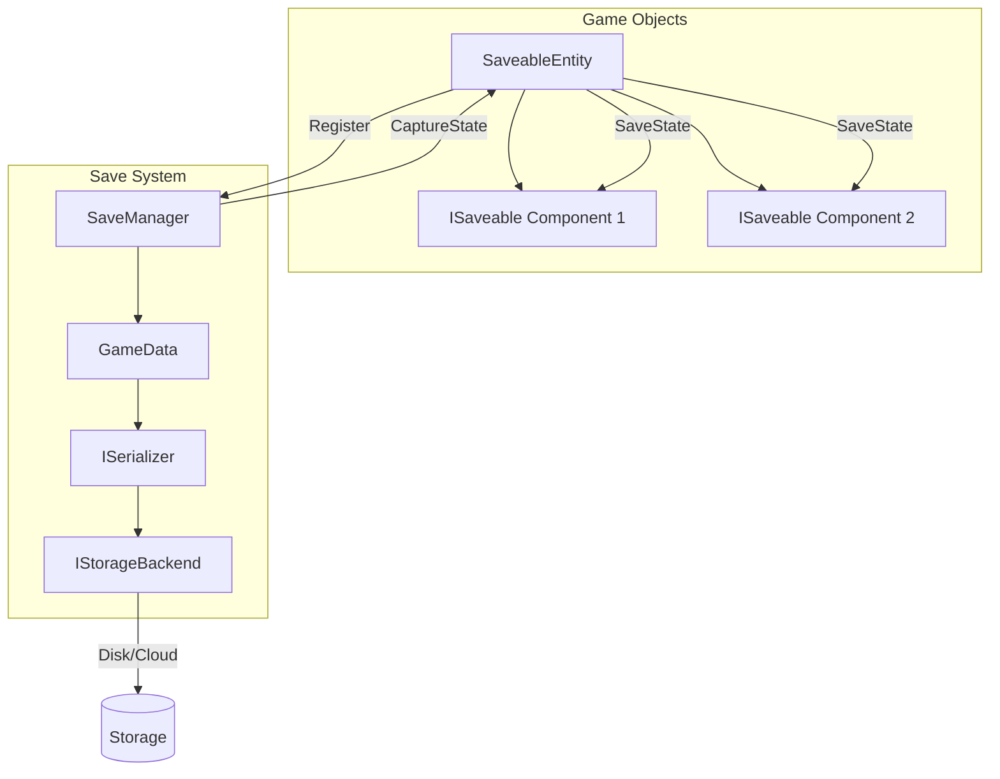
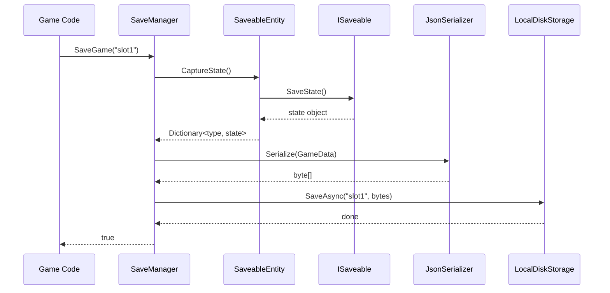

# Persistence System

The Persistence System provides a complete save/load solution for game state. It handles entity registration, state serialization, and pluggable storage backends.

---

## Table of Contents

1. [Architecture](#1-architecture)
2. [Quick Start](#2-quick-start)
3. [SaveableEntity Component](#3-saveableentity-component)
4. [Implementing ISaveable](#4-implementing-isaveable)
5. [SaveManager API](#5-savemanager-api)
6. [Serialization](#6-serialization)
7. [Storage Backends](#7-storage-backends)
8. [Custom Storage Backend](#8-custom-storage-backend)
9. [API Reference](#9-api-reference)

---

## 1. Architecture





---

## 2. Quick Start

### 2.1 Setup

1. Add `SaveableEntity` component to GameObjects you want to save
2. Add components implementing `ISaveable` to those GameObjects
3. Call `SaveManager.SaveGame()` and `LoadGame()`

### 2.2 Basic Save/Load

```csharp
using UnityEngine;
using Eraflo.Catalyst;
using Eraflo.Catalyst.Core.Save;

public class SaveLoadUI : MonoBehaviour
{
    public async void OnSaveClicked()
    {
        SaveManager saveManager = App.Get<SaveManager>();
        
        bool success = await saveManager.SaveGame("save_slot_1");
        
        if (success)
            Debug.Log("Game saved!");
        else
            Debug.LogError("Save failed!");
    }
    
    public async void OnLoadClicked()
    {
        SaveManager saveManager = App.Get<SaveManager>();
        
        bool success = await saveManager.LoadGame("save_slot_1");
        
        if (success)
            Debug.Log("Game loaded!");
        else
            Debug.LogError("Load failed!");
    }
}
```

---

## 3. SaveableEntity Component

The `SaveableEntity` component identifies a GameObject for saving. It:
- Generates a unique GUID (auto-generated in editor)
- Auto-registers with `SaveManager` on enable
- Collects state from all `ISaveable` components on the same GameObject

### 3.1 Usage

1. Add `SaveableEntity` to any GameObject you want to persist
2. The GUID is auto-generated; use "Regenerate GUID" context menu if needed
3. Add components implementing `ISaveable` to define what gets saved

```
Player (GameObject)
├── SaveableEntity         ← Identifies this object for saving
├── PlayerHealth : ISaveable  ← Saves health
├── PlayerInventory : ISaveable  ← Saves inventory
└── PlayerProgress : ISaveable  ← Saves quest progress
```

> [!NOTE]
> Each `SaveableEntity` must have a unique GUID. Duplicating prefabs creates unique GUIDs automatically.

---

## 4. Implementing ISaveable

### 4.1 Basic Example

```csharp
using System;
using UnityEngine;
using Eraflo.Catalyst.Core.Save;

public class PlayerHealth : MonoBehaviour, ISaveable
{
    [SerializeField] private int _currentHealth = 100;
    [SerializeField] private int _maxHealth = 100;
    
    public int CurrentHealth => _currentHealth;
    public int MaxHealth => _maxHealth;
    
    public void TakeDamage(int amount)
    {
        _currentHealth = Mathf.Max(0, _currentHealth - amount);
    }
    
    // ISaveable implementation
    public object SaveState()
    {
        // Return a serializable object with the data to save
        return new HealthData
        {
            Current = _currentHealth,
            Max = _maxHealth
        };
    }
    
    public void LoadState(object state)
    {
        // Cast and restore the state
        if (state is HealthData data)
        {
            _currentHealth = data.Current;
            _maxHealth = data.Max;
        }
    }
    
    // Serializable data class
    [Serializable]
    private class HealthData
    {
        public int Current;
        public int Max;
    }
}
```

### 4.2 Complex Example (Inventory)

```csharp
using System;
using System.Collections.Generic;
using UnityEngine;
using Eraflo.Catalyst.Core.Save;

public class PlayerInventory : MonoBehaviour, ISaveable
{
    private List<InventoryItem> _items = new List<InventoryItem>();
    
    public void AddItem(string itemId, int quantity)
    {
        _items.Add(new InventoryItem { Id = itemId, Quantity = quantity });
    }
    
    public object SaveState()
    {
        return new InventoryData
        {
            Items = new List<InventoryItem>(_items)
        };
    }
    
    public void LoadState(object state)
    {
        if (state is InventoryData data)
        {
            _items.Clear();
            _items.AddRange(data.Items);
        }
    }
    
    [Serializable]
    private class InventoryData
    {
        public List<InventoryItem> Items;
    }
    
    [Serializable]
    public class InventoryItem
    {
        public string Id;
        public int Quantity;
    }
}
```

### 4.3 Transform Example

```csharp
using System;
using UnityEngine;
using Eraflo.Catalyst.Core.Save;

public class SaveableTransform : MonoBehaviour, ISaveable
{
    public object SaveState()
    {
        return new TransformData
        {
            Position = transform.position,
            Rotation = transform.rotation,
            Scale = transform.localScale
        };
    }
    
    public void LoadState(object state)
    {
        if (state is TransformData data)
        {
            transform.position = data.Position;
            transform.rotation = data.Rotation;
            transform.localScale = data.Scale;
        }
    }
    
    [Serializable]
    private class TransformData
    {
        public Vector3 Position;
        public Quaternion Rotation;
        public Vector3 Scale;
    }
}
```

---

## 5. SaveManager API

### 5.1 Saving and Loading

```csharp
SaveManager saveManager = App.Get<SaveManager>();

// Save current game state
bool saved = await saveManager.SaveGame("my_save");

// Load a saved game
bool loaded = await saveManager.LoadGame("my_save");

// Get metadata without loading full state
SaveMetadata meta = await saveManager.GetSaveMetadata("my_save");
if (meta != null)
{
    Debug.Log($"Save: {meta.Name}, Date: {meta.GetDateTime()}");
}
```

### 5.2 Network Awareness

The save system is network-aware. Only the server/host can save the game state:

```csharp
// On client, SaveGame will return false with a warning
bool success = await saveManager.SaveGame("slot1"); // false on clients
```

---

## 6. Serialization

### 6.1 JsonSerializer

The default serializer uses `Newtonsoft.Json` with Unity type converters. Production saves are serialized with `Formatting.None` (compact JSON, no whitespace) to minimize file size.

**Supported Unity Types:**
- `Vector2`, `Vector3`, `Vector4`
- `Quaternion`
- `Color`, `Color32`

### 6.2 Partial Deserialization

For performance (e.g., save slot UI), read metadata without loading full data:

```csharp
ISerializer serializer = App.Get<SaveManager>().Serializer;

// Only deserialize the Metadata field
if (serializer.TryReadHeader<SaveMetadata>(saveData, "Metadata", out var meta))
{
    Debug.Log($"Save name: {meta.Name}");
}
```

### 6.3 Custom Serializer

```csharp
public class MyBinarySerializer : ISerializer
{
    public byte[] Serialize<T>(T obj)
    {
        // Your binary serialization logic
    }
    
    public T Deserialize<T>(byte[] data)
    {
        // Your binary deserialization logic
    }
    
    public void Populate(byte[] data, object target)
    {
        // Populate existing object
    }
    
    public bool TryReadHeader<T>(byte[] data, string fieldName, out T value)
    {
        // Partial read logic
        value = default;
        return false;
    }
}

// Use it
App.Get<SaveManager>().Serializer = new MyBinarySerializer();
```

---

## 7. Storage Backends

### 7.1 LocalDiskStorage (Default)

Saves to `Application.persistentDataPath`. Both `SaveAsync` and `LoadAsync` are truly non-blocking — they use `File.WriteAllBytesAsync` and `File.ReadAllBytesAsync` respectively, so the main thread is never stalled during disk I/O.

```csharp
// Default - no setup needed
// Files saved to: [persistentDataPath]/save_slot_1.json
```

### 7.2 Checking if Save Exists

```csharp
IStorageBackend storage = App.Get<SaveManager>().Storage;

if (storage.Exists("save_slot_1"))
{
    Debug.Log("Save found!");
}
```

### 7.3 Deleting a Save

```csharp
await storage.DeleteAsync("save_slot_1");
```

---

## 8. Custom Storage Backend

### 8.1 Implementing IStorageBackend

```csharp
using System.Threading.Tasks;
using Eraflo.Catalyst.Core.Save;

public class CloudStorageBackend : IStorageBackend
{
    public async Task SaveAsync(string name, byte[] data)
    {
        // Upload to your cloud service
        // await MyCloudAPI.Upload($"saves/{name}.json", data);
        await Task.CompletedTask;
    }
    
    public async Task<byte[]> LoadAsync(string name)
    {
        // Download from your cloud service
        // return await MyCloudAPI.Download($"saves/{name}.json");
        return null;
    }
    
    public async Task DeleteAsync(string name)
    {
        // Delete from your cloud service
        await Task.CompletedTask;
    }
    
    public bool Exists(string name)
    {
        // Check if save exists on cloud
        return false;
    }
}
```

### 8.2 Using Custom Backend

```csharp
SaveManager saveManager = App.Get<SaveManager>();
saveManager.Storage = new CloudStorageBackend();

// Now saves go to the cloud
await saveManager.SaveGame("cloud_save");
```

---

## 9. API Reference

### SaveManager

| Member | Description |
|--------|-------------|
| `ISerializer Serializer` | Current serializer (get/set) |
| `IStorageBackend Storage` | Current storage backend (get/set) |
| `Register(SaveableEntity)` | Register entity for saving |
| `Unregister(SaveableEntity)` | Remove entity from save system |
| `GetEntity(string guid)` | Find entity by GUID |
| `SaveGame(string name)` | Save all entities to storage |
| `LoadGame(string name)` | Load and restore all entities |
| `GetSaveMetadata(string name)` | Get metadata without full load |

### SaveableEntity (Component)

| Member | Description |
|--------|-------------|
| `string Guid` | Unique identifier for this entity |
| `CaptureState()` | Collect state from all ISaveable components |
| `RestoreState(state)` | Restore state to all ISaveable components |

### ISaveable (Interface)

| Method | Description |
|--------|-------------|
| `object SaveState()` | Return serializable state object |
| `void LoadState(object)` | Restore from state object |

### ISerializer (Interface)

| Method | Description |
|--------|-------------|
| `byte[] Serialize<T>(T obj)` | Convert object to bytes |
| `T Deserialize<T>(byte[] data)` | Convert bytes to object |
| `void Populate(byte[], object)` | Populate existing object |
| `bool TryReadHeader<T>(bytes, field, out T)` | Partial deserialization |

### IStorageBackend (Interface)

| Method | Description |
|--------|-------------|
| `Task SaveAsync(name, bytes)` | Save data to storage |
| `Task<byte[]> LoadAsync(name)` | Load data from storage |
| `Task DeleteAsync(name)` | Delete saved data |
| `bool Exists(name)` | Check if save exists |

### GameData

| Field | Type | Description |
|-------|------|-------------|
| `Metadata` | `SaveMetadata` | Save file metadata |
| `Entities` | `Dictionary<guid, Dictionary<type, state>>` | All entity states |

### SaveMetadata

| Field | Type | Description |
|-------|------|-------------|
| `Name` | `string` | Display name of the save |
| `Timestamp` | `long` | DateTime ticks when saved |
| `Version` | `string` | Game version when saved |
| `GetDateTime()` | `DateTime` | Convert timestamp to DateTime |

---

## See Also

- [Service Locator](ServiceLocator.md): Accessing `SaveManager`
- [Settings Manager](SettingsManager.md): User preferences (uses same serialization layer)
