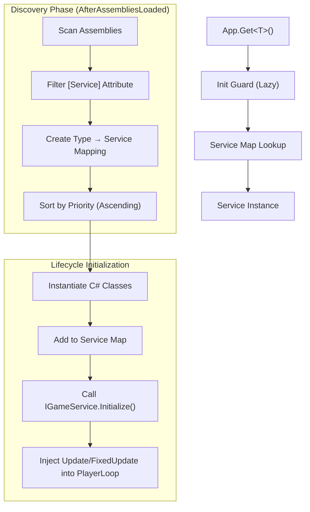
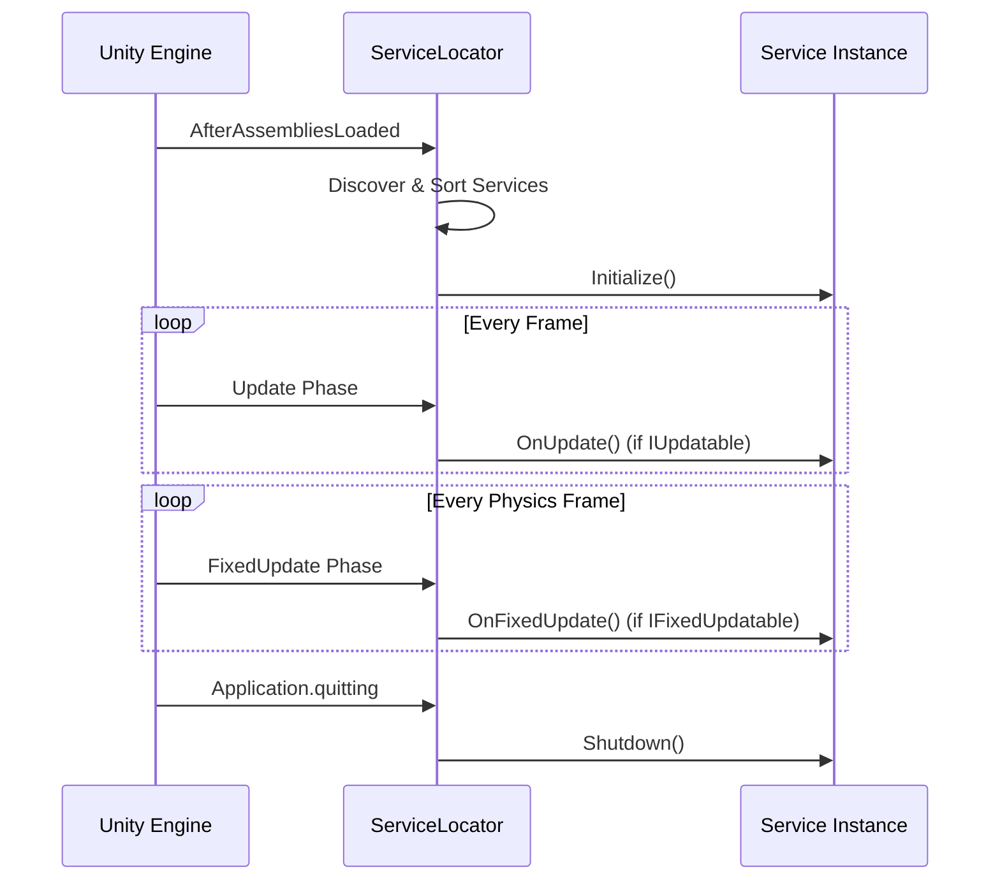

# Service Locator

The Service Locator is the architectural backbone of Eraflo.Catalyst. It provides a centralized, decoupled way to manage core systems (services) without relying on Singletons or MonoBehaviours.

---

## Table of Contents

1. [Key Features](#1-key-features)
2. [Architecture](#2-architecture)
3. [Quick Start](#3-quick-start)
4. [Creating a Service](#4-creating-a-service)
5. [Lifecycle Management](#5-lifecycle-management)
6. [Priority System](#6-priority-system)
7. [Testing](#7-testing)
8. [API Reference](#8-api-reference)

---

## 1. Key Features

- **Pure C# Services**: Services are POCO classes, no `MonoBehaviour` overhead
- **Auto-Discovery**: Mark any class with `[Service]` for automatic registration at startup
- **Lifecycle Management**: Hook into Unity's update loop via `IUpdatable` and `IFixedUpdatable`
- **Priority Control**: Controlled initialization order via `Priority` property
- **Global Access**: Access any service from anywhere via `App.Get<T>()`
- **No Scene Dependencies**: Works without any GameObjects in your scene

---

## 2. Architecture

### 2.1 Discovery Flow



### 2.2 PlayerLoop Integration

The Service Locator automatically injects its lifecycle into Unity's `PlayerLoop`. No bootstrapper MonoBehaviours required.



---

## 3. Quick Start

### 3.1 Accessing a Service

```csharp
using UnityEngine;
using Eraflo.Catalyst;

public class MyGameComponent : MonoBehaviour
{
    void Start()
    {
        // Get any registered service
        Timer timer = App.Get<Timer>();
        
        // Use it
        timer.CreateDelay(2f, () => Debug.Log("Timer fired!"));
    }
}
```

### 3.2 Service Handle Example

```csharp
using UnityEngine;
using Eraflo.Catalyst;
using Eraflo.Catalyst.Events;
using Eraflo.Catalyst.Networking;

public class GameManager : MonoBehaviour
{
    private EventBus _events;
    private NetworkManager _network;
    private Timer _timer;
    
    void Awake()
    {
        // Cache service references for performance
        _events = App.Get<EventBus>();
        _network = App.Get<NetworkManager>();
        _timer = App.Get<Timer>();
    }
    
    void StartGame()
    {
        // Use cached services
        _events.Publish(new GameStartedEvent());
        _timer.CreateDelay(3f, () => SpawnEnemies());
    }
}
```

---

## 4. Creating a Service

### 4.1 Basic Service

```csharp
using UnityEngine;
using Eraflo.Catalyst;

[Service(Priority = 50)]
public class ScoreManager : IGameService
{
    private int _totalScore;
    
    public int TotalScore => _totalScore;
    
    public void Initialize()
    {
        _totalScore = 0;
        Debug.Log("[ScoreManager] Initialized");
    }
    
    public void Shutdown()
    {
        Debug.Log($"[ScoreManager] Final score: {_totalScore}");
    }
    
    public void AddScore(int points)
    {
        _totalScore += points;
        Debug.Log($"[ScoreManager] Score: {_totalScore}");
    }
}
```

### 4.2 Service with Update Loop

```csharp
using UnityEngine;
using Eraflo.Catalyst;

[Service(Priority = 60)]
public class DayNightCycle : IGameService, IUpdatable
{
    private float _timeOfDay;
    private float _dayDuration = 120f; // seconds per full day
    
    public float TimeOfDay => _timeOfDay;
    public bool IsNight => _timeOfDay > 0.75f || _timeOfDay < 0.25f;
    
    public void Initialize()
    {
        _timeOfDay = 0.5f; // Start at noon
    }
    
    public void OnUpdate()
    {
        // Option 1: Use Unity's standard deltaTime
        float dt = Time.deltaTime;
        
        // Option 2: Use ChronosManager for channel-scaled delta
        // float dt = App.Get<ChronosManager>().GetDeltaTime(ChronosManager.DefaultChannel);
        
        _timeOfDay += dt / _dayDuration;
        if (_timeOfDay > 1f) _timeOfDay -= 1f;
    }
    
    public void Shutdown() { }
}
```

> [!NOTE]
> `OnUpdate()` and `OnFixedUpdate()` receive no parameters. Access time via `Time.deltaTime` or `ChronosManager.GetDeltaTime(channelId)` for channel-scaled updates.

### 4.3 Service with Physics Update

```csharp
using UnityEngine;
using Eraflo.Catalyst;

[Service(Priority = 70)]
public class PhysicsDebugger : IGameService, IFixedUpdatable
{
    private int _frameCount;
    
    public void Initialize()
    {
        _frameCount = 0;
    }
    
    public void OnFixedUpdate()
    {
        _frameCount++;
        // Physics-rate logic here
    }
    
    public void Shutdown()
    {
        Debug.Log($"[PhysicsDebugger] Total physics frames: {_frameCount}");
    }
}
```

---

## 5. Lifecycle Management

### 5.1 Lifecycle Order

| Phase | When | Method Called |
|-------|------|---------------|
| **Discovery** | `AfterAssembliesLoaded` | (reflection scan) |
| **Instantiation** | After discovery, by priority | (constructor) |
| **Initialization** | After instantiation | `Initialize()` |
| **Update** | Every frame | `OnUpdate()` (if `IUpdatable`) |
| **FixedUpdate** | Every physics frame | `OnFixedUpdate()` (if `IFixedUpdatable`) |
| **Shutdown** | `Application.quitting` | `Shutdown()` |

### 5.2 Complete Service Example

```csharp
using UnityEngine;
using Eraflo.Catalyst;

[Service(Priority = 55)]
public class AudioManager : IGameService, IUpdatable
{
    private float _masterVolume = 1f;
    private bool _isMuted;
    
    public float MasterVolume
    {
        get => _isMuted ? 0f : _masterVolume;
        set => _masterVolume = Mathf.Clamp01(value);
    }
    
    public void Initialize()
    {
        // Load saved settings
        _masterVolume = PlayerPrefs.GetFloat("MasterVolume", 1f);
        _isMuted = PlayerPrefs.GetInt("IsMuted", 0) == 1;
        
        Debug.Log($"[AudioManager] Volume: {_masterVolume}, Muted: {_isMuted}");
    }
    
    public void OnUpdate()
    {
        // Fade logic, ducking, etc.
    }
    
    public void Shutdown()
    {
        // Save settings
        PlayerPrefs.SetFloat("MasterVolume", _masterVolume);
        PlayerPrefs.SetInt("IsMuted", _isMuted ? 1 : 0);
        PlayerPrefs.Save();
    }
    
    public void Mute() => _isMuted = true;
    public void Unmute() => _isMuted = false;
    public void ToggleMute() => _isMuted = !_isMuted;
}
```

---

## 6. Priority System

### 6.1 How Priority Works

- **Lower numbers** initialize **first** and update **first**
- **Higher numbers** initialize **later** and update **later**
- Services with dependencies should have higher priority than their dependencies

### 6.2 Priority Brackets

| Priority Range | Layer | Examples |
|---------------|-------|----------|
| **-100 to 0** | Core | EventBus, Timer, Blackboard |
| **1 to 20** | Infrastructure | Networking, Pooling, Persistence |
| **21 to 50** | Gameplay | AI, Combat, Quests |
| **51 to 100+** | Auxiliary | Debug tools, Analytics |

### 6.3 Built-in Service Priorities

| Service | Priority | Description |
|---------|----------|-------------|
| `EventBus` | -10 | Central communication hub |
| `Blackboard` | -5 | Global data sharing |
| `Timer` | 0 | Timing and delays |
| `NetworkIdManager` | 1 | Network ID registry |
| `NetworkManager` | 2 | Networking facade |
| `NetworkOwnershipManager` | 3 | Authority control |
| `NetworkDiagnostics` | 4 | Network simulation & metrics |
| `ConnectionManager` | 5 | Connection lifecycle |
| `LobbyManager` | 6 | Lobby management |
| `NetworkSpawnManager` | 7 | Player spawning |
| `NetworkActionManager` | 8 | Lightweight actions |
| `NetworkAttachmentManager` | 9 | Network parenting |
| `VoiceManager` | 10 | Voice chat abstraction |
| `NetworkCullingManager` | 11 | Interest management |
| `NetworkDiscovery` | 12 | LAN discovery |
| `SettingsManager` | 13 | Configuration |
| `Pool` | 14 | Object pooling |
| `SaveManager` | 15 | Persistence |
| `SceneLoaderService` | 16 | Scene loading |
| `AssetManager` | 20 | Asset loading |
| `HfsmNetworkHandler` | 21 | HFSM sync |
| `InputRemapper` | 40 | Input rebinding |
| `ChronosManager` | 41 | Time scaling |
| `InputManager` | 50 | Input processing |
| `CommandManager` | 55 | Undo/Redo |
| `LogExporter` | 100 | Logging utility |

---

## 7. Testing

### 7.1 Manual Registration

For unit tests, manually register mock or real services:

```csharp
using NUnit.Framework;
using Eraflo.Catalyst;

[TestFixture]
public class ScoreManagerTests
{
    private ScoreManager _scoreManager;
    
    [SetUp]
    public void SetUp()
    {
        // Create and register the service manually
        _scoreManager = new ScoreManager();
        App.Register<ScoreManager>(_scoreManager);
    }
    
    [TearDown]
    public void TearDown()
    {
        // Always shutdown to clear registry
        App.Shutdown();
    }
    
    [Test]
    public void AddScore_IncreasesTotalScore()
    {
        _scoreManager.AddScore(100);
        _scoreManager.AddScore(50);
        
        Assert.AreEqual(150, _scoreManager.TotalScore);
    }
}
```

### 7.2 Mocking Dependencies

```csharp
using NUnit.Framework;
using Eraflo.Catalyst;

// Define an interface for your service
public interface IScoreService
{
    int TotalScore { get; }
    void AddScore(int points);
}

// Implement in your real service
[Service(Priority = 50)]
public class ScoreManager : IGameService, IScoreService
{
    // ... implementation
}

// Create a mock for testing
public class MockScoreService : IGameService, IScoreService
{
    public int TotalScore { get; private set; }
    public void AddScore(int points) => TotalScore += points;
    public void Initialize() { }
    public void Shutdown() { }
}

[TestFixture]
public class GameLogicTests
{
    [SetUp]
    public void SetUp()
    {
        App.Register<IScoreService>(new MockScoreService());
    }
    
    [TearDown]
    public void TearDown()
    {
        App.Shutdown();
    }
}
```

> [!IMPORTANT]
> Always call `App.Shutdown()` in `TearDown` to prevent state pollution between tests.

### 7.3 Setter Injection Pattern

For services that need mockable dependencies:

```csharp
using Eraflo.Catalyst;

[Service(Priority = 60)]
public class AchievementManager : IGameService
{
    private IScoreService _scoreService;
    
    public void Initialize()
    {
        // Use setter value if provided, otherwise get from locator
        if (_scoreService == null)
            _scoreService = App.Get<IScoreService>();
    }
    
    public void Shutdown() { }
    
    // For testing: inject mock before Initialize() is called
    public void SetScoreService(IScoreService service)
    {
        _scoreService = service;
    }
    
    public void CheckAchievements()
    {
        if (_scoreService.TotalScore >= 1000)
        {
            // Unlock achievement
        }
    }
}
```

---

## 8. API Reference

### App (Static Facade)

| Method | Description |
|--------|-------------|
| `T Get<T>()` | Retrieve a registered service by type or interface |
| `void Register<T>(T instance)` | Manually register a service instance |
| `void Shutdown()` | Shutdown all services and clear registry |

### Interfaces

| Interface | Methods | Purpose |
|-----------|---------|---------|
| `IGameService` | `Initialize()`, `Shutdown()` | Base interface for all services |
| `IUpdatable` | `OnUpdate()` | Frame-rate dependent update |
| `IFixedUpdatable` | `OnFixedUpdate()` | Physics-rate update |

### ServiceAttribute

```csharp
[Service(Priority = 50)]
public class MyService : IGameService { ... }
```

| Property | Type | Default | Description |
|----------|------|---------|-------------|
| `Priority` | `int` | `0` | Initialization and update order (lower = earlier) |

---

## See Also

- [EventBus](EventBus.md): Decoupled communication between services
- [Timer](Timers.md): Delay and interval management
- [Networking](../Modules/Networking.md): Networked services
