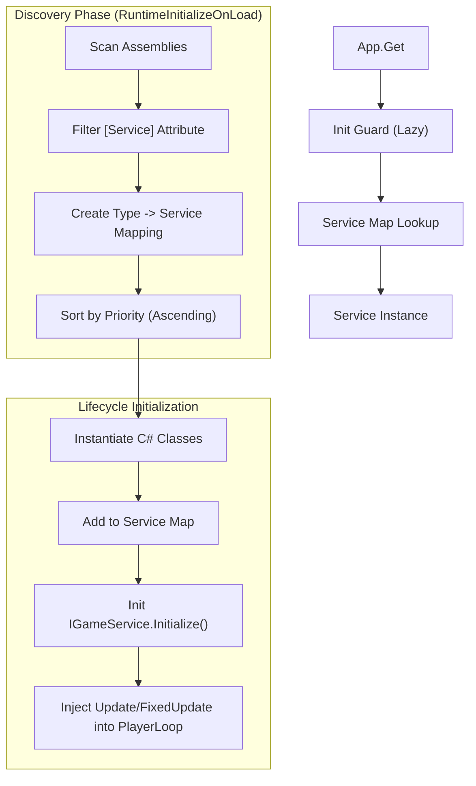
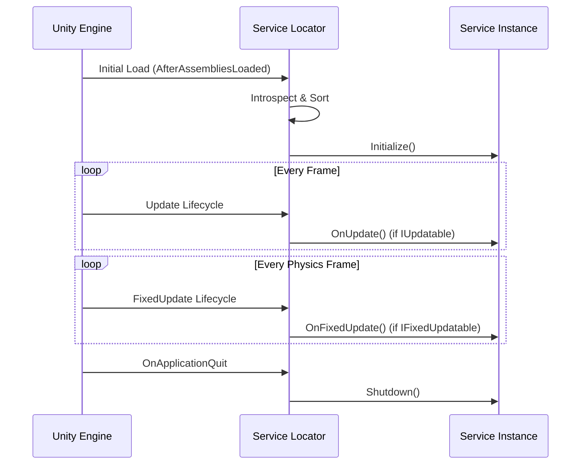

# Service Locator

The Service Locator (or Service Registry) is the architectural backbone of Eraflo.Catalyst. It provides a centralized, decoupled way to manage core systems (services) without relying on Singletons or MonoBehaviours.

## Key Features

- **Pure C# Services**: Services are POCO classes, reducing overhead and improving testability.
- **Auto-Discovery**: Mark any class with `[Service]` to have it automatically registered at startup. Robustly handles various test and headless environments.
- **Lifecycle Management**: Services can hook into Unity's update loop via `IUpdatable` and `IFixedUpdatable`.
- **Dependency Management**: Controlled initialization order via `Priority`.
- **Global Access**: Access any service from anywhere via the unified `App` facade (e.g., `App.Get<ChronosManager>()`).

### Architecture & Discovery

The initialization process uses Reflection to identify and configure services without manual registration.



## Usage

### Accessing a Service

Use `App.Get<T>()` to retrieve any registered service.

```csharp
using Eraflo.Catalyst.Services;
using Eraflo.Catalyst.Timers;

// Get the Timer service
var timer = App.Get<Timer>();
timer.CreateDelay(2f, () => Debug.Log("Delayed!"));
```

### Creating a New Service

1.  **Define your class**: Implement `IGameService` (optional but recommended for initialization).
2.  **Add Lifecycle** (optional): Implement `IUpdatable` or `IFixedUpdatable`.
3.  **Attribute**: Mark with `[Service]`.

```csharp
using Eraflo.Catalyst.Services;
using Eraflo.Catalyst.Services.Attributes;
using UnityEngine;

[Service(Priority = 100)]
public class MyCustomService : IGameService, IUpdatable
{
    public void Initialize() 
    {
        Debug.Log("Service Initialized!");
    }

    public void OnUpdate() 
    {
        // Custom update logic
    }

    public void Shutdown() 
    {
        Debug.Log("Service Shutdown!");
    }
}
```

### Initialization Order

The `Priority` property in the `[Service]` attribute determines the order in which services are initialized and updated.
- **Lower Priority**: Initialized first, Updated first.
- **Higher Priority**: Initialized later, Updated later.

#### Architectural Layers

To maintain consistency, follow these priority brackets when adding new services:

| Priority Bracket | Layer | Description |
| :--- | :--- | :--- |
| **-100 to 0** | **Core** | Critical infrastructure (Events, Timers, Memory). |
| **1 to 20** | **Infrastructure** | Global data systems (Networking, Persistence, Pooling). |
| **21 to 50** | **Gameplay** | High-level game systems (AI, Combat, Quests). |
| **51 to 100+** | **Auxiliary** | Non-essential utilities, debug tools, and exporters. |

#### Current Package Priorities

| Service | Priority | Layer | Description |
| :--- | :--- | :--- | :--- |
| `EventBus` | -10 | Core | Central communication hub. |
| `BlackboardManager` | -5 | Core | Global and scoped data sharing. |
| `Timer` | 0 | Core | Basic timing and delay system. |
| `NetworkIdManager` | 1 | Infrastructure | Centralized registry for network identification. |
| `NetworkManager` | 2 | Infrastructure | Central networking facade. |
| `NetworkOwnershipManager`| 3 | Infrastructure | Synchronized ownership and authority. |
| `ConnectionManager` | 4 | Infrastructure | Backend lifecycle management. |
| `LobbyManager` | 5 | Infrastructure | LAN and Online Lobby management. |
| `NetworkActionManager` | 6 | Infrastructure | Networked command relay. |
| `NetworkDiscovery` | 7 | Infrastructure | LAN server/client discovery. |
| `SettingsManager` | 8 | Infrastructure | Global configuration (now loads early). |
| `Pool` | 9 | Infrastructure | Memory management and object pooling. |
| `SaveManager` | 10 | Infrastructure | Persistence and state serialization. |
| `SceneLoaderService` | 11 | Infrastructure | Additive and standard scene loading. |
| `AssetManager` | 20 | Infrastructure | Decoupled asset loading system. |
| `HfsmNetworkHandler` | 21 | Gameplay | HFSM state path synchronization. |
| `InputRemapper` | 40 | Gameplay | Runtime action-to-key binding. |
| `ChronosManager` | 41 | Gameplay | Time-scaling and local clock management. |
| `InputManager` | 50 | Gameplay | Action-based input processing. |
| `CommandManager` | 55 | Gameplay | History, Undo/Redo, and Replay system. |
| `LogExporter` | 100 | Auxiliary | Console and file logging utility. |

## PlayerLoop Integration

The Service Locator automatically injects its lifecycle into Unity's `PlayerLoop`. You do **not** need to place any bootstrappers or MonoBehaviours in your scene for core systems to work. 

Initialization happens at `AfterAssembliesLoaded`, and updates are hooked into the `Update` and `FixedUpdate` system groups.



## Accessing Services

The standard and preferred way to access any service is via the unified `App` facade. This ensures that you are always working with the correctly registered instance, whether it was auto-discovered or manually registered for testing.

```csharp
// Accessing services via the App facade
var pool = App.Get<Pool>();
var timer = App.Get<Timer>();
var events = App.Get<EventBus>();
```

### Pattern: Mock Registration (Preferred for Unit Tests)

Since version 1.1.0, the `App` facade allows manual registration of service instances. This is the cleanest way to set up a test environment with mocks, as it bypasses auto-discovery.

```csharp
[SetUp]
public void SetUp() {
    // 1. Create your mock or instance
    var manager = new SettingsManager();
    
    // 2. Register manually (overwrites any auto-discovered instance)
    App.Register<ISettingsManager>(manager);
}

[TearDown]
public void TearDown() {
    // 3. Always shutdown to clear the registry for the next test
    App.Shutdown();
}
```

> [!IMPORTANT]
> Always call `App.Shutdown()` in your `TearDown` to avoid state pollution between tests.

### Pattern: Setter Injection

If you prefer to avoid the global state during testing, design your service to accept its dependencies via setter methods.

```csharp
public class MyService : IGameService {
    private IOtherService _dependency;

    public void Initialize() {
        if (_dependency == null) _dependency = App.Get<IOtherService>();
    }

    public void SetDependency(IOtherService dependency) {
        _dependency = dependency;
    }
}
```
