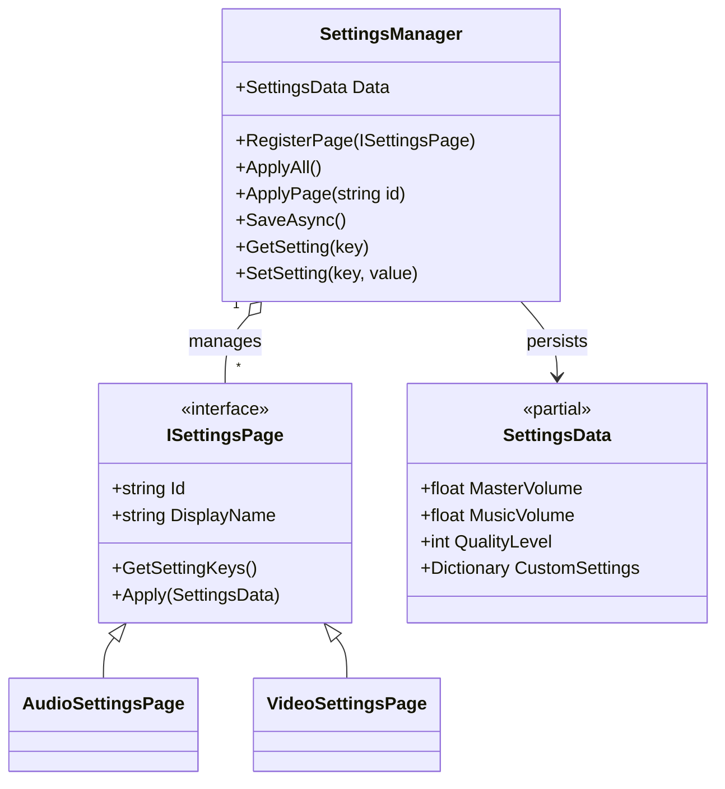
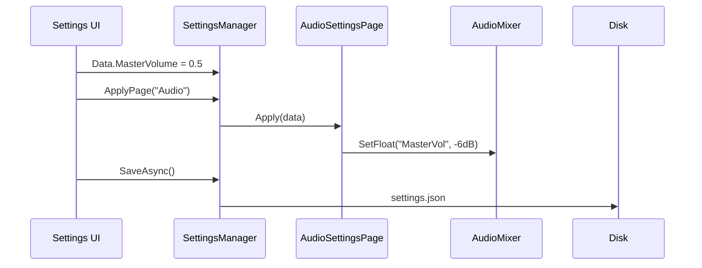

# Settings Manager

The **Settings Manager** provides a centralized and persistent system for managing user preferences (Audio, Video, Gameplay). It uses a modular "Page" architecture for easy extension.

---

## Table of Contents

1. [Features](#1-features)
2. [Architecture](#2-architecture)
3. [Quick Start](#3-quick-start)
4. [Built-in Pages](#4-built-in-pages)
5. [Creating Custom Pages](#5-creating-custom-pages)
6. [Extending SettingsData](#6-extending-settingsdata)
7. [Generic Settings](#7-generic-settings)
8. [API Reference](#8-api-reference)

---

## 1. Features

- **Modular Pages**: Group settings into categories (Audio, Video, Gameplay) using `ISettingsPage`
- **Centralized Persistence**: All settings stored in a single JSON file (configurable via PackageSettings)
- **Extensible Data**: `SettingsData` is a `partial` class — extend it in your own files
- **Auto-Save**: Automatically saves settings when application quits
- **Generic Fallback**: Store custom settings via key/value dictionary

---

## 2. Architecture





---

## 3. Quick Start

### 3.1 Reading Settings

```csharp
using UnityEngine;
using Eraflo.Catalyst;
using Eraflo.Catalyst.Core.Settings;

public class SettingsUI : MonoBehaviour
{
    void Start()
    {
        SettingsManager settings = App.Get<SettingsManager>();
        
        // Read current values
        float masterVolume = settings.Data.MasterVolume;
        bool fullscreen = settings.Data.Fullscreen;
        int quality = settings.Data.QualityLevel;
        
        Debug.Log($"Volume: {masterVolume}, Fullscreen: {fullscreen}, Quality: {quality}");
    }
}
```

### 3.2 Modifying and Applying Settings

```csharp
using UnityEngine;
using UnityEngine.UI;
using Eraflo.Catalyst;
using Eraflo.Catalyst.Core.Settings;

public class VolumeSlider : MonoBehaviour
{
    [SerializeField] private Slider _slider;
    
    private SettingsManager _settings;
    
    void Start()
    {
        _settings = App.Get<SettingsManager>();
        
        // Initialize slider with current value
        _slider.value = _settings.Data.MasterVolume;
        
        // Listen for changes
        _slider.onValueChanged.AddListener(OnVolumeChanged);
    }
    
    void OnVolumeChanged(float value)
    {
        // 1. Update the data
        _settings.Data.MasterVolume = value;
        
        // 2. Apply to the Audio page
        _settings.ApplyPage("Audio");
    }
    
    void OnDestroy()
    {
        // Save when leaving settings screen
        _settings?.SaveAsync();
    }
}
```

---

## 4. Built-in Pages

### 4.1 AudioSettingsPage

Manages audio volumes via Unity's AudioMixer.

**Settings Keys:** `MasterVolume`, `MusicVolume`, `SFXVolume`

**Setup:**
```csharp
using UnityEngine;
using UnityEngine.Audio;
using Eraflo.Catalyst;
using Eraflo.Catalyst.Core.Settings;

public class AudioSetup : MonoBehaviour
{
    [SerializeField] private AudioMixer _audioMixer;
    
    void Start()
    {
        // Get the Audio page and provide the mixer
        SettingsManager settings = App.Get<SettingsManager>();
        AudioSettingsPage audioPage = settings.GetPage("Audio") as AudioSettingsPage;
        
        if (audioPage != null)
        {
            audioPage.SetMixer(_audioMixer);
            settings.ApplyPage("Audio"); // Re-apply with mixer
        }
    }
}
```

> [!IMPORTANT]
> Your AudioMixer must have exposed parameters named: `MasterVol`, `MusicVol`, `SFXVol`

### 4.2 VideoSettingsPage

Manages display settings.

**Settings Keys:** `ResolutionWidth`, `ResolutionHeight`, `Fullscreen`, `VSync`, `QualityLevel`

```csharp
// Change quality
SettingsManager settings = App.Get<SettingsManager>();
settings.Data.QualityLevel = 3;
settings.Data.VSync = true;
settings.ApplyPage("Video");
```

---

## 5. Creating Custom Pages

### 5.1 Define the Page

```csharp
using System.Collections.Generic;
using Eraflo.Catalyst.Core.Settings;

public class GameplaySettingsPage : ISettingsPage
{
    public string Id => "Gameplay";
    public string DisplayName => "Gameplay";
    
    public IEnumerable<string> GetSettingKeys()
    {
        yield return "MouseSensitivity";
        yield return "InvertY";
        yield return "Difficulty";
    }
    
    public void Apply(SettingsData data)
    {
        // Apply mouse sensitivity
        // Example: CameraController.Sensitivity = data.MouseSensitivity;
        
        // Apply Y inversion
        // Example: CameraController.InvertY = data.InvertY;
        
        // Apply difficulty (if you added it to SettingsData)
        // Example: GameManager.SetDifficulty(data.Difficulty);
    }
}
```

### 5.2 Register the Page

```csharp
using UnityEngine;
using Eraflo.Catalyst;
using Eraflo.Catalyst.Core.Settings;

public class GameBootstrap : MonoBehaviour
{
    void Start()
    {
        SettingsManager settings = App.Get<SettingsManager>();
        
        // Register your custom page
        settings.RegisterPage(new GameplaySettingsPage());
    }
}
```

---

## 6. Extending SettingsData

Add strongly-typed settings by extending the partial class in your own file:

```csharp
// File: MySettingsData.cs (in YOUR project, not the package)
namespace Eraflo.Catalyst.Core.Settings
{
    public partial class SettingsData
    {
        // Your custom settings
        public int Difficulty = 1;
        public bool TutorialCompleted = false;
        public string SelectedCharacter = "Default";
    }
}
```

Now use them like built-in settings:

```csharp
SettingsManager settings = App.Get<SettingsManager>();

// Read
int difficulty = settings.Data.Difficulty;

// Write
settings.Data.Difficulty = 3;
settings.Data.TutorialCompleted = true;

// Save
await settings.SaveAsync();
```

---

## 7. Generic Settings

For settings you don't want to add as strongly-typed fields, use the generic system:

```csharp
using UnityEngine;
using Eraflo.Catalyst;
using Eraflo.Catalyst.Core.Settings;

public class GenericSettingsExample : MonoBehaviour
{
    void Example()
    {
        SettingsManager settings = App.Get<SettingsManager>();
        
        // Store any value as string
        settings.SetSetting("LastPlayedLevel", 5);
        settings.SetSetting("PlayerName", "Hero123");
        settings.SetSetting("HighScore", 99999);
        
        // Retrieve with type conversion
        int level = settings.GetSetting<int>("LastPlayedLevel", defaultValue: 1);
        string name = settings.GetSetting<string>("PlayerName", defaultValue: "Player");
        int score = settings.GetSetting<int>("HighScore", defaultValue: 0);
        
        Debug.Log($"Level: {level}, Name: {name}, Score: {score}");
    }
}
```

> [!NOTE]
> Generic settings are stored in `SettingsData.CustomSettings` dictionary and serialized as strings.

---

## 8. API Reference

### SettingsManager

| Property/Method | Description |
|-----------------|-------------|
| `SettingsData Data` | The current settings data object |
| `IEnumerable<ISettingsPage> Pages` | All registered pages |
| `RegisterPage(ISettingsPage page)` | Register a custom settings page |
| `GetPage(string id)` | Get a page by its ID |
| `ApplyAll()` | Apply all pages |
| `ApplyPage(string pageId)` | Apply a specific page |
| `SaveAsync()` | Save settings to disk asynchronously |
| `GetSetting<T>(key, default)` | Get a custom setting with type conversion |
| `SetSetting<T>(key, value)` | Set a custom setting |

### ISettingsPage

| Member | Description |
|--------|-------------|
| `string Id` | Unique identifier for the page |
| `string DisplayName` | Human-readable name for UI |
| `GetSettingKeys()` | Returns all setting keys managed by this page |
| `Apply(SettingsData data)` | Apply settings to the engine |

### SettingsData (Built-in Fields)

| Category | Field | Type | Default |
|----------|-------|------|---------|
| **Audio** | `MasterVolume` | `float` | `1.0` |
| | `MusicVolume` | `float` | `0.8` |
| | `SFXVolume` | `float` | `0.8` |
| **Video** | `ResolutionWidth` | `int` | `1920` |
| | `ResolutionHeight` | `int` | `1080` |
| | `Fullscreen` | `bool` | `true` |
| | `VSync` | `bool` | `true` |
| | `QualityLevel` | `int` | `2` |
| **Gameplay** | `MouseSensitivity` | `float` | `1.0` |
| | `InvertY` | `bool` | `false` |
| **Custom** | `CustomSettings` | `Dictionary<string,string>` | `{}` |

### Configuration (PackageSettings)

| Setting | Description |
|---------|-------------|
| `SettingsFilename` | Name of the settings file (default: `settings.json`) |

---

## See Also

- [Service Locator](ServiceLocator.md): Accessing settings via `App.Get<SettingsManager>()`
- [Save System](SaveManager.md): Underlying persistence layer
