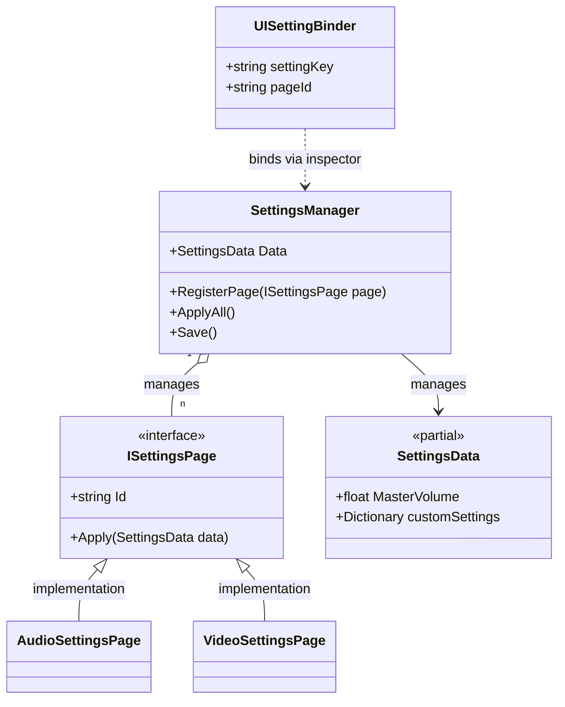
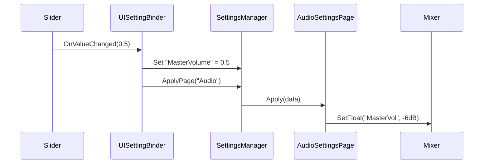

# Settings Manager

The **Settings Manager** module provides a centralized and persistent system for managing user preferences (Audio, Video, Gameplay). It is built for extensibility, as users can easily add their own settings without modifying the core package.

## Features

- **Modular Pages**: Group settings into categories (Audio, Video, Gameplay) using `ISettingsPage`.
- **Centralized & Configurable Data**: All settings are stored in a single file (default: `settings.json`), configurable in [Package Settings](../Infrastructure/PackageSettings.md).
- **Extensible Architecture**: Uses a `partial` class and a generic Key/Value system.
- **Auto-Save**: Automatically saves settings when the application shuts down.
- **Pro UI Binding**: Select setting keys from a professional dropdown in the inspector via `UISettingBinder`.
- **Logarithmic Audio**: Handles linear-to-decibel conversion for Unity's AudioMixer.

## Architecture

The system follows a modular "Page" architecture:



## The "Page" System

Settings are applied through **Pages**. This prevents the `SettingsManager` from becoming a monolithic class with knowledge of every engine subsystem.

### Standard Pages
- `AudioSettingsPage`: Manages Master, Music, and SFX volumes via an `AudioMixer`.
- `VideoSettingsPage`: Manages Resolution, Fullscreen, Quality, and VSync.

### Creating a Custom Page
If you add specialized settings (e.g., "Difficulty" or "Camera Shake"), create a new page:

```csharp
public class GameplayPage : ISettingsPage {
    public string Id => "Gameplay";
    public string DisplayName => "Gameplay";

    public IEnumerable<string> GetSettingKeys() {
        yield return "Difficulty";
        yield return "ShakeEnabled";
    }

    public void Apply(SettingsData data) {
        // Apply logic here...
    }
}

// Register it
App.Get<SettingsManager>().RegisterPage(new GameplayPage());
```

## Extensibility

### 1. Adding Strongly-Typed Settings
To add a new setting that behaves like a core setting:
Create a new file in your project:
```csharp
namespace Eraflo.Catalyst.Core.Settings
{
    public partial class SettingsData
    {
        public int Difficulty = 1;
    }
}
```

### 2. Using Custom Settings (Generic)
You can store any data using the generic system:
```csharp
var manager = App.Get<SettingsManager>();
manager.SetSetting("PlayerColor", Color.red.ToString());
Color color = manager.GetSetting<Color>("PlayerColor");
```

## UI Integration: UISettingBinder

Place the `UISettingBinder` component on any UI element (Slider, Toggle, Dropdown).

### The Custom Inspector
The `UISettingBinder` features a **professional inspector** that automatically scans your project for available settings keys. You don't need to type key names manually; simply select them from the dropdown.



## Code Usage

### Applying Settings
```csharp
var settings = App.Get<SettingsManager>();

// Manually update and apply
settings.Data.MasterVolume = 0.5f;
settings.ApplyPage("Audio");

// Save immediately
await settings.SaveAsync();
```

### Setting the AudioMixer
The manager needs an `AudioMixer` to apply volume changes. You should provide it during your game initialization:
```csharp
App.Get<SettingsManager>().SetAudioMixer(myMixer);
```
Ensure your mixer has parameters named `MasterVol`, `MusicVol`, and `SFXVol`.
