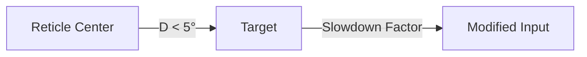
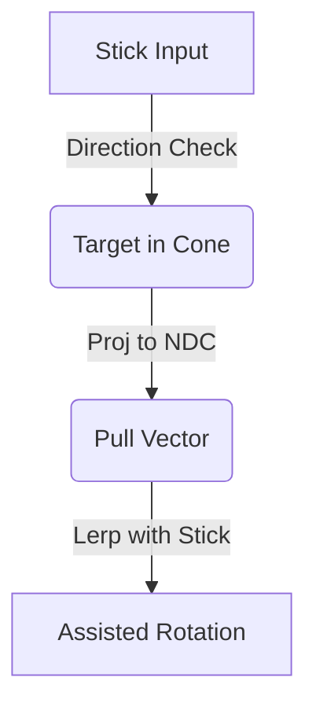

# Aim Assist (Sticky Magnetism)

The Aim Assist module provides a standard AAA-feel aiming experience for controllers and touch inputs. It consists of two main features: **Reticle Friction** (slowdown) and **Aim Adhesion** (magnetism).

## Systems Overview

### 1. Reticle Friction (Sensitivity Slowdown)
When the reticle (screen center) passes near a target, the input sensitivity is reduced. This helps the player make precise adjustments and stay on target.



### 2. Aim Adhesion (Magnetism)
When the player is already moving the stick towards a target within a certain cone, the system subtly "pulls" the aim towards the target's center.



## Features

- **Reticle Friction**: Automatically reduces look sensitivity when the reticle is near a target.
- **Aim Adhesion**: Subtly pulls the aim towards the target center when moving the stick.
- **Stick Alignment Reward**: Magnetism is stronger if your stick direction already aligns with the target.
- **Ultra-Optimized**: Uses `NativeSpatialHash` for O(1) culling and `Burst` jobs for math.
- **Smoothed Transitions**: Uses the internal `Easing` module for friction falloff and magnetism curves.

## Configuration (`AimAssistConfig`)

- **MaxDistance**: Maximum range for assist.
- **ConeAngle**: Field of view for magnetism (usually 10-15°).
- **MaxFriction**: Minimum sensitivity multiplier (e.g., 0.5 = 50% speed).
- **FrictionEase**: Easing function for the friction falloff.
- **MaxMagnetism**: Maximum pull strength.
- **MagnetismSmoothing**: How smoothly the pull is applied (high = instant, low = gradual).

## Setup Tutorial

### 1. Component Setup
Add the `TargetableEntity` component to your enemies. Assign a `Collider` to `CenterCollider` (usually the torso/head) to define exactly where the assist should pull.

### 2. Service Registration
Ensure `AimAssistManager` is registered in your `App` (usually via `[Service]` auto-discovery).

### 3. Integration in Player Controller
In your rotation logic, wrap your look input with `ApplyAssist`.

```csharp
public class PlayerController : MonoBehaviour
{
    private IAimAssistService _aimAssist;
    private Camera _cam;

    void Start()
    {
        _aimAssist = App.Get<IAimAssistService>();
        _cam = Camera.main;
    }

    void Update()
    {
        // 1. Get raw look input (axes)
        Vector2 rawLookInput = GetInput(); 

        // 2. Apply Assist
        Vector2 assistedInput = _aimAssist.ApplyAssist(
            rawLookInput, 
            _cam.transform.position, 
            _cam.transform.forward, 
            _cam, 
            Time.deltaTime
        );

        // 3. Rotate using assistedInput
        ApplyRotation(assistedInput);
    }
}
```

## Performance Note

The system uses:
- **Spatial Culling**: Uses `NativeSpatialHash` from the `Spatial` module to only check targets in the immediate vicinity.
- **Burst Jobs**: Heavy math (Frustum checks, NDC projections) is compiled to native code.
- **No-GC Pipeline**: All per-frame data stays in unmanaged memory.

