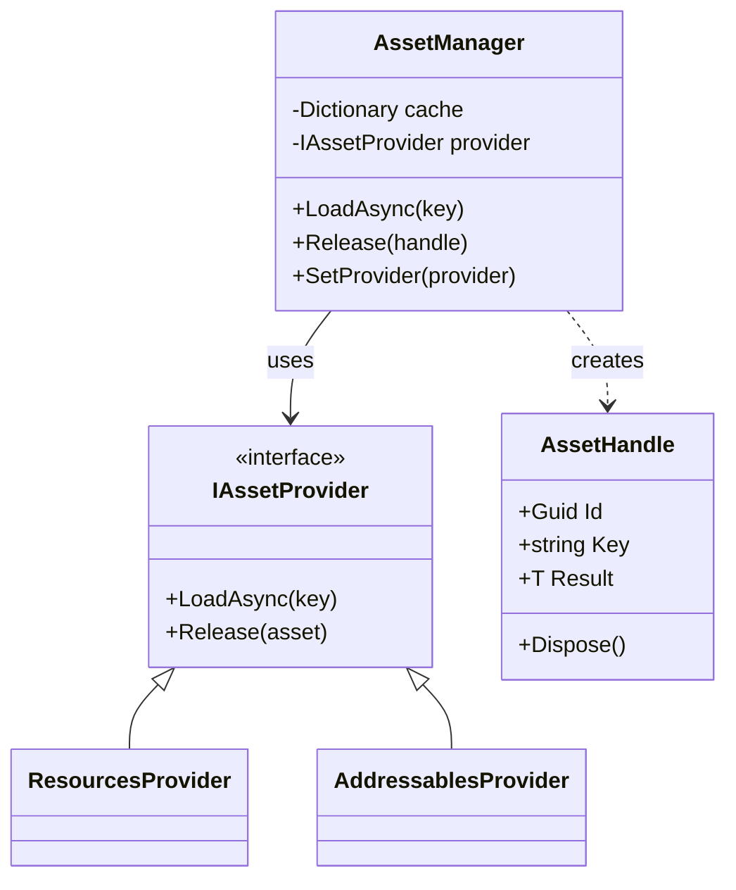
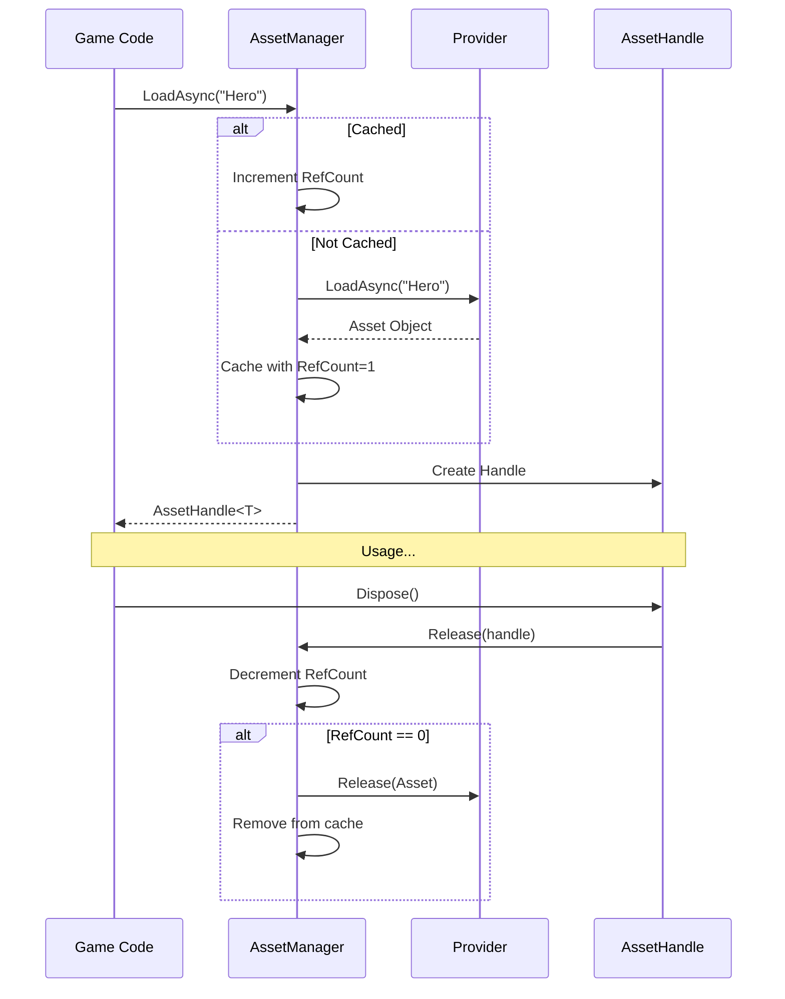

# Asset Management

The **Asset Management** module provides a clean abstraction for loading and managing Unity assets (Prefabs, Textures, Audio, etc.) with built-in reference counting and caching.

---

## Table of Contents

1. [Features](#1-features)
2. [Architecture](#2-architecture)
3. [Quick Start](#3-quick-start)
4. [AssetHandle and Reference Counting](#4-assethandle-and-reference-counting)
5. [Built-in Providers](#5-built-in-providers)
6. [Pool Integration](#6-pool-integration)
7. [Custom Providers](#7-custom-providers)
8. [Configuration](#8-configuration)
9. [API Reference](#9-api-reference)

---

## 1. Features

- **Provider Abstraction**: Switch between `Resources` or `Addressables` without changing code
- **Reference Counting**: Automatically unloads assets when no longer used
- **Caching**: Prevents redundant loading of the same asset
- **Deduplication**: Multiple simultaneous requests for same key share one load
- **Disposable Handles**: Clean memory management using `using` pattern
- **Pool Integration**: Load prefabs and warm up pools in a single call

---

## 2. Architecture





---

## 3. Quick Start

### 3.1 Load and Use an Asset

```csharp
using UnityEngine;
using UnityEngine.UI;
using Eraflo.Catalyst;
using Eraflo.Catalyst.Assets;

public class MenuBackground : MonoBehaviour
{
    [SerializeField] private RawImage _backgroundImage;
    
    private AssetHandle<Texture2D> _textureHandle;
    
    async void Start()
    {
        AssetManager assetManager = App.Get<AssetManager>();
        
        // Load texture
        _textureHandle = await assetManager.LoadAsync<Texture2D>("Backgrounds/Menu");
        
        if (_textureHandle != null)
        {
            _backgroundImage.texture = _textureHandle.Result;
        }
    }
    
    void OnDestroy()
    {
        // Release when done
        _textureHandle?.Dispose();
    }
}
```

### 3.2 Using Pattern (Auto-Dispose)

```csharp
using UnityEngine;
using Eraflo.Catalyst;
using Eraflo.Catalyst.Assets;

public class OneTimeLoader : MonoBehaviour
{
    async void ProcessTexture()
    {
        AssetManager assetManager = App.Get<AssetManager>();
        
        // Using pattern auto-disposes the handle
        using (var handle = await assetManager.LoadAsync<Texture2D>("Icons/Star"))
        {
            if (handle != null)
            {
                // Use the texture
                ProcessPixels(handle.Result);
            }
        } // Handle disposed here, RefCount decremented
    }
    
    void ProcessPixels(Texture2D texture) { /* ... */ }
}
```

---

## 4. AssetHandle and Reference Counting

### 4.1 How Reference Counting Works

1. **First Load**: Asset loaded, cached with RefCount = 1
2. **Subsequent Loads**: Same asset, RefCount incremented
3. **Dispose**: RefCount decremented
4. **Final Dispose**: When RefCount = 0, asset unloaded from memory

### 4.2 Multiple References

```csharp
using UnityEngine;
using Eraflo.Catalyst;
using Eraflo.Catalyst.Assets;

public class MultiReferenceExample : MonoBehaviour
{
    async void Example()
    {
        AssetManager assetManager = App.Get<AssetManager>();
        
        // First load - RefCount = 1
        var handle1 = await assetManager.LoadAsync<Texture2D>("Shared/Logo");
        
        // Second load (cached) - RefCount = 2
        var handle2 = await assetManager.LoadAsync<Texture2D>("Shared/Logo");
        
        // Both handles point to same cached asset
        Debug.Log(handle1.Result == handle2.Result); // true
        
        // First dispose - RefCount = 1 (asset still in memory)
        handle1.Dispose();
        
        // Second dispose - RefCount = 0 (asset unloaded)
        handle2.Dispose();
    }
}
```

> [!IMPORTANT]
> Always dispose handles when done. Failing to dispose causes memory leaks.

---

## 5. Built-in Providers

### 5.1 ResourcesProvider

Loads assets from Unity's `Resources` folders.

```csharp
// Asset path: Resources/Prefabs/Enemy.prefab
// Load key: "Prefabs/Enemy" (no .prefab extension)
var handle = await assetManager.LoadAsync<GameObject>("Prefabs/Enemy");
```

**Pros:** Simple, no setup required
**Cons:** All Resources included in build, less control

### 5.2 AddressablesProvider

Loads assets via Unity's Addressables system.

```csharp
// Asset must be marked Addressable with key "Prefabs/Enemy"
var handle = await assetManager.LoadAsync<GameObject>("Prefabs/Enemy");
```

**Pros:** Better memory management, remote loading, DLC support
**Cons:** Requires Addressables package setup

---

## 6. Pool Integration

Load a prefab and warm up its pool in one call.

```csharp
using UnityEngine;
using Eraflo.Catalyst;
using Eraflo.Catalyst.Assets;
using Eraflo.Catalyst.Pooling;

public class VFXSpawner : MonoBehaviour
{
    private Pool _pool;
    private AssetHandle<GameObject> _explosionHandle;
    
    async void Start()
    {
        _pool = App.Get<Pool>();
        
        // Load prefab AND create 10 pooled instances
        _explosionHandle = await _pool.LoadAndPoolAsync("VFX/Explosion", 10);
    }
    
    public void SpawnExplosion(Vector3 position)
    {
        if (_explosionHandle?.Result != null)
        {
            // Spawn from pre-warmed pool
            _pool.SpawnObject(_explosionHandle.Result, position);
        }
    }
    
    void OnDestroy()
    {
        // Clear pool first, then release asset
        if (_explosionHandle?.Result != null)
        {
            _pool.ClearPool(_explosionHandle.Result);
        }
        _explosionHandle?.Dispose();
    }
}
```

---

## 7. Custom Providers

### 7.1 Implement IAssetProvider

```csharp
using System.Threading.Tasks;
using UnityEngine;
using Eraflo.Catalyst.Assets;

public class StreamingAssetsProvider : IAssetProvider
{
    public async Task<T> LoadAsync<T>(string key) where T : Object
    {
        // Custom loading logic
        // Example: load from StreamingAssets, web, etc.
        await Task.Yield();
        return null;
    }
    
    public void Release(Object asset)
    {
        // Custom unload logic
        if (asset != null)
        {
            Object.Destroy(asset);
        }
    }
}
```

### 7.2 Set Custom Provider

```csharp
using Eraflo.Catalyst;
using Eraflo.Catalyst.Assets;

public class AssetSetup
{
    void ConfigureCustomProvider()
    {
        AssetManager assetManager = App.Get<AssetManager>();
        assetManager.SetProvider(new StreamingAssetsProvider());
    }
}
```

---

## 8. Configuration

Configure the default provider in **Package Settings** (`CatalystSettings` ScriptableObject in Resources).

| Setting | Description |
|---------|-------------|
| `AssetProviderType` | `Resources` or `Addressables` |

```csharp
// PackageSettings.Instance.AssetProviderType
public enum AssetProviderType
{
    Resources,
    Addressables
}
```

---

## 9. API Reference

### AssetManager (Service)

| Member | Description |
|--------|-------------|
| `LoadAsync<T>(key)` | Load asset, returns `AssetHandle<T>` |
| `Release(handle)` | Decrement ref count (called by handle.Dispose) |
| `SetProvider(provider)` | Switch asset provider at runtime |

### AssetHandle<T>

| Member | Type | Description |
|--------|------|-------------|
| `Id` | `Guid` | Unique handle identifier |
| `Key` | `string` | Asset key used for loading |
| `Result` | `T` | The loaded asset |
| `Dispose()` | `void` | Release reference (IDisposable) |

### IAssetProvider (Interface)

| Method | Description |
|--------|-------------|
| `Task<T> LoadAsync<T>(key)` | Load asset of type T |
| `void Release(asset)` | Unload asset from memory |

### Pool Extensions

| Method | Description |
|--------|-------------|
| `pool.LoadAndPoolAsync(key, count)` | Load prefab and warm up pool |

---

## See Also

- [Service Locator](../Core/ServiceLocator.md): Accessing `AssetManager`
- [Pool System](Pooling.md): Object pooling
- [Package Settings](../Infrastructure/PackageSettings.md): Configuration
