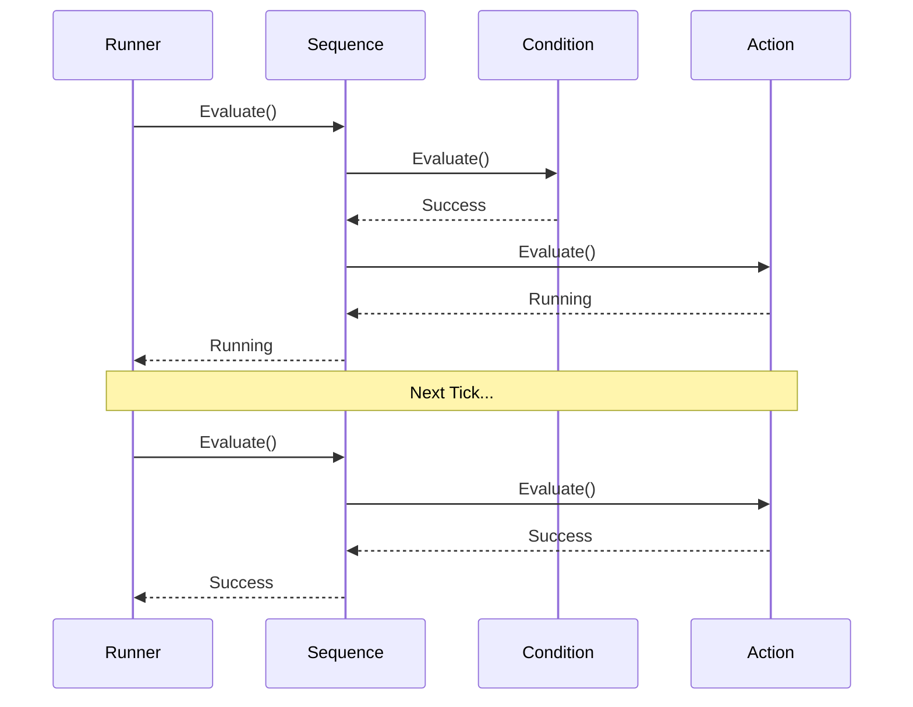
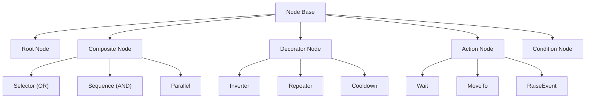

# Behaviour Tree System

A flexible, ScriptableObject-based Behaviour Tree system for AI agents with visual graph editing, services, data flow, and multiplayer support.

---

## Table of Contents

1. [Features](#1-features)
2. [Quick Start](#2-quick-start)
3. [Architecture](#3-architecture)
4. [BehaviourTreeRunner](#4-behaviourtreerunner)
5. [Node Types](#5-node-types)
6. [Services](#6-services)
7. [Blackboard](#7-blackboard)
8. [Data Flow (Ports)](#8-data-flow-ports)
9. [Custom Nodes](#9-custom-nodes)
10. [Multiplayer](#10-multiplayer)
11. [API Reference](#11-api-reference)

---

## 1. Features

- **Visual Editor**: Node-based graph with drag, zoom, and context menus
- **Node Search**: Press Space for quick node creation
- **Composites**: Selector (OR), Sequence (AND), Parallel, RandomSelector
- **Decorators**: Inverter, Repeater, Cooldown, TimeLimit, Probability, SubTree
- **Actions**: Wait, MoveTo, RaiseEvent, ExecuteCommand, PlayAnimation
- **Conditions**: BlackboardCondition, IsInRange, HasLineOfSight
- **Services**: Background tasks running at intervals
- **Data Flow**: Connect node ports for direct data passing
- **Blackboard**: Hierarchical shared data with reactive listeners
- **Multiplayer**: Server-authoritative AI with state sync

---

## 2. Quick Start

### 2.1 Create and Run a Tree

1. **Create Tree**: Right-click in Project → Create → Catalyst → Behaviour Tree → Behaviour Tree
2. **Open Editor**: Click "Open Behaviour Tree Editor" button in inspector
3. **Add Nodes**: Right-click in graph or press Space
4. **Connect Nodes**: Drag from output (bottom) to input (top)
5. **Run**: Add `BehaviourTreeRunner` to your agent and assign the tree

### 2.2 Basic Agent Setup

```csharp
using UnityEngine;
using Eraflo.Catalyst.BehaviourTree;

public class AIAgent : MonoBehaviour
{
    [SerializeField] private BehaviourTree _treeAsset;
    
    private BehaviourTreeRunner _runner;
    
    void Start()
    {
        // Add runner at runtime
        _runner = gameObject.AddComponent<BehaviourTreeRunner>();
        _runner.SetTree(_treeAsset);
        
        // Set initial blackboard values
        _runner.Blackboard.Set("Health", 100);
        _runner.Blackboard.Set("Target", null as Transform);
    }
    
    void Update()
    {
        // Access current tree state
        if (_runner.TreeState == NodeState.Success)
        {
            Debug.Log("AI completed its behaviour");
        }
    }
    
    public void SetTarget(Transform target)
    {
        _runner.Blackboard.Set("Target", target);
    }
}
```

---

## 3. Architecture

### 3.1 Execution Flow



### 3.2 Node Hierarchy



---

## 4. BehaviourTreeRunner

### 4.1 Component Setup

```csharp
using UnityEngine;
using Eraflo.Catalyst.BehaviourTree;

public class RunnerConfiguration : MonoBehaviour
{
    void Start()
    {
        BehaviourTreeRunner runner = GetComponent<BehaviourTreeRunner>();
        
        // Access the runtime tree (cloned from asset)
        BehaviourTree tree = runner.RuntimeTree;
        
        // Access blackboard
        var blackboard = runner.Blackboard;
        blackboard.Set("PatrolIndex", 0);
        
        // Check current state
        NodeState state = runner.TreeState;
    }
}
```

### 4.2 Update Modes

| Mode | Description |
|------|-------------|
| `Update` | Tick every frame |
| `FixedUpdate` | Tick in FixedUpdate |
| `Throttled` | Tick at fixed rate (TickRate property) |
| `Manual` | Only tick when you call `Tick()` |

### 4.3 Manual Control

```csharp
using UnityEngine;
using Eraflo.Catalyst.BehaviourTree;

public class ManualTreeControl : MonoBehaviour
{
    private BehaviourTreeRunner _runner;
    
    void Start()
    {
        _runner = GetComponent<BehaviourTreeRunner>();
        // Set to manual if you want full control
    }
    
    public void TickTree()
    {
        // Manually evaluate tree
        NodeState result = _runner.Tick();
        
        if (result == NodeState.Success)
        {
            Debug.Log("Tree completed successfully");
        }
    }
    
    public void ReloadTree()
    {
        // Reset to initial state
        _runner.ResetTree();
    }
    
    public void SwitchBehaviour(BehaviourTree newTree)
    {
        // Change tree at runtime
        _runner.SetTree(newTree);
    }
}
```

### 4.4 AI LOD Scheduler (BTSchedulerService)

`BTSchedulerService` is an optional Catalyst service that automatically manages tick frequency for all registered runners based on their distance to `Camera.main`. When present, `BehaviourTreeRunner` components register and unregister themselves automatically on `OnEnable`/`OnDisable` — no user code is required.

| Tier | Distance | Tick Frequency |
|------|----------|----------------|
| Tier 0 | < 15 m | Every frame |
| Tier 1 | 15 – 50 m | Every 3 frames |
| Tier 2 | > 50 m | Every 10 frames |

The runner switches to `Manual` mode automatically when the service is active. If the service is absent (e.g. removed from service discovery), runners fall back to their own configured `UpdateMode`.

**Configuration:**

```csharp
var scheduler = App.Get<BTSchedulerService>();
scheduler.Tier1Distance = 20f;
scheduler.Tier2Distance = 60f;
scheduler.MaxMsPerFrame = 3f;
```

---

## 5. Node Types

### 5.1 Composites (Blue)

| Node | Behaviour |
|------|-----------|
| `Selector` | Returns Success on first child success (OR) |
| `Sequence` | Returns Failure on first child failure (AND) |
| `Parallel` | Runs all children simultaneously |
| `RandomSelector` | Shuffles children before selection |

### 5.2 Decorators (Purple)

| Node | Behaviour |
|------|-----------|
| `Inverter` | Inverts child result |
| `Repeater` | Repeats N times (0 = infinite) |
| `Succeeder` | Always returns Success |
| `Failer` | Always returns Failure |
| `UntilFail` | Repeats until child fails |
| `Cooldown` | Rate-limits execution |
| `TimeLimit` | Aborts child after timeout |
| `Probability` | Executes child with X% chance |
| `SubTree` | Executes another BT asset |
| `BlackboardConditional` | Guards with Blackboard condition |

### 5.3 Actions (Green)

**General:**
| Node | Description |
|------|-------------|
| `Wait` | Waits N seconds |
| `RaiseEvent` | Raises EventChannel |
| `WaitForEvent` | Waits for EventChannel |
| `RunUnityEvent` | Invokes a UnityEvent |
| `ExecuteCommand` | Runs Command System action |
| `Log` | Debug.Log message |
| `SetBlackboardValue` | Sets blackboard data |

**Navigation (requires NavMeshAgent):**
| Node | Description |
|------|-------------|
| `MoveTo` | NavMesh pathfinding |
| `RotateTo` | Smooth rotation |

**Animation:**
| Node | Description |
|------|-------------|
| `PlayAnimation` | Plays with crossfade |
| `SetAnimatorParameter` | Sets Bool/Int/Float/Trigger |

### 5.4 Conditions (Yellow)

| Node | Description |
|------|-------------|
| `BlackboardCondition` | Checks blackboard value |
| `IsInRange` | Distance check |
| `HasLineOfSight` | Raycast visibility |

---

## 6. Services

Services are background tasks attached to nodes that run at intervals while the node is active.

### 6.1 Built-in Services

| Service | Description |
|---------|-------------|
| `FindTargetService` | Finds GameObject by tag |
| `FindClosestByTagService` | Finds nearest with tag |
| `UpdateDistanceService` | Calculates distance |
| `CheckRangeService` | Checks if in range |
| `UpdateSelfPositionService` | Stores owner position |
| `DebugLogService` | Logs debug messages |

### 6.2 Adding Services in Editor

1. Right-click on any node → **Add Service**
2. Select service from list
3. Configure in Inspector
4. ⚙️ badge indicates attached services

### 6.3 Custom Service

```csharp
using UnityEngine;
using Eraflo.Catalyst.BehaviourTree;

[BehaviourTreeNode("Services", "Update Player Distance")]
public class UpdatePlayerDistanceService : ServiceNode
{
    public float Interval = 0.5f;
    public string DistanceKey = "PlayerDistance";
    
    protected override void OnServiceUpdate()
    {
        GameObject player = GameObject.FindWithTag("Player");
        if (player != null && Owner != null)
        {
            float distance = Vector3.Distance(
                Owner.transform.position, 
                player.transform.position
            );
            Blackboard.Set(DistanceKey, distance);
        }
    }
}
```

---

## 7. Blackboard

Shared data container powered by the Core Blackboard System.

### 7.1 Basic Usage

```csharp
using UnityEngine;
using Eraflo.Catalyst.BehaviourTree;

public class BlackboardExample : MonoBehaviour
{
    private BehaviourTreeRunner _runner;
    
    void Start()
    {
        _runner = GetComponent<BehaviourTreeRunner>();
        var bb = _runner.Blackboard;
        
        // Set values
        bb.Set("Health", 100);
        bb.Set("Target", transform);
        bb.Set("IsAggressive", true);
        
        // Get values
        int health = bb.Get<int>("Health");
        Transform target = bb.Get<Transform>("Target");
        
        // Check existence
        if (bb.Contains("Target"))
        {
            // ...
        }
    }
}
```

### 7.2 Reactive Listeners

```csharp
using UnityEngine;
using Eraflo.Catalyst.BehaviourTree;

public class ReactiveBlackboard : MonoBehaviour
{
    private BehaviourTreeRunner _runner;
    
    void Start()
    {
        _runner = GetComponent<BehaviourTreeRunner>();
        
        // Listen to specific key changes
        _runner.Blackboard.RegisterListener("Health", OnHealthChanged);
    }
    
    void OnDestroy()
    {
        _runner?.Blackboard?.UnregisterListener("Health", OnHealthChanged);
    }
    
    void OnHealthChanged(object oldVal, object newVal)
    {
        int oldHealth = (int)oldVal;
        int newHealth = (int)newVal;
        Debug.Log($"Health changed: {oldHealth} → {newHealth}");
    }
}
```

### 7.3 Hierarchical Scoping

```csharp
using Eraflo.Catalyst;
using Eraflo.Catalyst.Core.Blackboard;
using Eraflo.Catalyst.BehaviourTree;

public class ScopedAI : MonoBehaviour
{
    void Start()
    {
        var runner = GetComponent<BehaviourTreeRunner>();
        var globalBB = App.Get<BlackboardManager>().Global;
        
        // Link AI blackboard to global (inherits global values)
        runner.Blackboard.SetParent(globalBB);
        
        // AI can read global values
        float worldDanger = runner.Blackboard.Get<float>("WorldDangerLevel");
        
        // But local overrides take precedence
        runner.Blackboard.Set("LocalDanger", 0.5f);
    }
}
```

---

## 8. Data Flow (Ports)

Connect nodes directly to pass data without using Blackboard.

### 8.1 Port Types

- **Input Port** (Left): Receives data from another node
- **Output Port** (Right): Sends data to another node

### 8.2 Supported Types

`float`, `int`, `bool`, `string`, `Vector3`, `GameObject`, `Transform`

### 8.3 Creating Nodes with Ports

```csharp
using UnityEngine;
using Eraflo.Catalyst.BehaviourTree;

[BehaviourTreeNode("Custom", "Random Position Generator")]
public class RandomPositionGenerator : ActionNode
{
    public float Radius = 10f;
    
    [NodeOutput] public Vector3 OutputPosition;
    
    protected override NodeState OnUpdate()
    {
        Vector3 randomOffset = Random.insideUnitSphere * Radius;
        randomOffset.y = 0;
        OutputPosition = Owner.transform.position + randomOffset;
        return NodeState.Success;
    }
}

[BehaviourTreeNode("Custom", "Move To Position")]
public class MoveToPosition : ActionNode
{
    [NodeInput] public Vector3 TargetPosition;
    
    public float Speed = 5f;
    
    protected override NodeState OnUpdate()
    {
        Vector3 target = GetData("TargetPosition", TargetPosition);
        
        Vector3 direction = (target - Owner.transform.position).normalized;
        Owner.transform.position += direction * Speed * Time.deltaTime;
        
        if (Vector3.Distance(Owner.transform.position, target) < 0.5f)
            return NodeState.Success;
            
        return NodeState.Running;
    }
}
```

---

## 9. Custom Nodes

### 9.1 Action Node

```csharp
using UnityEngine;
using Eraflo.Catalyst.BehaviourTree;

[BehaviourTreeNode("Actions/Combat", "Attack Target")]
public class AttackTarget : ActionNode
{
    public int Damage = 10;
    public float AttackRange = 2f;
    
    protected override void OnStart()
    {
        Debug.Log("Starting attack");
    }
    
    protected override NodeState OnUpdate()
    {
        Transform target = Blackboard.Get<Transform>("Target");
        if (target == null) return NodeState.Failure;
        
        float distance = Vector3.Distance(
            Owner.transform.position, 
            target.position
        );
        
        if (distance > AttackRange)
            return NodeState.Failure;
        
        // Apply damage
        var health = target.GetComponent<Health>();
        if (health != null)
        {
            health.TakeDamage(Damage);
            return NodeState.Success;
        }
        
        return NodeState.Failure;
    }
    
    protected override void OnStop()
    {
        Debug.Log("Attack finished");
    }
}
```

### 9.2 Condition Node

```csharp
using UnityEngine;
using Eraflo.Catalyst.BehaviourTree;

[BehaviourTreeNode("Conditions", "Is Health Low")]
public class IsHealthLow : ConditionNode
{
    public float Threshold = 30f;
    
    protected override bool CheckCondition()
    {
        int health = Blackboard.Get<int>("Health");
        return health < Threshold;
    }
}
```

### 9.3 Decorator Node

```csharp
using UnityEngine;
using Eraflo.Catalyst.BehaviourTree;

[BehaviourTreeNode("Decorators", "Print Result")]
public class PrintResult : DecoratorNode
{
    public string Message = "Child returned:";
    
    protected override NodeState OnUpdate()
    {
        if (Child == null) return NodeState.Failure;
        
        NodeState result = Child.Evaluate();
        Debug.Log($"{Message} {result}");
        
        return result;
    }
}
```

---

## 10. Multiplayer

### 10.1 Server-Authoritative AI

Add `NetworkBehaviourTreeSync` for server-authoritative trees:
- Server evaluates tree
- Clients receive state updates
- Blackboard values can be synchronized

### 10.2 Network Identification

```csharp
using UnityEngine;
using Eraflo.Catalyst.BehaviourTree;
using Eraflo.Catalyst.Networking;

public class NetworkedAI : MonoBehaviour
{
    void Start()
    {
        var runner = GetComponent<BehaviourTreeRunner>();
        
        // Get network ID
        uint networkId = runner.GetNetworkId();
        Debug.Log($"AI Network ID: {networkId}");
    }
}
```

---

## 11. API Reference

### BehaviourTreeRunner (Component)

| Member | Type | Description |
|--------|------|-------------|
| `RuntimeTree` | `BehaviourTree` | Cloned runtime instance |
| `Blackboard` | `Blackboard` | Tree's data container |
| `TreeState` | `NodeState` | Current evaluation state |
| `Tick()` | `NodeState` | Manually evaluate tree |
| `ResetTree()` | `void` | Reset to initial state |
| `SetTree(tree)` | `void` | Change tree at runtime |

### BehaviourTree (Asset)

| Member | Description |
|--------|-------------|
| `Evaluate()` | Evaluate from root |
| `Reset()` | Reset all nodes |
| `Clone()` | Create runtime copy |
| `Bind(owner)` | Bind to GameObject |

### Node Base

| Member | Description |
|--------|-------------|
| `Owner` | GameObject running the tree |
| `Blackboard` | Access to tree's blackboard |
| `State` | Current node state |

### NodeState (Enum)

| Value | Description |
|-------|-------------|
| `Running` | Still executing |
| `Success` | Completed successfully |
| `Failure` | Failed to complete |

### Attributes

| Attribute | Description |
|-----------|-------------|
| `[BehaviourTreeNode("Category", "Name")]` | Register node in editor |
| `[NodeInput]` | Create input port |
| `[NodeOutput]` | Create output port |

---

## See Also

- [Blackboard](../Core/Blackboard.md): Core blackboard system
- [Timer](Timers.md): Used by Wait and Cooldown nodes
- [Events](Events.md): Used by RaiseEvent node
- [Command System](CommandSystem.md): Used by ExecuteCommand node
