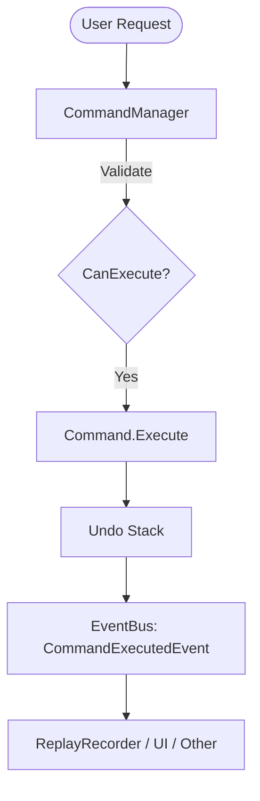
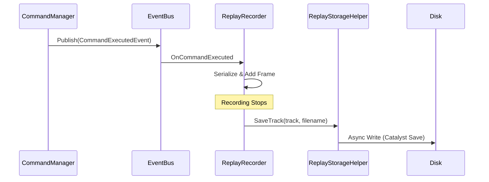
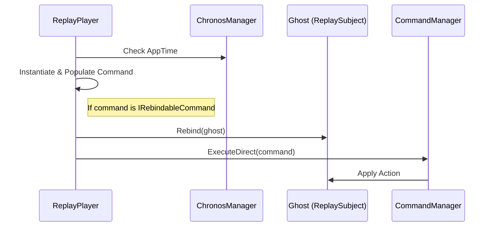
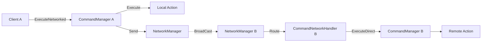

# Command System

The Catalyst **Command System** provides a powerful, asynchronous, and serializable architecture for managing game actions. It natively supports **Undo/Redo history**, **gameplay recording/replay**, and **automatic network synchronization**.

---

## Features

- ⚡ **Asynchronous Execution**: Commands are `Task`-based, allowing them to wait for animations or external events.
- 🕒 **Undo/Redo History**: Automatic management of action stacks with configurable size.
- 📽️ **Replay System**: Record action sequences and play them back on different subjects (Ghosts).
- 🌐 **Network Ready**: One-line synchronization of actions across clients.
- 🤖 **AI Integration**: Treat AI actions exactly like player inputs for unified logic.
- 🛠️ **Macro Support**: Group multiple commands into atomic `CompositeCommand` units.
- 📦 **Robust Serialization**: Automatic support for `GameObject` references (via GUID or Path).

---

## Quick Start

### 1. Define a Command
Implement `ICommand` or `IRebindableCommand` (if you need Ghost redirection).

```csharp
public class JumpCommand : ICommand
{
    public float Force = 5f;
    private Rigidbody _rb;

    public async Task Execute()
    {
        _rb = App.Get<Player>().Rigidbody;
        _rb.AddForce(Vector3.up * Force, ForceMode.Impulse);
        await Task.Yield();
    }

    public async Task Undo() => _rb.velocity = Vector3.zero;
    public bool CanExecute() => _rb != null;
}
```

### 2. Execute it via the Manager
```csharp
var command = new JumpCommand { Force = 10f };
await App.Get<CommandManager>().Execute(command);
```

---

## Architecture

### Core Execution Flow



### Replay Recording & Storage



---

## Core Architecture

### CommandManager
The central hub for all actions. It handles:
- **Execution**: Validates `CanExecute()` and runs the command.
- **History**: Stores commands in an `Undo` stack (FIFO removal if `MaxHistorySize` is exceeded).
- **Events**: Publishes `CommandExecutedEvent`, `CommandUndoneEvent`, and `CommandRedoneEvent` to the `EventBus`.

### Interfaces

#### `ICommand`
The base interface for all actions.
- `Task Execute()`: The logic to perform.
- `Task Undo()`: The logic to revert (if applicable).
- `bool CanExecute()`: Validation before execution.

#### `IRebindableCommand`
Inherits `ICommand`. Adds the ability to redirect the command to a different target during replay.
- `void Rebind(GameObject newTarget)`: Maps the command's internal target to a new one.

---

## Replay System

The Replay system is decoupled and non-intrusive.

### Recording
`ReplayRecorder` listens to the global `EventBus`. It captures every command executed through the `CommandManager`.

```csharp
var recorder = new ReplayRecorder("Race_01");
recorder.Start();
// ...
recorder.Stop();
var track = recorder.Track; // Data is ready for save/playback
```

### Playback & Ghosts



`ReplayPlayer` uses `ChronosManager` to ensure playback timing matches the recording, even under time-scaling.

```csharp
// Play back on a Ghost object
var player = new ReplayPlayer(track, this, ghostPrefab);
player.Play();
```

> [!TIP]
> **Ghost Redirection**: If your command implements `IRebindableCommand`, the `ReplayPlayer` will automatically inject the "Ghost" instance into your command before execution.

---

## Serialization & Unity Types

The system uses a custom `JsonSerializer` that understands Unity-specific types:
- **Vectors & Quaternions**: Normalized JSON objects.
- **GameObjects**: 
    - **GUID**: Uses `SaveableEntity` GUID for persistent session-to-session references.
    - **Path**: Uses Hierarchy Paths (e.g., `/Env/Doors/Door_01`) for scene-local references.

This allows commands like `MoveCommand` to be saved to disk and correctly "find" their targets upon loading.

---

## Networking

Synchronizing actions is trivial. Use the `CommandExtensions` to broadcast actions.



```csharp
// Executes locally AND sends to all other clients
await myCommand.ExecuteNetworked();
```

> [!NOTE]
> Networked commands are executed via `ExecuteDirect` on remote clients to avoid polluting their local undo history or causing recording loops.

---

## AI Integration

AI agents can use the same commands as players via the **ExecuteCommandAction** node in the **Behaviour Tree**.

- **Blackboard Integration**: Pass command parameters or the command instance itself through the Blackboard.
- **Unified Logic**: One command logic for Player, AI, and Replay.

---

## Premium Utilities

### `CommandQueue`
Sequential execution with timed delays. Perfect for cutscenes or scripted sequences.
```csharp
var queue = new CommandQueue();
queue.Enqueue(new MoveCommand(p, p1), delayBefore: 0.5f);
queue.Enqueue(new MoveCommand(p, p2), delayBefore: 1.0f);
```

### `ReplayStorageHelper`
Automates the boilerplate of saving tracks to disk using the **Catalyst Save System**.
```csharp
await ReplayStorageHelper.SaveTrack(track, "myReplay.json");
```

### `UndoRedoUI`
A ready-made MonoBehaviour to bind UI Buttons to the `CommandManager` without writing code.

---

## Samples

A comprehensive sample is included in the package. 
**Location**: `Samples~/CommandSample`

It demonstrates:
- Asynchronous move commands.
- Undo/Redo UI buttons.
- Recording a track.
- Replaying the track on a "Ghost" cube.

---

## Best Practices

1. **Keep it Pure**: Commands should contain data and the logic to apply that data.
2. **Serialization**: Use `[JsonProperty]` for private fields that need to be recorded.
3. **Idempotence**: Ensure `Undo` perfectly reverts the state changed in `Execute`.
4. **Targeting**: Use `IRebindableCommand` if your command acts on a GameObject that might be a "Ghost" later.
