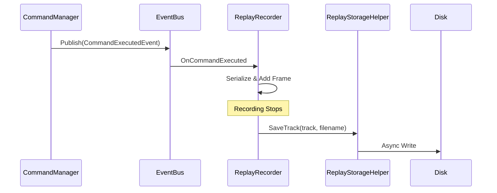
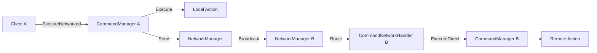

# Command System

The Catalyst **Command System** provides a powerful, asynchronous, and serializable architecture for managing game actions. It natively supports **Undo/Redo history**, **gameplay recording/replay**, and **automatic network synchronization**.

---

## Table of Contents

1. [Features](#1-features)
2. [Quick Start](#2-quick-start)
3. [Architecture](#3-architecture)
4. [ICommand Interface](#4-icommand-interface)
5. [Undo/Redo](#5-undoredo)
6. [Replay System](#6-replay-system)
7. [Networking](#7-networking)
8. [Utilities](#8-utilities)
9. [API Reference](#9-api-reference)

---

## 1. Features

- **Asynchronous Execution**: Commands are `Task`-based for async operations
- **Undo/Redo History**: Automatic management with configurable size
- **Replay System**: Record and playback on different subjects (Ghosts)
- **Network Ready**: One-line synchronization across clients
- **AI Integration**: Same commands for Player, AI, and Replay
- **Macro Support**: Group commands into `CompositeCommand` units
- **Serialization**: Automatic support for Unity types and GameObjects

---

## 2. Quick Start

### 2.1 Define a Command

```csharp
using System.Threading.Tasks;
using UnityEngine;
using Eraflo.Catalyst.Command;

public class JumpCommand : ICommand
{
    public float Force = 5f;
    
    private Rigidbody _rb;
    private Vector3 _previousVelocity;
    
    public bool CanExecute()
    {
        _rb = Object.FindObjectOfType<Player>()?.GetComponent<Rigidbody>();
        return _rb != null;
    }
    
    public async Task Execute()
    {
        _previousVelocity = _rb.velocity;
        _rb.AddForce(Vector3.up * Force, ForceMode.Impulse);
        await Task.Yield();
    }
    
    public async Task Undo()
    {
        _rb.velocity = _previousVelocity;
        await Task.CompletedTask;
    }
}
```

### 2.2 Execute via CommandManager

```csharp
using UnityEngine;
using Eraflo.Catalyst;
using Eraflo.Catalyst.Command;

public class PlayerController : MonoBehaviour
{
    async void Update()
    {
        if (Input.GetKeyDown(KeyCode.Space))
        {
            CommandManager cmdManager = App.Get<CommandManager>();
            
            var jumpCmd = new JumpCommand { Force = 10f };
            await cmdManager.Execute(jumpCmd);
        }
    }
}
```

---

## 3. Architecture

### 3.1 Execution Flow


### 3.2 Replay Flow



---

## 4. ICommand Interface

### 4.1 Basic Command

```csharp
using System.Threading.Tasks;
using UnityEngine;
using Eraflo.Catalyst.Command;

public class MoveCommand : ICommand
{
    public Vector3 Direction;
    public float Distance = 1f;
    
    private Transform _target;
    private Vector3 _previousPosition;
    
    public bool CanExecute()
    {
        _target = Object.FindObjectOfType<Player>()?.transform;
        return _target != null;
    }
    
    public async Task Execute()
    {
        _previousPosition = _target.position;
        _target.position += Direction.normalized * Distance;
        await Task.CompletedTask;
    }
    
    public async Task Undo()
    {
        _target.position = _previousPosition;
        await Task.CompletedTask;
    }
}
```

### 4.2 Rebindable Command (for Replay/Ghosts)

```csharp
using System.Threading.Tasks;
using UnityEngine;
using Eraflo.Catalyst.Command;

public class MoveRebindable : IRebindableCommand
{
    public Vector3 Direction;
    public float Distance = 1f;
    
    private GameObject _target;
    private Vector3 _previousPosition;
    
    public void Rebind(GameObject newTarget)
    {
        _target = newTarget;
    }
    
    public bool CanExecute() => _target != null;
    
    public async Task Execute()
    {
        _previousPosition = _target.transform.position;
        _target.transform.position += Direction.normalized * Distance;
        await Task.CompletedTask;
    }
    
    public async Task Undo()
    {
        _target.transform.position = _previousPosition;
        await Task.CompletedTask;
    }
}
```

---

## 5. Undo/Redo

### 5.1 Basic Usage

```csharp
using UnityEngine;
using Eraflo.Catalyst;
using Eraflo.Catalyst.Command;

public class UndoRedoController : MonoBehaviour
{
    private CommandManager _cmdManager;
    
    void Start()
    {
        _cmdManager = App.Get<CommandManager>();
        
        // Configure max history size
        _cmdManager.MaxHistorySize = 100;
    }
    
    async void Update()
    {
        // Ctrl+Z for Undo
        if (Input.GetKey(KeyCode.LeftControl) && Input.GetKeyDown(KeyCode.Z))
        {
            if (_cmdManager.UndoCount > 0)
            {
                await _cmdManager.Undo();
                Debug.Log($"Undone. {_cmdManager.UndoCount} actions remaining.");
            }
        }
        
        // Ctrl+Y for Redo
        if (Input.GetKey(KeyCode.LeftControl) && Input.GetKeyDown(KeyCode.Y))
        {
            if (_cmdManager.RedoCount > 0)
            {
                await _cmdManager.Redo();
                Debug.Log($"Redone. {_cmdManager.RedoCount} redo actions remaining.");
            }
        }
    }
    
    public void ClearAllHistory()
    {
        _cmdManager.ClearHistory();
    }
}
```

### 5.2 Events

```csharp
using UnityEngine;
using Eraflo.Catalyst;
using Eraflo.Catalyst.Command;
using Eraflo.Catalyst.Events;

public class CommandEventListener : MonoBehaviour
{
    private EventBus _eventBus;
    
    void Start()
    {
        _eventBus = App.Get<EventBus>();
        
        _eventBus.Subscribe<CommandExecutedEvent>(OnCommandExecuted);
        _eventBus.Subscribe<CommandUndoneEvent>(OnCommandUndone);
        _eventBus.Subscribe<CommandRedoneEvent>(OnCommandRedone);
    }
    
    void OnDestroy()
    {
        _eventBus?.Unsubscribe<CommandExecutedEvent>(OnCommandExecuted);
        _eventBus?.Unsubscribe<CommandUndoneEvent>(OnCommandUndone);
        _eventBus?.Unsubscribe<CommandRedoneEvent>(OnCommandRedone);
    }
    
    void OnCommandExecuted(CommandExecutedEvent e)
    {
        Debug.Log($"Executed: {e.Command.GetType().Name} at {e.Timestamp}");
    }
    
    void OnCommandUndone(CommandUndoneEvent e)
    {
        Debug.Log($"Undone: {e.Command.GetType().Name}");
    }
    
    void OnCommandRedone(CommandRedoneEvent e)
    {
        Debug.Log($"Redone: {e.Command.GetType().Name}");
    }
}
```

---

## 6. Replay System

### 6.1 Recording

```csharp
using UnityEngine;
using Eraflo.Catalyst.Command;

public class ReplayRecorderExample : MonoBehaviour
{
    private ReplayRecorder _recorder;
    
    public void StartRecording()
    {
        _recorder = new ReplayRecorder("Race_01");
        _recorder.Start();
        Debug.Log("Recording started");
    }
    
    public void StopRecording()
    {
        _recorder.Stop();
        ReplayTrack track = _recorder.Track;
        Debug.Log($"Recording stopped. {track.Frames.Count} frames captured.");
    }
    
    public async void SaveRecording()
    {
        await ReplayStorageHelper.SaveTrack(_recorder.Track, "myReplay.json");
        Debug.Log("Recording saved");
    }
}
```

### 6.2 Playback with Ghost

```csharp
using UnityEngine;
using Eraflo.Catalyst.Command;

public class ReplayPlayerExample : MonoBehaviour
{
    [SerializeField] private GameObject _ghostPrefab;
    
    private ReplayPlayer _player;
    
    public async void LoadAndPlay()
    {
        // Load saved track
        ReplayTrack track = await ReplayStorageHelper.LoadTrack("myReplay.json");
        
        // Play on ghost prefab
        _player = new ReplayPlayer(track, this, _ghostPrefab);
        _player.Play();
    }
    
    public void StopPlayback()
    {
        _player?.Stop();
    }
}
```

> [!TIP]
> Commands implementing `IRebindableCommand` will automatically have their target replaced with the Ghost instance during playback.

---

## 7. Networking

### 7.1 Synchronized Execution

```csharp
using UnityEngine;
using Eraflo.Catalyst;
using Eraflo.Catalyst.Command;

public class NetworkedActions : MonoBehaviour
{
    async void PerformNetworkedAction()
    {
        var moveCmd = new MoveCommand 
        { 
            Direction = Vector3.forward, 
            Distance = 2f 
        };
        
        // Executes locally AND sends to all other clients
        await moveCmd.ExecuteNetworked();
    }
}
```

### 7.2 Network Flow



> [!NOTE]
> Remote clients use `ExecuteDirect` to avoid polluting their local undo history.

---

## 8. Utilities

### 8.1 CommandQueue (Sequential Execution)

```csharp
using Eraflo.Catalyst.Command;

public class CutsceneController
{
    async void PlayCutscene()
    {
        var queue = new CommandQueue();
        
        queue.Enqueue(new MoveCommand { Direction = Vector3.forward }, delayBefore: 0f);
        queue.Enqueue(new JumpCommand { Force = 5f }, delayBefore: 0.5f);
        queue.Enqueue(new MoveCommand { Direction = Vector3.right }, delayBefore: 1f);
        
        await queue.ExecuteAll();
    }
}
```

### 8.2 CompositeCommand (Atomic Groups)

```csharp
using Eraflo.Catalyst.Command;

public class CompositeExample
{
    void CreateMacro()
    {
        var composite = new CompositeCommand();
        composite.Add(new MoveCommand { Direction = Vector3.forward });
        composite.Add(new JumpCommand { Force = 3f });
        
        // Executes as one atomic action (single undo)
        App.Get<CommandManager>().Execute(composite);
    }
}
```

### 8.3 UndoRedoUI (Ready-Made Component)

Add `UndoRedoUI` MonoBehaviour to bind UI Buttons without code.

---

## 9. API Reference

### CommandManager (Service)

| Member | Type | Description |
|--------|------|-------------|
| `UndoCount` | `int` | Number of undoable commands |
| `RedoCount` | `int` | Number of redoable commands |
| `MaxHistorySize` | `int` | Max undo history (default: 50) |
| `Execute(cmd)` | `Task` | Run and add to history |
| `ExecuteDirect(cmd)` | `Task` | Run without history/events |
| `Undo()` | `Task` | Undo last command |
| `Redo()` | `Task` | Redo last undone |
| `ClearHistory()` | `void` | Clear undo/redo stacks |

### ICommand (Interface)

| Method | Description |
|--------|-------------|
| `Task Execute()` | Command logic |
| `Task Undo()` | Revert logic |
| `bool CanExecute()` | Pre-validation (default: true) |

### IRebindableCommand (Interface)

| Method | Description |
|--------|-------------|
| `void Rebind(GameObject)` | Redirect target for replay |

### Events

| Event | Description |
|-------|-------------|
| `CommandExecutedEvent` | Fired after Execute |
| `CommandUndoneEvent` | Fired after Undo |
| `CommandRedoneEvent` | Fired after Redo |

---

## See Also

- [EventBus](Events.md): Used for command events
- [Chronos Manager](../Core/ChronosManager.md): Timing for replay
- [Behaviour Tree](BehaviourTree.md): ExecuteCommand node
- [Networking](Networking.md): Network sync
