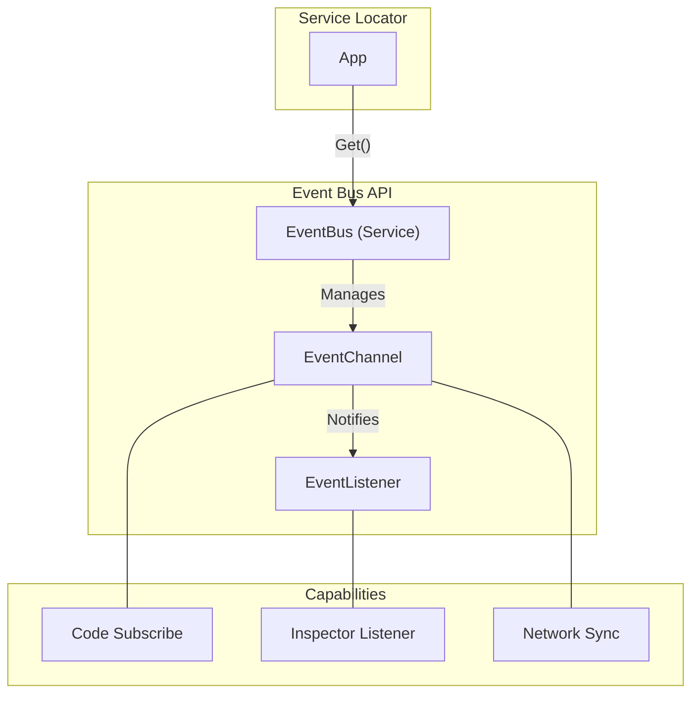
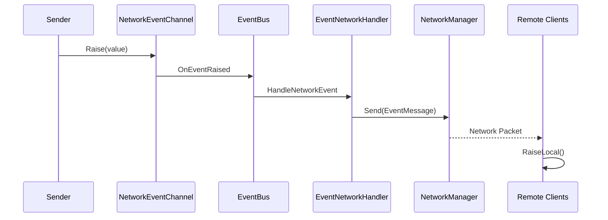

# Event Bus System

A unified, thread-safe event system for Unity. Works via **code**, **inspector**, or **network**.

---

## Table of Contents

1. [Features](#1-features)
2. [Quick Start](#2-quick-start)
3. [Architecture](#3-architecture)
4. [Built-in Channels](#4-built-in-channels)
5. [Type-Based Events](#5-type-based-events)
6. [Custom Channels](#6-custom-channels)
7. [Auto-Subscribe Attribute](#7-auto-subscribe-attribute)
8. [Network Events](#8-network-events)
9. [Addressables Integration](#9-addressables-integration)
10. [API Reference](#10-api-reference)

---

## 1. Features

- **Channel-Based Events**: ScriptableObject channels for inspector-friendly setup
- **Type-Based Events**: Generic C# event structs for code-only events
- **Thread-Safe**: All operations are lock-protected
- **Network Ready**: Built-in network event channels with target routing
- **Inspector Listeners**: MonoBehaviour listeners with UnityEvent responses
- **Auto-Subscribe**: `[SubscribeTo]` attribute for clean subscription
- **Addressables**: EventChannels auto-registered for dynamic loading

---

## 2. Quick Start

### 2.1 Via Code (Channel-Based)

```csharp
using UnityEngine;
using Eraflo.Catalyst;
using Eraflo.Catalyst.Events;

public class ScoreManager : MonoBehaviour
{
    [SerializeField] private IntEventChannel _onScoreChanged;
    
    private int _score;
    
    void OnEnable()
    {
        _onScoreChanged.Subscribe(OnScoreChanged);
    }
    
    void OnDisable()
    {
        _onScoreChanged.Unsubscribe(OnScoreChanged);
    }
    
    void OnScoreChanged(int newScore)
    {
        Debug.Log($"Score changed to: {newScore}");
    }
    
    public void AddScore(int points)
    {
        _score += points;
        _onScoreChanged.Raise(_score);
    }
}
```

### 2.2 Via Inspector

1. **Create Channel**: Right-click → Create → Catalyst → Events → [Type] Channel
2. **Add Listener**: Add Component → Events → [Type] Channel Listener
3. **Configure**: Drag channel asset, set up UnityEvent response
4. **Raise**: Call `channel.Raise()` from any script

### 2.3 Via EventBus Service

```csharp
using UnityEngine;
using Eraflo.Catalyst;
using Eraflo.Catalyst.Events;

public class EventBusExample : MonoBehaviour
{
    [SerializeField] private IntEventChannel _scoreChannel;
    
    void Start()
    {
        EventBus bus = App.Get<EventBus>();
        
        // Subscribe via EventBus
        bus.Subscribe(_scoreChannel, OnScore);
    }
    
    void OnDestroy()
    {
        EventBus bus = App.Get<EventBus>();
        bus.Unsubscribe(_scoreChannel, OnScore);
    }
    
    void OnScore(int score)
    {
        Debug.Log($"Score: {score}");
    }
}
```

---

## 3. Architecture



### Safety Features

| Feature | Implementation |
|---------|----------------|
| **Thread-safe** | `lock` on all dictionary operations |
| **Async-safe** | Copy subscribers before iteration |
| **Editor-safe** | Raise button disabled outside Play mode |

---

## 4. Built-in Channels

### 4.1 Local Channels

| Type | Channel | Listener |
|------|---------|----------|
| void | `EventChannel` | `EventChannelListener` |
| int | `IntEventChannel` | `IntEventChannelListener` |
| float | `FloatEventChannel` | `FloatEventChannelListener` |
| string | `StringEventChannel` | `StringEventChannelListener` |
| bool | `BoolEventChannel` | `BoolEventChannelListener` |
| Vector3 | `Vector3EventChannel` | `Vector3EventChannelListener` |

### 4.2 Network Channels

| Type | Channel |
|------|---------|
| void | `NetworkEventChannel` |
| int | `NetworkIntEventChannel` |
| float | `NetworkFloatEventChannel` |
| string | `NetworkStringEventChannel` |
| bool | `NetworkBoolEventChannel` |
| Vector3 | `NetworkVector3EventChannel` |

---

## 5. Type-Based Events

For internal system events that don't need inspector visibility.

### 5.1 Define and Use

```csharp
using UnityEngine;
using Eraflo.Catalyst;
using Eraflo.Catalyst.Events;

// Define event as struct
public struct PlayerLevelUpEvent
{
    public int NewLevel;
    public int SkillPoints;
}

public class LevelSystem : MonoBehaviour
{
    private EventBus _eventBus;
    
    void Start()
    {
        _eventBus = App.Get<EventBus>();
        _eventBus.Subscribe<PlayerLevelUpEvent>(OnLevelUp);
    }
    
    void OnDestroy()
    {
        _eventBus?.Unsubscribe<PlayerLevelUpEvent>(OnLevelUp);
    }
    
    void OnLevelUp(PlayerLevelUpEvent e)
    {
        Debug.Log($"Level up! New level: {e.NewLevel}, Skill points: {e.SkillPoints}");
    }
    
    public void GainLevel()
    {
        _eventBus.Publish(new PlayerLevelUpEvent 
        { 
            NewLevel = 10, 
            SkillPoints = 3 
        });
    }
}
```

### 5.2 System Events

| Event | Description |
|-------|-------------|
| `CommandExecutedEvent` | After command execution |
| `CommandUndoneEvent` | After undo |
| `CommandRedoneEvent` | After redo |
| `TimerSyncEvent` | Timer network sync |

---

## 6. Custom Channels

### 6.1 Create Channel Type

```csharp
using UnityEngine;
using Eraflo.Catalyst.Events;

[CreateAssetMenu(menuName = "Catalyst/Events/Player Data Channel")]
public class PlayerDataChannel : EventChannel<PlayerData> { }

[System.Serializable]
public struct PlayerData
{
    public string Name;
    public int Score;
    public Vector3 Position;
}
```

### 6.2 Create Listener (Optional)

```csharp
using Eraflo.Catalyst.Events;

public class PlayerDataChannelListener : EventChannelListener<PlayerDataChannel, PlayerData> { }
```

### 6.3 Use Custom Channel

```csharp
using UnityEngine;
using Eraflo.Catalyst.Events;

public class PlayerTracker : MonoBehaviour
{
    [SerializeField] private PlayerDataChannel _onPlayerUpdated;
    
    void OnEnable()
    {
        _onPlayerUpdated.Subscribe(OnPlayerUpdated);
    }
    
    void OnDisable()
    {
        _onPlayerUpdated.Unsubscribe(OnPlayerUpdated);
    }
    
    void OnPlayerUpdated(PlayerData data)
    {
        Debug.Log($"Player {data.Name} at {data.Position} with score {data.Score}");
    }
    
    public void UpdatePlayer(string name, int score, Vector3 pos)
    {
        _onPlayerUpdated.Raise(new PlayerData 
        { 
            Name = name, 
            Score = score, 
            Position = pos 
        });
    }
}
```

---

## 7. Auto-Subscribe Attribute

Simplify subscription with `[SubscribeTo]` attribute—no OnEnable/OnDisable needed.

```csharp
using UnityEngine;
using Eraflo.Catalyst.Events;

public class PlayerUI : EventSubscriber  // Inherit from EventSubscriber
{
    [SerializeField] private IntEventChannel _onHealthChanged;
    [SerializeField] private EventChannel _onPlayerDied;
    [SerializeField] private UnityEngine.UI.Slider _healthBar;
    [SerializeField] private GameObject _gameOverScreen;

    [SubscribeTo(nameof(_onHealthChanged))]
    void OnHealthChanged(int health)
    {
        _healthBar.value = health;
    }

    [SubscribeTo(nameof(_onPlayerDied))]
    void OnPlayerDied()
    {
        _gameOverScreen.SetActive(true);
    }
}
```

---

## 8. Network Events

### 8.1 Configuration

| Property | Description |
|----------|-------------|
| `EnableNetwork` | Send over network |
| `NetworkTarget` | `All`, `Others`, `Server`, `Clients` |
| `RaiseLocally` | Also trigger locally |

### 8.2 Usage

```csharp
using UnityEngine;
using Eraflo.Catalyst.Events;
using Eraflo.Catalyst.Networking;

public class NetworkEventExample : MonoBehaviour
{
    [SerializeField] private NetworkIntEventChannel _onDamageDealt;
    
    void OnEnable()
    {
        _onDamageDealt.Subscribe(OnDamage);
    }
    
    void OnDisable()
    {
        _onDamageDealt.Unsubscribe(OnDamage);
    }
    
    void OnDamage(int damage)
    {
        Debug.Log($"Damage received: {damage}");
    }
    
    public void DealDamage(int amount)
    {
        // Use default target from inspector
        _onDamageDealt.Raise(amount);
        
        // Or override target at runtime
        _onDamageDealt.Raise(amount, NetworkTarget.Others);
    }
    
    public void DealDamageLocalOnly(int amount)
    {
        // Local only (no network)
        _onDamageDealt.RaiseLocal(amount);
    }
}
```

### 8.3 Network Flow



---

## 9. Addressables Integration

EventChannels are auto-registered to Addressables when created.

**Address format**: `Events/{Type}/{AssetName}` (e.g., `Events/Int/OnScoreChanged`)

### 9.1 Dynamic Loading

```csharp
using UnityEngine;
using Eraflo.Catalyst.Events;
using System.Collections.Generic;

public class ModLoader : MonoBehaviour
{
    private List<IntEventChannel> _loadedEvents = new List<IntEventChannel>();
    
    public void LoadModEvent(string address)
    {
        EventChannelLoader.LoadAsync<IntEventChannel>(address, channel =>
        {
            if (channel != null)
            {
                _loadedEvents.Add(channel);
                channel.Subscribe(OnModEvent);
                Debug.Log($"Loaded: {address}");
            }
        });
    }
    
    void OnModEvent(int value)
    {
        Debug.Log($"Mod event: {value}");
    }
}
```

---

## 10. API Reference

### EventBus (Service)

**Channel-Based:**
| Method | Description |
|--------|-------------|
| `Subscribe(channel, callback)` | Subscribe to channel |
| `Unsubscribe(channel, callback)` | Unsubscribe from channel |

**Type-Based:**
| Method | Description |
|--------|-------------|
| `Subscribe<T>(callback)` | Subscribe to event type |
| `Unsubscribe<T>(callback)` | Unsubscribe from type |
| `Publish<T>(event)` | Broadcast event |

**Utility:**
| Method | Description |
|--------|-------------|
| `GetSubscriberCount(key)` | Get subscriber count |
| `Clear()` | Clear all subscriptions |
| `Clear(key)` | Clear specific channel/type |

### EventChannel / EventChannel<T>

| Method | Description |
|--------|-------------|
| `Raise()` / `Raise(value)` | Notify subscribers |
| `Subscribe(callback)` | Add subscriber |
| `Unsubscribe(callback)` | Remove subscriber |

### NetworkEventChannel / NetworkEventChannel<T>

| Property | Description |
|----------|-------------|
| `EnableNetwork` | Network sync enabled |
| `NetworkTarget` | Target recipients |
| `RaiseLocally` | Also trigger locally |

| Method | Description |
|--------|-------------|
| `Raise()` / `Raise(value)` | Raise with network |
| `Raise(value, target)` | Override target |
| `RaiseLocal()` | Local only |

---

## See Also

- [Networking](Networking.md): Network event routing
- [Command System](CommandSystem.md): Command events
- [Service Locator](../Core/ServiceLocator.md): Accessing EventBus
