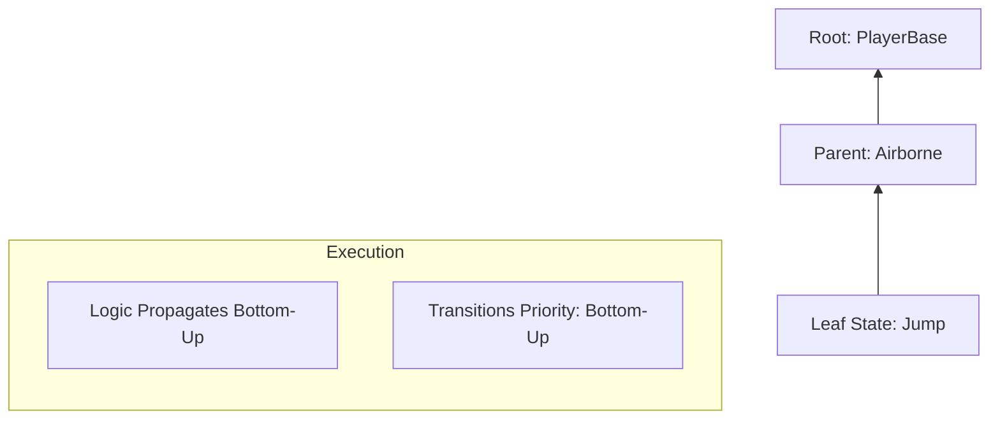
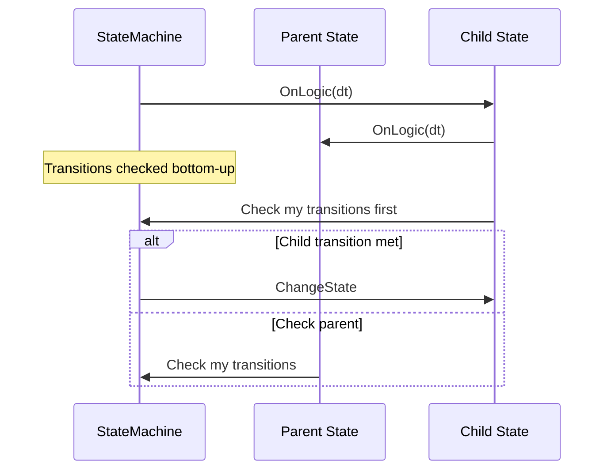

# Hierarchical Finite State Machine (HFSM)

A powerful, hierarchical state machine for complex AI and gameplay logic. Supports nesting, Chronos time-scaling, async operations, and networking.

---

## Table of Contents

1. [Features](#1-features)
2. [Quick Start](#2-quick-start)
3. [Architecture](#3-architecture)
4. [State Lifecycle](#4-state-lifecycle)
5. [Transitions](#5-transitions)
6. [Hierarchical Execution](#6-hierarchical-execution)
7. [Async States](#7-async-states)
8. [Blackboard Integration](#8-blackboard-integration)
9. [Networking](#9-networking)
10. [HFSMSchedulerService](#10-hfsmschedulerservice)
11. [API Reference](#11-api-reference)

---

## 1. Features

- **Hierarchical States**: Nested states share logic and transitions
- **Bottom-Up Execution**: Child states have priority for logic and transitions
- **Chronos Integration**: Per-state TimeChannel for time-scaled logic
- **Zero-Alloc Transitions**: Pre-cached state paths at init
- **Async Safe**: `ExitToken` for cancellable async operations
- **Blackboard Access**: Read/write shared data from any state
- **Network Sync**: Authority-aware state synchronization

---

## 2. Quick Start

### 2.1 Complete Example

```csharp
using UnityEngine;
using Eraflo.Catalyst.HFSM;

public class PlayerStateMachine : MonoBehaviour
{
    private StateMachine _hfsm;
    
    void Start()
    {
        _hfsm = new StateMachine();
        
        // Create states
        var idle = new IdleState();
        var run = new RunState();
        var jump = new JumpState();
        
        // Add transitions
        idle.AddTransition(new Transition(run, () => Input.GetAxis("Horizontal") != 0));
        run.AddTransition(new Transition(idle, () => Input.GetAxis("Horizontal") == 0));
        idle.AddTransition(new Transition(jump, () => Input.GetKeyDown(KeyCode.Space)));
        run.AddTransition(new Transition(jump, () => Input.GetKeyDown(KeyCode.Space)));
        jump.AddTransition(new Transition(idle, () => IsGrounded()));
        
        // Set root and start
        _hfsm.SetRootState(idle);
        _hfsm.Start();
    }
    
    void Update()
    {
        _hfsm.Update();
    }
    
    void FixedUpdate()
    {
        _hfsm.FixedUpdate();
    }
    
    bool IsGrounded() => Physics.Raycast(transform.position, Vector3.down, 0.1f);
}
```

### 2.2 Custom State

```csharp
using UnityEngine;
using Eraflo.Catalyst.HFSM;

public class IdleState : StateBase
{
    public IdleState() : base("Idle") { }
    
    public override void OnEnter()
    {
        base.OnEnter(); // Required for ExitToken
        Debug.Log("Entered Idle");
    }
    
    public override void OnLogic(float dt)
    {
        // Called every Update with time-scaled dt
    }
    
    public override void OnExit()
    {
        base.OnExit(); // Required for ExitToken cleanup
        Debug.Log("Left Idle");
    }
}
```

---

## 3. Architecture





---

## 4. State Lifecycle

| Method | Description |
|--------|-------------|
| `OnEnter()` | Called when entering state. Call `base.OnEnter()` for ExitToken |
| `OnLogic(dt)` | Called every Update with time-scaled delta time |
| `OnFixedLogic(dt)` | Called every FixedUpdate with time-scaled delta time |
| `OnExit()` | Called when leaving state. Call `base.OnExit()` for cleanup |

### Properties

| Property | Type | Description |
|----------|------|-------------|
| `Name` | `string` | State identifier |
| `StateDuration` | `float` | Time spent in current state |
| `TimeChannel` | `string` | Chronos channel (default: "World") |
| `Machine` | `StateMachine` | Parent machine reference |
| `Parent` | `StateBase` | Parent state in hierarchy |
| `Children` | `List<StateBase>` | Child states |
| `ExitToken` | `CancellationToken` | Cancelled when state exits |

---

## 5. Transitions

### 5.1 Basic Transitions

```csharp
using Eraflo.Catalyst.HFSM;

public class SetupTransitions
{
    void Setup()
    {
        var idle = new IdleState();
        var attack = new AttackState();
        
        // Simple condition
        idle.AddTransition(new Transition(attack, () => Input.GetMouseButtonDown(0)));
        
        // Time-based (using StateDuration)
        attack.AddTransition(new Transition(idle, () => attack.StateDuration > 0.5f));
    }
}
```

### 5.2 Using StateBuilder

```csharp
using Eraflo.Catalyst.HFSM;

public class FluentExample
{
    void Setup()
    {
        var idle = new IdleState();
        var run = new RunState();
        
        new StateBuilder(idle)
            .AddTransition(run, () => IsMoving())
            .Build();
        
        new StateBuilder(run)
            .AddTransition(idle, () => !IsMoving())
            .Build();
    }
    
    bool IsMoving() => Input.GetAxis("Horizontal") != 0;
}
```

---

## 6. Hierarchical Execution

### 6.1 Parent-Child Relationship

```csharp
using UnityEngine;
using Eraflo.Catalyst.HFSM;

// Parent handles shared logic
public class GroundedState : StateBase
{
    public GroundedState() : base("Grounded") { }
    
    public override void OnLogic(float dt)
    {
        // Shared for all grounded states (Idle, Run, Crouch)
        ApplyGravity();
        HandleMovementInput();
    }
}

// Children handle specific behavior
public class IdleState : StateBase
{
    public IdleState() : base("Idle") { }
    
    public override void OnLogic(float dt)
    {
        PlayIdleAnimation();
    }
}

public class RunState : StateBase
{
    public RunState() : base("Run") { }
    
    public override void OnLogic(float dt)
    {
        PlayRunAnimation();
    }
}

// Setup hierarchy
public class HierarchySetup
{
    void Setup()
    {
        var grounded = new GroundedState();
        var idle = new IdleState();
        var run = new RunState();
        
        // Add as children
        grounded.AddChild(idle);
        grounded.AddChild(run);
        
        // Transitions between siblings
        idle.AddTransition(new Transition(run, () => IsMoving()));
        run.AddTransition(new Transition(idle, () => !IsMoving()));
        
        // Parent-level transition (interrupts any child)
        grounded.AddTransition(new Transition(airborne, () => !IsGrounded()));
    }
}
```

---

## 7. Async States

Use `ExitToken` for safe async operations that auto-cancel on state exit.

```csharp
using System.Threading.Tasks;
using UnityEngine;
using Eraflo.Catalyst.HFSM;

public class DashState : StateBase
{
    private Rigidbody _rb;
    private float _dashForce = 20f;
    
    public DashState(Rigidbody rb) : base("Dash") 
    { 
        _rb = rb;
    }
    
    public override async void OnEnter()
    {
        base.OnEnter(); // IMPORTANT: creates ExitToken
        
        // Apply dash
        _rb.AddForce(Vector3.forward * _dashForce, ForceMode.Impulse);
        
        try
        {
            // Wait 200ms (auto-cancels if we exit early)
            await Task.Delay(200, ExitToken);
            
            // Stop dash (only runs if we're still in this state)
            _rb.velocity = Vector3.zero;
        }
        catch (TaskCanceledException)
        {
            // State was exited early - normal
        }
    }
    
    public override void OnExit()
    {
        base.OnExit(); // IMPORTANT: cancels ExitToken
    }
}
```

---

## 8. Blackboard Integration

States have built-in access to the global Blackboard.

```csharp
using UnityEngine;
using Eraflo.Catalyst.HFSM;

public class AttackState : StateBase
{
    public AttackState() : base("Attack") { }
    
    public override void OnEnter()
    {
        base.OnEnter();
        
        // Read from blackboard
        Transform target = GetBlackboardValue<Transform>("Target");
        int damage = GetBlackboardValue("AttackDamage", 10);
        
        if (target != null)
        {
            DealDamage(target, damage);
        }
    }
    
    public override void OnExit()
    {
        base.OnExit();
        
        // Write cooldown to blackboard
        SetBlackboardValue("LastAttackTime", Time.time);
    }
}
```

---

## 9. Networking

### 9.1 Registration

```csharp
using UnityEngine;
using Eraflo.Catalyst;
using Eraflo.Catalyst.HFSM;
using Eraflo.Catalyst.HFSM.Networking;
using Eraflo.Catalyst.Networking;

public class NetworkedAI : MonoBehaviour
{
    private StateMachine _hfsm;
    
    void Start()
    {
        _hfsm = new StateMachine();
        // ... setup states ...
        
        // Register for network sync
        uint netId = this.GetNetworkId();
        App.Get<HfsmNetworkHandler>().RegisterMachine(netId, _hfsm);
    }
}
```

### 9.2 Authority Modes

| Mode | Behavior | Use Case |
|------|----------|----------|
| `ServerAuthoritative` | Server controls state, clients forced | Combat AI, NPCs |
| `ClientAuthoritative` | Owner client controls, server relays | Player movement |

```csharp
// Set authority mode
_hfsm.Authority = AuthorityMode.ClientAuthoritative;
```

---

## 10. HFSMSchedulerService

`HFSMSchedulerService` is an optional Catalyst service that applies distance-based LOD to state machine updates. Unlike the BT scheduler, there is no MonoBehaviour driver — you must register and unregister your state machines manually.

| Tier | Distance | Tick Frequency |
|------|----------|----------------|
| Tier 0 | < 15 m | Every frame |
| Tier 1 | 15 – 50 m | Every 3 frames |
| Tier 2 | > 50 m | Every 10 frames |

### 10.1 Registration

```csharp
using UnityEngine;
using Eraflo.Catalyst;
using Eraflo.Catalyst.HFSM;
using Eraflo.Catalyst.HFSM.Scheduling;

public class AIAgent : MonoBehaviour
{
    private StateMachine _fsm;

    private void OnEnable()
    {
        _fsm = new StateMachine(...);
        _fsm.Start();
        App.Get<HFSMSchedulerService>()?.Register(_fsm, transform);
    }

    private void OnDisable()
    {
        App.Get<HFSMSchedulerService>()?.Unregister(_fsm);
    }
    // Note: do NOT call _fsm.Update() manually when registered with the scheduler
}
```

`StateMachine` handles its own delta time via ChronosManager channels — the scheduler just decides when to call `Update()`.

### 10.2 Configuration

```csharp
var scheduler = App.Get<HFSMSchedulerService>();
scheduler.Tier1Distance = 20f;
scheduler.Tier2Distance = 60f;
scheduler.MaxMsPerFrame = 3f;
```

---

## 11. API Reference

### StateMachine

| Member | Description |
|--------|-------------|
| `ActiveState` | Current leaf state |
| `ActivePath` | Full path from root to leaf |
| `Authority` | Network authority mode |
| `SetRootState(state)` | Set the root state |
| `Start()` | Begin execution |
| `Stop()` | Stop and exit all states |
| `Update()` | Call in MonoBehaviour.Update |
| `FixedUpdate()` | Call in MonoBehaviour.FixedUpdate |
| `ChangeStateByPath(path)` | Change state by path string |
| `FindStateByPath(path)` | Find state by path |

### StateBase

| Member | Description |
|--------|-------------|
| `Name` | State name |
| `StateDuration` | Time in current state |
| `TimeChannel` | Chronos channel |
| `ExitToken` | Cancellation token |
| `OnEnter()` | Override for enter logic |
| `OnLogic(dt)` | Override for update logic |
| `OnFixedLogic(dt)` | Override for fixed update |
| `OnExit()` | Override for exit logic |
| `AddTransition(t)` | Add outgoing transition |
| `AddChild(state)` | Add child state |
| `GetBlackboardValue<T>()` | Read from blackboard |
| `SetBlackboardValue<T>()` | Write to blackboard |

### Transition

| Member | Description |
|--------|-------------|
| `TargetState` | State to transition to |
| `Condition` | `Func<bool>` condition |

---

## See Also

- [Blackboard](../Core/Blackboard.md): Shared data
- [Chronos Manager](../Core/ChronosManager.md): Time scaling
- [Behaviour Tree](BehaviourTree.md): Alternative AI system
