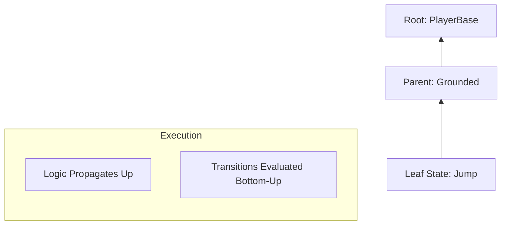

# Hierarchical Finite State Machine (HFSM)

The Catalyst **HFSM** module provides a powerful, hierarchical logic controller designed for complex entities. Unlike traditional FSMs, it supports **nesting**, allowing you to share logic and transitions across related states.

---

## Key Concepts

### 🌳 Hierarchical Execution (Bottom-Up)
Catalyst HFSM uses a **Bottom-Up** execution model for both logic and transitions:
1. **Logic (`OnLogic`)**: Every frame, the machine executes the logic of the **active leaf state**, then propagates upwards to its parents. This allows a `Parent` state to handle shared logic (like gravity or input movement) while the `Child` handles specific animations or effects.
2. **Transitions**: Transitions are evaluated starting from the leaf. If a child state's transition is met, it takes priority. If not, the parent's transitions are checked.

### 🕒 Time Scaling & Chronos
States are natively integrated with the **Chronos** module. Each state tracks its own `StateDuration`, which is automatically scaled by the `TimeChannel` assigned to the machine or local state overrides.

---

## 🚀 Performance & Optimization

The HFSM is built for high-performance gameplay:
- **Zero-Alloc Transitions**: State paths are pre-cached during initialization. Switching states does not allocate `List<T>` or `Array` at runtime.
- **Service Caching**: The `StateMachine` caches `ChronosManager` and `EventBus` internally to avoid overhead in `Update`.
- **Async Ready**: Native support for `CancellationToken` (via `ExitToken`) allows safe `async/await` patterns without memory leaks or race conditions.

---

## Architecture Overview



---

## Quick Start

### 1. Fluent Configuration
Use the `StateBuilder` for rapid prototyping.

```csharp
var idle = new HfsmCallbackState("Idle");
var run = new HfsmCallbackState("Run", (dt) => Move(dt));

new StateBuilder(idle)
    .AddTransition(run, () => App.Get<InputManager>().IsPressed("Move"))
    .Build();

fsm.SetRootState(idle);
fsm.Start();
```

### 2. Async States
Safe async operations in `OnEnter` using `ExitToken`.

```csharp
public class DashState : StateBase
{
    public override async void OnEnter()
    {
        ApplyDashImpulse();
        // Automatically stops if we transition out during delay
        await Task.Delay(200, ExitToken);
        StopDash();
    }
}
```

---

## Networking & Authority

The **HfsmNetworkHandler** synchronizes the active state path of any registered machine.

### Registration
```csharp
// In your entity initialization (requires Eraflo.Catalyst.Networking)
using Eraflo.Catalyst.Networking;

// works on GameObject or Component (this)
uint netId = this.GetNetworkId(); 
App.Get<HfsmNetworkHandler>().RegisterMachine(netId, myFsm);
```

### Authority Modes
| Mode | Behavior | Use Case |
| :--- | :--- | :--- |
| **ServerAuthoritative** | Only the server sends state changes. Clients are forced. | Competitive Combat, AI. |
| **ClientAuthoritative** | The owner client sends state changes. Server relays. | Player Movement (Low Latency). |

---

## Best Practices

1. **State Granularity**: Keep states focused. Use hierarchy to share code rather than giant `switch` statements.
2. **Blackboard for Memory**: Use `GetBlackboardValue` to share data between unrelated machines or to persist "cooldown" states.
3. **Transition Priority**: Remember that children have the first "say" in transitions. Use parent transitions for global "interrupts" (like `OnDeath`).
