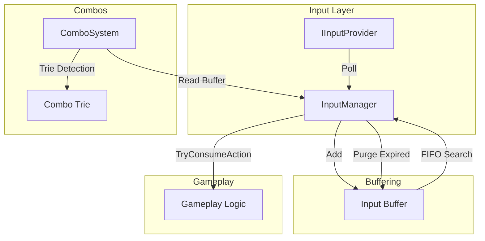
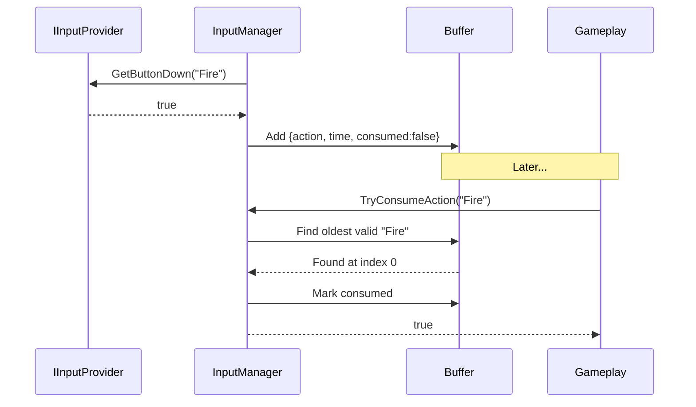
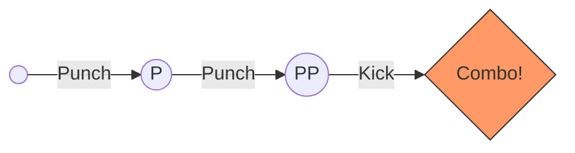
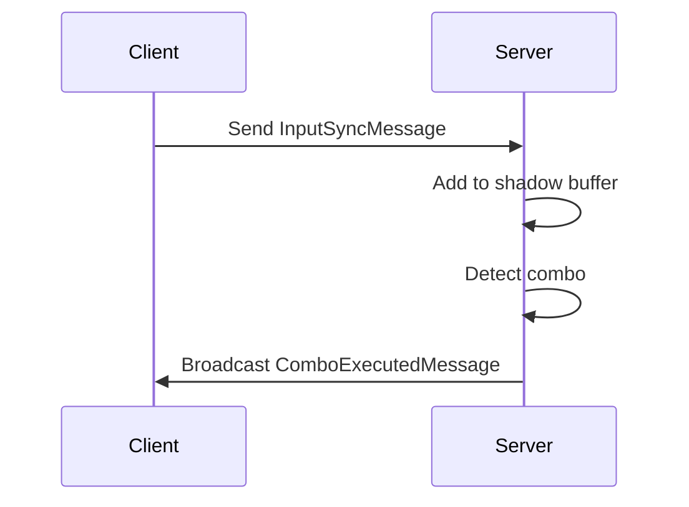

# Input System

A robust Input Buffering and Combo System for action games. Provides predictable input handling, sequence detection, and network synchronization.

---

## Table of Contents

1. [Features](#1-features)
2. [Quick Start](#2-quick-start)
3. [Architecture](#3-architecture)
4. [Input Buffering](#4-input-buffering)
5. [Combo System](#5-combo-system)
6. [Providers](#6-providers)
7. [Networking](#7-networking)
8. [Advanced Features](#8-advanced-features)
9. [API Reference](#9-api-reference)

---

## 1. Features

- **Input Buffering**: FIFO buffer retains inputs during lag or animations
- **Combo Detection**: Trie-based O(N) sequence recognition
- **Provider System**: Swap between Legacy Input, New Input System, or Virtual
- **Async Support**: `TryConsumeActionAsync` for input tolerance
- **Haptic Feedback**: Controller vibration API
- **Network Sync**: Client or Server authoritative modes
- **AI Simulation**: `VirtualInputProvider` for testing and AI

---

## 2. Quick Start

### 2.1 Register and Consume Actions

```csharp
using UnityEngine;
using Eraflo.Catalyst;
using Eraflo.Catalyst.InputSystem;

public class PlayerController : MonoBehaviour
{
    private InputManager _input;
    
    void Start()
    {
        _input = App.Get<InputManager>();
        
        // Register actions to track
        _input.RegisterAction("Jump");
        _input.RegisterAction("Attack");
        _input.RegisterAction("Dash");
    }
    
    void Update()
    {
        // Consume from buffer (removes if found)
        if (_input.TryConsumeAction("Jump"))
        {
            PerformJump();
        }
        
        if (_input.TryConsumeAction("Attack"))
        {
            PerformAttack();
        }
    }
    
    void PerformJump() { /* ... */ }
    void PerformAttack() { /* ... */ }
}
```

### 2.2 Setup Combos

1. Create **Combo Database**: Right-click → Create → Catalyst → Input → Combo Database
2. Create **Combo Definition** assets for sequences
3. Assign definitions to database
4. Initialize in code:

```csharp
using UnityEngine;
using Eraflo.Catalyst.InputSystem;
using Eraflo.Catalyst.InputSystem.Combos;

public class CombatSystem : MonoBehaviour
{
    [SerializeField] private ComboDatabase _database;
    
    private ComboSystem _combos;
    
    void Start()
    {
        _combos = new ComboSystem(_database);
        _combos.OnComboExecuted += OnComboExecuted;
    }
    
    void OnComboExecuted(ComboDefinition combo)
    {
        Debug.Log($"Executed combo: {combo.ComboId}");
        ExecuteComboAction(combo.ComboId);
    }
    
    void ExecuteComboAction(string comboId) { /* ... */ }
}
```

---

## 3. Architecture



---

## 4. Input Buffering

### 4.1 How It Works

Inputs are stored with timestamps. When gameplay requests an action, the buffer searches from oldest to newest and marks consumed entries.



### 4.2 Buffer Duration

Configure in **Package Settings** → **Input** → **Buffer Duration** (default: 0.2s)

---

## 5. Combo System

### 5.1 Trie-Based Detection

Combos use a prefix tree for O(N) lookup where N is sequence length.



### 5.2 Sequence Timeout

The combo resets if no valid input within the window. Uses Timer system internally.

### 5.3 Async Wait for Combo

```csharp
using System.Threading;
using System.Threading.Tasks;
using UnityEngine;
using Eraflo.Catalyst.InputSystem;
using Eraflo.Catalyst.InputSystem.Combos;

public class UltimateAbility : MonoBehaviour
{
    private ComboSystem _combos;
    private CancellationTokenSource _cts;
    
    async void Start()
    {
        _cts = new CancellationTokenSource();
        
        // Wait for specific combo
        var combo = await _combos.WaitForComboAsync("UltimateMove", _cts.Token);
        
        if (combo != null)
        {
            ExecuteUltimate();
        }
    }
    
    void OnDestroy()
    {
        _cts?.Cancel();
        _cts?.Dispose();
    }
    
    void ExecuteUltimate() { /* ... */ }
}
```

---

## 6. Providers

### 6.1 Built-in Providers

| Provider | Description |
|----------|-------------|
| `LegacyInputProvider` | Unity's old Input class |
| `NewInputSystemProvider` | Unity's new Input System |
| `VirtualInputProvider` | For AI/testing |

### 6.2 Switching Providers

```csharp
using Eraflo.Catalyst;
using Eraflo.Catalyst.InputSystem;

public class InputConfig
{
    void SetupVirtualInput()
    {
        var input = App.Get<InputManager>();
        var virtualProvider = new VirtualInputProvider();
        
        input.SetProvider(virtualProvider);
    }
}
```

### 6.3 AI Input Simulation

```csharp
using UnityEngine;
using Eraflo.Catalyst;
using Eraflo.Catalyst.InputSystem;

public class AIController : MonoBehaviour
{
    private VirtualInputProvider _virtualProvider;
    private InputManager _input;
    
    void Start()
    {
        _input = App.Get<InputManager>();
        _virtualProvider = new VirtualInputProvider();
        _input.SetProvider(_virtualProvider);
    }
    
    void SimulateAttack()
    {
        // Inject input into buffer
        _virtualProvider.TriggerButton("Attack");
    }
}
```

---

## 7. Networking

### 7.1 Authority Modes

| Mode | Description | Use Case |
|------|-------------|----------|
| **Client Authoritative** | Client detects combo, broadcasts result | Best feel, less secure |
| **Server Authoritative** | Client sends raw inputs, server validates | Most secure |

### 7.2 Network Flow (Server Authoritative)



### 7.3 Configuration

Configure in **Package Settings** → **Networking** → **Default Authority Mode**

---

## 8. Advanced Features

### 8.1 Async Input Tolerance

Wait for input when network jitter may delay packets:

```csharp
using UnityEngine;
using Eraflo.Catalyst;
using Eraflo.Catalyst.InputSystem;

public class TolerantInput : MonoBehaviour
{
    private InputManager _input;
    
    async void CheckJump()
    {
        _input = App.Get<InputManager>();
        
        // Wait up to 100ms for input
        bool success = await _input.TryConsumeActionAsync("Jump", 0.1f);
        
        if (success)
        {
            PerformJump();
        }
    }
    
    void PerformJump() { /* ... */ }
}
```

### 8.2 Haptic Feedback

```csharp
using Eraflo.Catalyst;
using Eraflo.Catalyst.InputSystem;

public class HapticExample
{
    void TriggerVibration()
    {
        var input = App.Get<InputManager>();
        
        // intensity (0-1), duration (seconds)
        input.Vibrate(0.5f, 0.2f);
    }
}
```

### 8.3 Input Remapping

```csharp
using Eraflo.Catalyst;
using Eraflo.Catalyst.InputSystem;

public class RemapExample
{
    void RemapJump()
    {
        var remapper = App.Get<InputRemapper>();
        
        // Remap Jump to A button
        remapper.RemapLegacy("Jump", "JoystickButton0");
    }
}
```

### 8.4 Debugging

Enable **Debug Mode** in Package Settings to see real-time buffer overlay.

---

## 9. API Reference

### InputManager (Service)

| Member | Description |
|--------|-------------|
| `RegisterAction(actionId)` | Track an action |
| `TryConsumeAction(actionId)` | Consume from buffer |
| `TryConsumeActionAsync(actionId, timeout)` | Async with tolerance |
| `Vibrate(intensity, duration)` | Haptic feedback |
| `SetProvider(provider)` | Switch input provider |
| `GetBuffer()` | Read-only buffer access |
| `CurrentDeviceType` | Keyboard/Gamepad/Virtual |

### ComboSystem

| Member | Description |
|--------|-------------|
| `OnComboExecuted` | Event when combo detected |
| `WaitForComboAsync(id, token)` | Async wait for combo |

### IInputProvider (Interface)

| Method | Description |
|--------|-------------|
| `GetButtonDown(name)` | Button pressed this frame |
| `GetButton(name)` | Button held |
| `GetAxis(name)` | Axis value |

---

## See Also

- [Settings Manager](../Core/SettingsManager.md): Persistent bindings
- [Chronos Manager](../Core/ChronosManager.md): Input timestamps
- [Networking](Networking.md): Network sync
