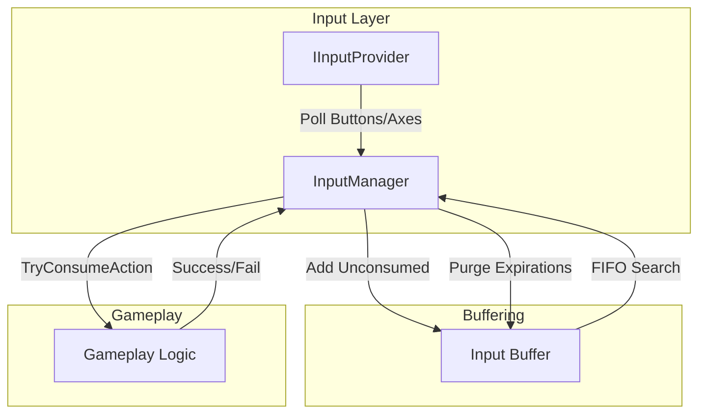
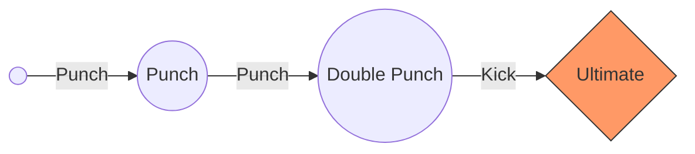
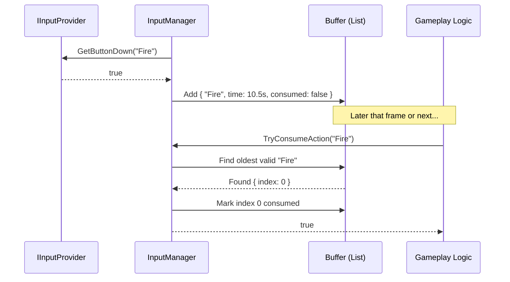
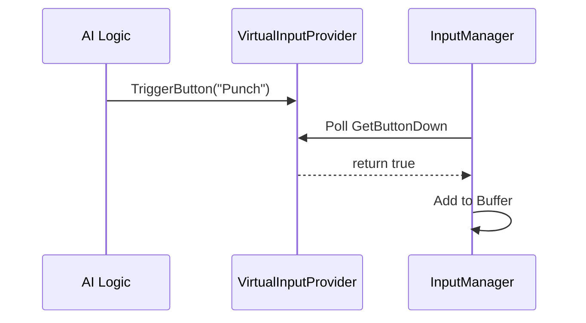
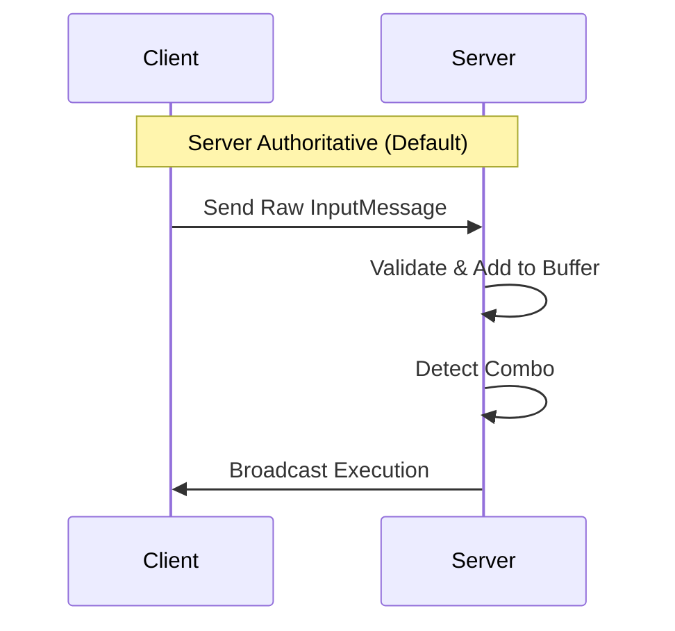

# Input System

A robust Input Buffering and Combo System designed for high-performance action games. It provides predictable input handling, sequence detection, and seamless network synchronization.

---

## Getting Started (Beginner)

### 1. Registration
The `InputManager` is a core service. It initializes automatically based on your `PackageSettings`. To start using it, register the actions you want to track:

```csharp
using Eraflo.Catalyst;

public class PlayerCombat : MonoBehaviour {
    void Start() {
        var input = App.Get<InputManager>();
        input.RegisterAction("Jump");
        input.RegisterAction("Punch");
    }
}
```

### 2. Consuming Input
Instead of polling Unity's raw input every frame in your logic, use `TryConsumeAction`. This checks if the input exists in the buffer (was pressed recently) and "consumes" it so it can't be used twice.

```csharp
void Update() {
    if (App.Get<InputManager>().TryConsumeAction("Jump")) {
        PerformJump();
    }
}
```

### 3. Setting up Combos
1. Create a **Combo Database** asset (Right-click → Create → Catalyst → Input → Combo Database).
2. Create **Combo Definition** assets for each sequence (e.g., "Fireball").
3. Assign the definitions to the database.
4. Initialize a `ComboSystem` in your script:

```csharp
_combos = new ComboSystem(myDatabase);
_combos.OnComboExecuted += combo => Debug.Log($"Executed: {combo.ComboId}");
```

---

## Architecture & Flow

### Input Buffering
The `InputManager` maintains a First-In-First-Out (FIFO) buffer of raw inputs. This allows the game to "remember" actions that occurred during a lag spike or while the player's character was in a non-interruptible state.



### Combo Detection (Trie)
Combos are detected using a Prefix Tree (Trie) for O(N) lookup efficiency, where N is the sequence length.



---

## Advanced Features

### Input Buffering Architecture
The `InputManager` maintains a `List<BufferedInput>` and polls the registered `IInputProvider` at a priority of 50 (after `ChronosManager`). 



### Trie-Based Combo Detection
The `ComboSystem` uses a Prefix Tree (Trie) for O(N) detection where N is the length of the current sequence. 

- **Sequence Reset**: Handled via the unified `Timer` module. Every valid input in a sequence restarts a `DelayTimer`. If the timer expires, the Trie pointer resets to root.
- **FIFO Consumption**: The buffer is processed from oldest to newest to ensure logical consistency in complex sequences.

### Network Synchronization & Authority
The `InputNetworkHandler` bridges the input system with Catalyst's networking module.

| Mode | Description |
|------|-------------|
| **Client Authoritative** | Client detects combo locally and broadcasts a `ComboExecutedMessage`. |
| **Server Authoritative** | Client sends raw inputs (`InputSyncMessage`). Server maintains a shadow `ComboSystem` per client, validates the sequence, and broadcasts the result. |

### Async Support
You can wait for specific combos using standard C# `Task`:

```csharp
var combo = await _combos.WaitForComboAsync("UltimateMove", token);
ExecuteUltimate(combo);
```

### Input Tolerance (Async)
For high-speed actions, use `TryConsumeActionAsync` to allow a small window of tolerance.

```csharp
// Wait up to 100ms for a "Jump" input
bool success = await input.TryConsumeActionAsync("Jump", 0.1f);
if (success) PerformHighJump();
```

### Haptic Feedback
Trigger controller vibrations easily:

```csharp
input.Vibrate(0.5f, 0.2s); // intensity, duration
```

### Input Remapping
The system integrates with `SettingsManager` for persistent bindings.

```csharp
var remapper = App.Get<InputRemapper>();
remapper.RemapLegacy("Jump", "JoystickButton0"); // Changes Jump to A button (Legacy)
```

### Debugging
Toggle **Enable Debugger** in `PackageSettings` to see a real-time overlay of the input buffer and detected devices in-game.

### Input Simulation (AI)
You can simulate inputs for AI or unit testing by using the `VirtualInputProvider`. This allows you to "inject" inputs into the buffer.



### Network Configuration
The system supports both Client and Server authoritative modes.



You can configure the authority model globally in **PackageSettings**:

1. Open **Project Settings > Eraflo Catalyst > Networking**.
2. Set **Default Authority Mode**:
    - **Server Authoritative** (Recommended): Client sends raw inputs, server validates and broadcasts execution. Most secure.
    - **Client Authoritative**: Client detects combo and broadcasts execution. Best feel, less secure.

> [!NOTE]
> The `InputNetworkHandler` automatically picks up this default setting, but you can also override it per-instance in code if needed.

### Configuration
Configure the system via **Project Settings > Eraflo Catalyst > Input**:
- **Input Provider**: Switch between `Legacy` and `InputSystem` (New).
- **Buffer Duration**: How long (in seconds) an input remains valid (default: 0.2s).
- **Authority Mode**: Global setting for network-aware input.
