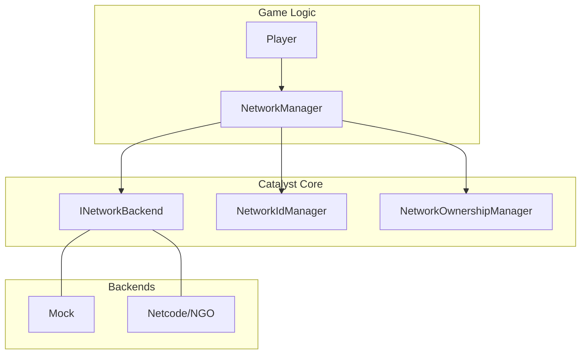

# Networking System

Eraflo.Catalyst provides a professional-grade, **backend-agnostic** networking abstraction. This module allows you to build complex multi-player experiences while remaining decoupled from any specific transport library.

---

## 1. Core Architecture

### 1.1 The Bridge Pattern
Catalyst functions as a high-level API bridge. Your game logic interacts with a unified interface, while the `INetworkBackend` handles the actual transmission (NGO, Mock, or custom).



### 1.2 Identification & NGO Integration
- **Deterministic ID**: Catalyst assigns internal IDs (`uint`) for state tracking. For pooled objects, this is managed by the server to avoid collisions.
- **NGO Coexistence**: If you use Unity Netcode (NGO) in parallel, an object will possess **two independent IDs**:
    1. The Catalyst ID (used for `NetworkProperty` and Collections).
    2. The NGO `NetworkObjectId` (used for `NetworkTransform` or NGO RPCs).
- **Mapping**: Catalyst's `NetcodeBackend` automatically handles the binding between these two systems during the spawn process.

---

## 2. Communication Patterns

### 2.1 Structured Messages (`INetworkMessage`)
Messages are binary-serialized for performance. They provide a strongly-typed way to communicate between peers.

```csharp
public struct DamageMessage : INetworkMessage {
    public int Amount;
    public void Serialize(BinaryWriter w) => w.Write(Amount);
    public void Deserialize(BinaryReader r) => Amount = r.ReadInt32();
}

// Sending
nm.Send(new DamageMessage { Amount = 10 }, NetworkTarget.Server);

// Receiving
nm.On<DamageMessage>(msg => ApplyDamage(msg.Amount));
```

---

## 3. State Synchronization

### 3.1 `NetworkProperty<T>`
A reactive property with **Client Prediction** and **Server Reconciliation**.
1. **Client**: Updates the value locally for instant visual feedback.
2. **Server**: Validates the new value. If invalid, the server sends a correction packet that "rolls back" the client's local state.

### 3.2 Delta-Synchronized Collections
Catalyst synchronizes only the **changes** (Deltas) rather than the entire collection.

| Collection | Key Events | Use Case |
| :--- | :--- | :--- |
| **`NetworkList<X>`** | `OnItemAdded`, `OnItemRemoved`, `OnItemSet`, `OnChanged` | Player lists, Skill bars. |
| **`NetworkDictionary<K,V>`** | `OnItemAdded`, `OnItemRemoved`, `OnItemSet`, `OnChanged` | Scoreboards, Inventories. |
| **`NetworkHashSet<X>`** | `OnItemAdded`, `OnItemRemoved`, `OnChanged` | Active Buffs, Team tags. |
| **`NetworkQueue/Stack<X>`** | `OnEnqueued/Pushed`, `OnDequeued/Popped` | Combat logs, Undo stacks. |

---

## 4. Lobby & Matchmaking

### 4.1 Custom Lobby Providers
Catalyst is provider-agnostic. You can integrate any service (Steam, Epic, Nakama) by implementing `ILobbyProvider`.

```csharp
public class MySteamProvider : ILobbyProvider {
    public string Name => "Steam";
    public async Task<LobbyResult> CreateLobby(LobbyOptions options) {
        // 1. Call Steamworks API
        // 2. Return result with JoinCode
        return LobbyResult.Ok(new LobbyInfo { Id = "XYZ", JoinCode = "12345" });
    }
    // Implement SearchLobbies, JoinLobby, LeaveLobby...
}
```

---

## 5. Lag Compensation & Input

Lag compensation in Catalyst is achieved through deep integration with the [InputSystem](InputSystem.md).

- **Timestamps**: The `InputNetworkHandler` automatically attaches the current `Chronos.AppTime` to every input sent by the client.
- **Historical Validation**: When the server receives an action, it can use this timestamp to "rewind" logic.
- **Consumption**: Use `InputManager.TryConsumeActionAsync()` on the server to handle incoming packets within a specific latency window.

---

## 6. Implementation Tutorials

### 6.1 Beginner: Global Scoreboard
A simple example of synchronizing a shared dictionary.

```csharp
// 1. Define the handler
public class ScoreboardHandler : MonoBehaviour {
    private NetworkDictionary<string, int> _scores;

    void Awake() {
        // Initialize as Server-Authoritative (Default)
        _scores = new NetworkDictionary<string, int>("GlobalScores", this.GetNetworkId());
        
        // Update UI when any score changes
        _scores.OnItemAdded += (name, val) => RefreshUI();
        _scores.OnItemSet += (name, old, @new) => RefreshUI();
    }

    public void AddPoints(string playerName, int points) {
        if (!App.Get<NetworkManager>().IsServer) return;
        _scores[playerName] = _scores.TryGetValue(playerName, out int s) ? s + points : points;
    }
}
```

### 6.2 Advanced: Latency-Compensated Melee
Using `Chronos` timestamps and `InputManager` for a "fair" combat system.

```csharp
// Client Side:
void OnAttackInput() {
    PlayAnimationLocally(); // Instant feedback
    nm.Send(new MeleeAttackMessage { 
        Timestamp = App.Get<ChronosManager>().AppTime 
    }, NetworkTarget.Server);
}

// Server Side:
void HandleAttack(MeleeAttackMessage msg, ulong senderId) {
    // 1. Validate the timestamp isn't too old (Anti-cheat)
    float latency = App.Get<ChronosManager>().AppTime - msg.Timestamp;
    if (latency > 0.5f) return; // Too much lag

    // 2. Perform distance check based on world state at msg.Timestamp
    if (CheckDistanceAtTime(senderId, msg.Timestamp)) {
        ApplyDamageToTarget();
    }
}
```

---

## 7. See Also
- [Input System](InputSystem.md): Details on input buffering and timestamps.
- [Pooling System](Pooling.md): Details on `SpawnNetworked()`.
- [Event Bus](EventBus.md): Network-aware event channels.
- [Timers](Timers.md): Explains how to use `MakeNetworked()`.
