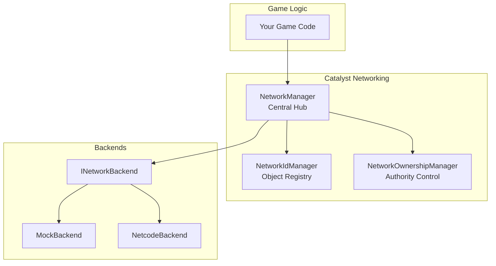
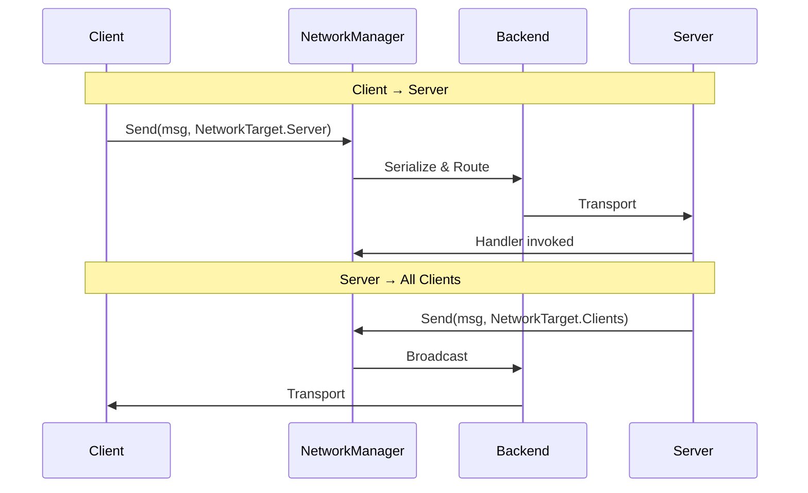
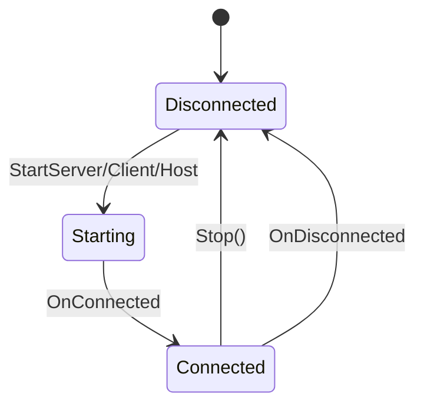
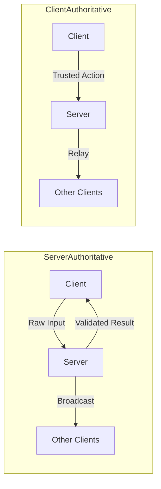
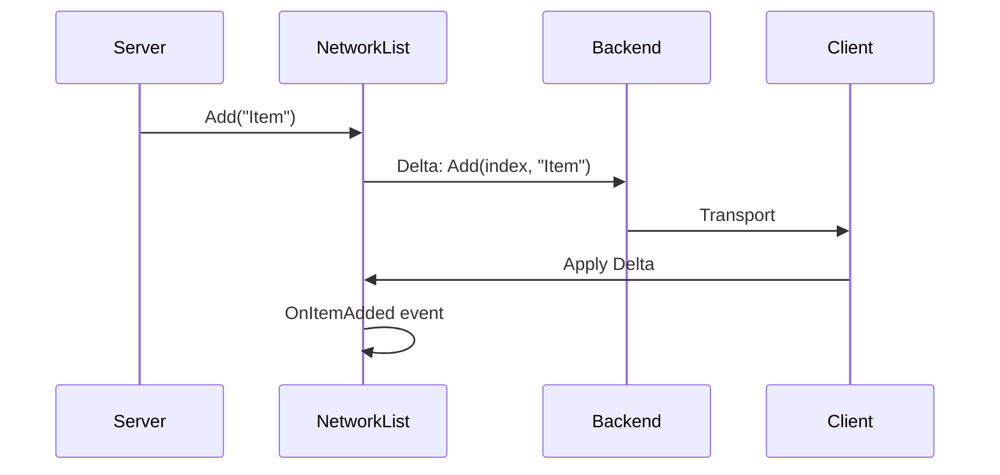
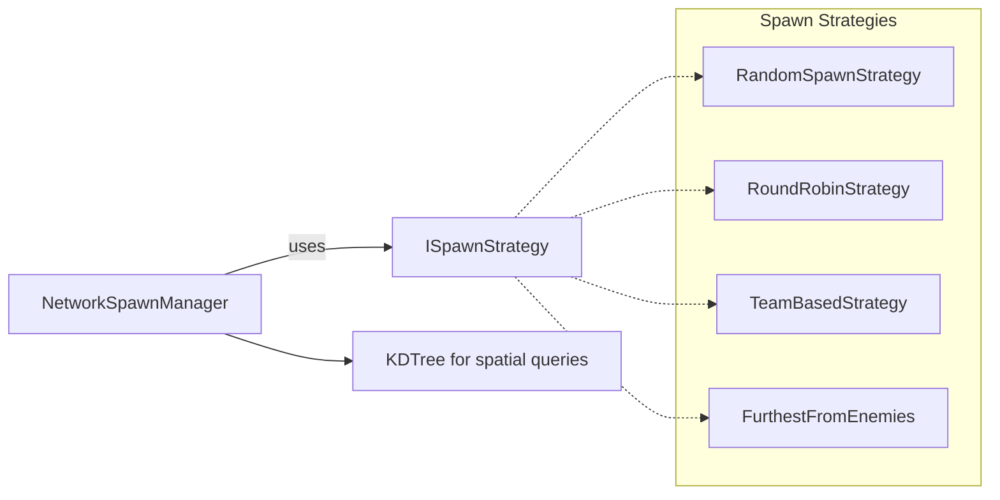
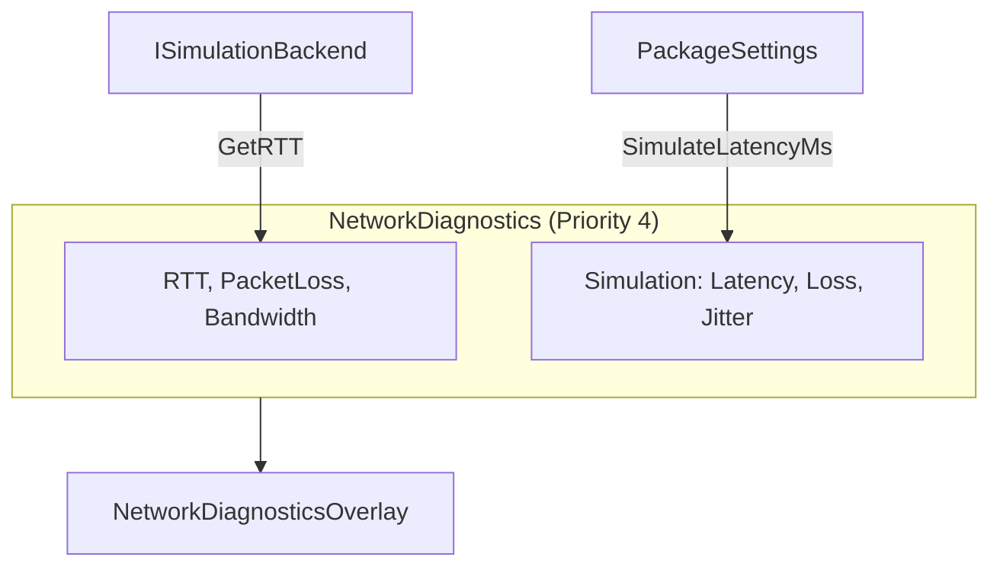
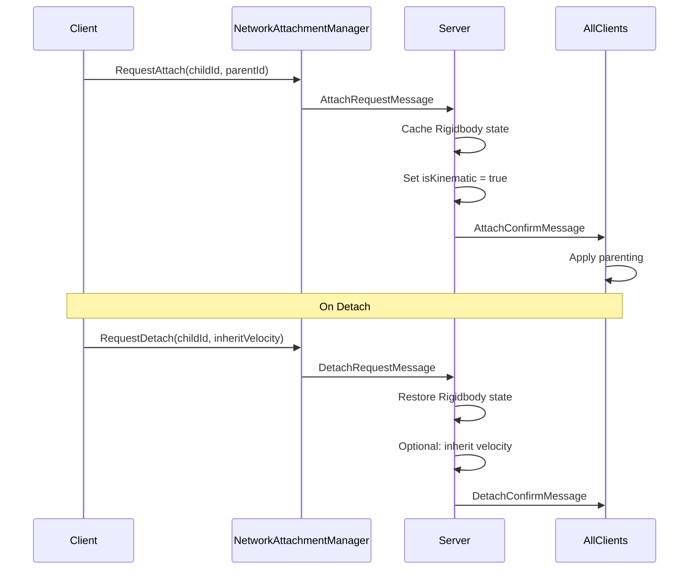
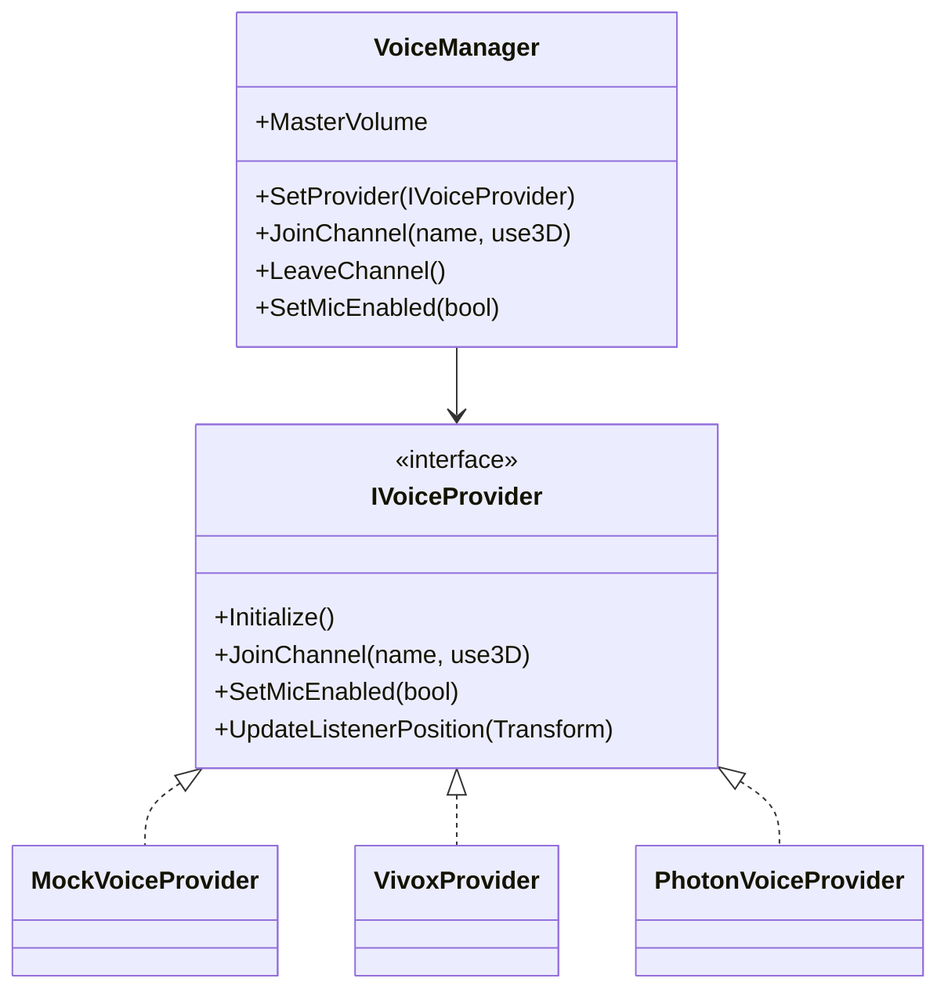
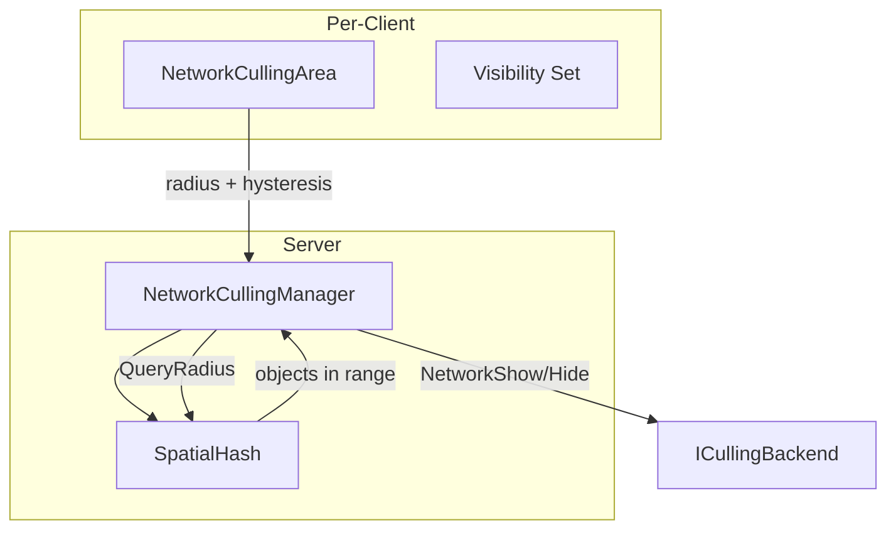

# Networking System

Eraflo.Catalyst provides a professional-grade, **backend-agnostic** networking abstraction. Build multiplayer experiences while remaining decoupled from any specific transport library.

---

## Table of Contents

1. [Architecture Overview](#1-architecture-overview)
2. [Quick Start](#2-quick-start)
3. [Configuration](#3-configuration)
4. [Core Services](#4-core-services)
5. [Communication](#5-communication)
6. [State Synchronization](#6-state-synchronization)
7. [Features](#7-features)
8. [Module Integrations](#8-module-integrations)
9. [Custom Lobby Provider](#9-custom-lobby-provider)
10. [Backends](#10-backends)
11. [Tutorials](#11-tutorials)
12. [API Reference](#12-api-reference)
13. [See Also](#see-also)

---

## 1. Architecture Overview

### 1.1 Core Services



### 1.2 Message Flow



### 1.3 Connection Lifecycle



### 1.4 Authority Modes



### 1.5 Delta Collection Sync



---

## 2. Quick Start

### 2.1 Server Setup

```csharp
using UnityEngine;
using Eraflo.Catalyst;
using Eraflo.Catalyst.Networking;

public class ServerBootstrap : MonoBehaviour
{
    void Start()
    {
        // Get the NetworkManager from the service locator
        NetworkManager nm = App.Get<NetworkManager>();
        
        // Start as server on default port
        bool success = nm.StartServer(port: 7777);
        
        if (success)
            Debug.Log("Server started on port 7777");
        else
            Debug.LogError("Failed to start server");
    }
}
```

### 2.2 Client Setup

```csharp
using UnityEngine;
using Eraflo.Catalyst;
using Eraflo.Catalyst.Networking;

public class ClientBootstrap : MonoBehaviour
{
    [SerializeField] private string _serverAddress = "127.0.0.1";
    
    void Start()
    {
        NetworkManager nm = App.Get<NetworkManager>();
        
        bool success = nm.StartClient(_serverAddress, port: 7777);
        
        if (success)
            Debug.Log($"Connecting to {_serverAddress}:7777");
    }
}
```

### 2.3 Host Setup (Server + Client)

```csharp
void Start()
{
    NetworkManager nm = App.Get<NetworkManager>();
    nm.StartHost(port: 7777);
}
```

---

## 3. Configuration

All network settings are configured via **PackageSettings** (`Resources/CatalystSettings`).

| Setting | Description | Default |
|---------|-------------|---------|
| `NetworkBackendId` | Backend to auto-initialize (`"Mock"`, `"Netcode"`, or empty) | `""` |
| `NetworkDebugMode` | Enable detailed network logs | `false` |
| `DefaultAuthorityMode` | Default authority for networked objects | `ServerAuthoritative` |
| `HandlerMode` | `Auto` (discover all handlers) or `Manual` (pick specific ones) | `Auto` |
| `EnabledHandlers` | List of handler type names when `Manual` mode is active | `[]` |

> [!TIP]
> Leave `NetworkBackendId` empty to manually initialize the backend via code. If set, the backend auto-initializes at startup.

---

## 4. Core Services

### 4.1 NetworkManager

Central hub for all networking operations.

**Properties:**
| Property | Type | Description |
|----------|------|-------------|
| `IsServer` | `bool` | True if running as server/host |
| `IsClient` | `bool` | True if running as client |
| `IsHost` | `bool` | True if both server and client |
| `IsConnected` | `bool` | True if network is active |
| `LocalClientId` | `ulong` | This client's unique ID |
| `ServerClientId` | `ulong` | The server's client ID |
| `Backend` | `INetworkBackend` | Currently active backend |

**Events:**
| Event | Description |
|-------|-------------|
| `OnConnected` | Fired when connection is established |
| `OnDisconnected` | Fired when connection is lost |
| `OnClientConnected(ulong)` | Server-only: a client connected |
| `OnClientDisconnected(ulong)` | Server-only: a client disconnected |

**Lifecycle Methods:**
```csharp
bool StartServer(ushort port = 7777);
bool StartClient(string address = "127.0.0.1", ushort port = 7777);
bool StartHost(ushort port = 7777);
void Stop();
```

**Messaging Methods:**
```csharp
void Send<T>(T msg, NetworkTarget target, NetworkDelivery delivery = Reliable);
void SendToClient<T>(T msg, ulong clientId, NetworkDelivery delivery = Reliable);
void SendToClients<T>(T msg, params ulong[] clientIds);
void SendToServer<T>(T msg, NetworkDelivery delivery = Reliable);
void On<T>(Action<T> handler);
void Off<T>(Action<T> handler);
```

### 4.2 NetworkIdManager

Maps network IDs ↔ object instances.

```csharp
NetworkIdManager idManager = App.Get<NetworkIdManager>();

// Register an object with a network ID
idManager.Register(networkId: 42, instance: myObject);

// Lookup object by ID
MyClass obj = idManager.GetObject<MyClass>(42);

// Get ID for an object
uint id = idManager.GetId(myObject);

// Extension method (using Eraflo.Catalyst.Networking)
uint myId = myComponent.GetNetworkId();
```

### 4.3 NetworkOwnershipManager

Controls who can modify networked objects.

| Mode | Description |
|------|-------------|
| `ServerAuthoritative` | Server validates all logic, clients send raw inputs/requests |
| `ClientAuthoritative` | Client's logic is trusted, server relays to other clients |

```csharp
NetworkOwnershipManager ownership = App.Get<NetworkOwnershipManager>();
NetworkManager nm = App.Get<NetworkManager>();

// Assign ownership (server only)
if (nm.IsServer)
{
    ownership.SetOwner(networkId: 42, clientId: 3);
}

// Check if I have authority
bool canModify = ownership.HasAuthority(42, AuthorityMode.ClientAuthoritative);

// Check if I own the object
bool isMine = ownership.IsOwner(42);

// Get owner client ID
ulong ownerId = ownership.GetOwner(42);
```

### 4.4 NetworkDelivery

| Mode | Guaranteed | Ordered | Best For |
|------|-----------|---------|----------|
| `Unreliable` | ❌ | ❌ | Position updates (high frequency) |
| `Reliable` | ✅ | ✅ | Important events |
| `UnreliableSequenced` | ❌ | ✅ | Newer data replaces older |
| `ReliableSequenced` | ✅ | ✅ | Standard reliable stream |
| `ReliableFragmented` | ✅ | ❌ | Large payloads |

---

## 5. Communication

### 5.1 Defining a Message

All messages must implement `INetworkMessage`:

```csharp
using System.IO;
using Eraflo.Catalyst.Networking;

public struct ChatMessage : INetworkMessage
{
    public string SenderName;
    public string Text;
    
    public void Serialize(BinaryWriter writer)
    {
        writer.Write(SenderName ?? "");
        writer.Write(Text ?? "");
    }
    
    public void Deserialize(BinaryReader reader)
    {
        SenderName = reader.ReadString();
        Text = reader.ReadString();
    }
}
```

### 5.2 Sending and Receiving

```csharp
using UnityEngine;
using Eraflo.Catalyst;
using Eraflo.Catalyst.Networking;

public class ChatExample : MonoBehaviour
{
    private NetworkManager _nm;
    
    void Start()
    {
        _nm = App.Get<NetworkManager>();
        
        // Register handler for incoming messages
        _nm.On<ChatMessage>(HandleChatMessage);
    }
    
    void OnDestroy()
    {
        // Always unregister handlers
        _nm?.Off<ChatMessage>(HandleChatMessage);
    }
    
    public void SendMessage(string playerName, string text)
    {
        ChatMessage msg = new ChatMessage
        {
            SenderName = playerName,
            Text = text
        };
        
        // Send to everyone including myself
        _nm.Send(msg, NetworkTarget.All);
    }
    
    private void HandleChatMessage(ChatMessage msg)
    {
        Debug.Log($"[{msg.SenderName}]: {msg.Text}");
    }
}
```

### 5.3 Network Targets

| Target | Recipients |
|--------|-----------|
| `NetworkTarget.All` | Everyone including sender |
| `NetworkTarget.Others` | Everyone except sender |
| `NetworkTarget.Server` | Server only (from client) |
| `NetworkTarget.Clients` | All clients (from server) |

### 5.4 Targeted Sending (Server Only)

```csharp
// Send to one specific client
_nm.SendToClient(msg, clientId: 3);

// Send to multiple specific clients
_nm.SendToClients(msg, 1, 2, 5);
```

---

## 6. State Synchronization

### 6.1 NetworkProperty\<T\>

Reactive property that syncs automatically when changed on the server.

```csharp
using UnityEngine;
using UnityEngine.UI;
using Eraflo.Catalyst;
using Eraflo.Catalyst.Networking;

public class PlayerHealth : MonoBehaviour
{
    [SerializeField] private Slider _healthBar;
    
    private NetworkProperty<int> _health;
    private NetworkManager _nm;
    private uint _myNetworkId;
    
    void Start()
    {
        _nm = App.Get<NetworkManager>();
        
        // Register this object and get its network ID
        NetworkIdManager idManager = App.Get<NetworkIdManager>();
        _myNetworkId = 1; // In real code, assign unique IDs
        idManager.Register(_myNetworkId, this);
        
        // Create the networked property
        _health = new NetworkProperty<int>(
            name: "Health", 
            networkId: _myNetworkId, 
            defaultValue: 100
        );
        
        // Subscribe to changes
        _health.OnValueChanged += OnHealthChanged;
        
        // Initialize UI
        OnHealthChanged(_health.Value);
    }
    
    private void OnHealthChanged(int newHealth)
    {
        if (_healthBar != null)
            _healthBar.value = newHealth / 100f;
    }
    
    // Server-only method
    public void TakeDamage(int amount)
    {
        if (!_nm.IsServer) return;
        
        _health.Value = Mathf.Max(0, _health.Value - amount);
    }
}
```

### 6.2 Delta-Synchronized Collections

Collections sync only changes (deltas), not the entire contents.

| Collection | Key Events |
|------------|------------|
| `NetworkList<T>` | `OnItemAdded`, `OnItemRemoved`, `OnItemSet`, `OnCleared`, `OnChanged` |
| `NetworkDictionary<K,V>` | `OnItemAdded`, `OnItemRemoved`, `OnItemSet`, `OnCleared`, `OnChanged` |
| `NetworkHashSet<T>` | `OnItemAdded`, `OnItemRemoved`, `OnChanged` |
| `NetworkQueue<T>` | `OnEnqueued`, `OnDequeued`, `OnChanged` |
| `NetworkStack<T>` | `OnPushed`, `OnPopped`, `OnChanged` |

**Complete Scoreboard Example:**

```csharp
using System.Linq;
using UnityEngine;
using UnityEngine.UI;
using Eraflo.Catalyst;
using Eraflo.Catalyst.Networking;
using Eraflo.Catalyst.Networking.Collections;

public class Scoreboard : MonoBehaviour
{
    [SerializeField] private Text _scoreText;
    
    private NetworkDictionary<string, int> _scores;
    private NetworkManager _nm;
    
    void Start()
    {
        _nm = App.Get<NetworkManager>();
        
        // Create collection with network ID 0 (global singleton)
        _scores = new NetworkDictionary<string, int>(
            name: "GlobalScores",
            networkId: 0,
            authorityMode: AuthorityMode.ServerAuthoritative
        );
        
        // Subscribe to all change events
        _scores.OnItemAdded += (key, value) => RefreshUI();
        _scores.OnItemSet += (key, oldVal, newVal) => RefreshUI();
        _scores.OnItemRemoved += (key, value) => RefreshUI();
        _scores.OnCleared += () => RefreshUI();
    }
    
    // Call this from server only
    public void AddScore(string playerName, int points)
    {
        if (!_nm.IsServer)
        {
            Debug.LogWarning("Only server can modify scores");
            return;
        }
        
        if (_scores.ContainsKey(playerName))
            _scores[playerName] += points;
        else
            _scores[playerName] = points;
    }
    
    private void RefreshUI()
    {
        if (_scoreText == null) return;
        
        // Sort by score descending
        var sorted = _scores.OrderByDescending(x => x.Value);
        
        string text = "=== SCOREBOARD ===\n";
        foreach (var kvp in sorted)
        {
            text += $"{kvp.Key}: {kvp.Value}\n";
        }
        
        _scoreText.text = text;
    }
}
```

---

## 7. Features

### 7.1 Connection Approval

Validate incoming connections with custom payloads.

```csharp
using UnityEngine;
using Eraflo.Catalyst;
using Eraflo.Catalyst.Networking;
using Eraflo.Catalyst.Networking.Features.Connection;

// Define your auth payload
public struct AuthPayload
{
    public string PlayerName;
    public string AuthToken;
}

public class ConnectionExample : MonoBehaviour
{
    void Start()
    {
        NetworkManager nm = App.Get<NetworkManager>();
        ConnectionManager conn = App.Get<ConnectionManager>();
        
        if (nm.IsServer)
        {
            // Server: validate incoming connections
            conn.OnValidateConnection += ValidateClient;
        }
        else
        {
            // Client: set auth payload BEFORE connecting
            conn.SetPayload(new AuthPayload 
            { 
                PlayerName = "Player1",
                AuthToken = "my-secret-token"
            });
        }
    }
    
    private ConnectionResponse ValidateClient(ConnectionRequest request)
    {
        // Deserialize the payload
        AuthPayload auth = NetworkSerializer.DeserializeValue<AuthPayload>(request.Payload);
        
        // Validate
        if (string.IsNullOrEmpty(auth.AuthToken))
        {
            return ConnectionResponse.Reject("Missing auth token");
        }
        
        if (auth.AuthToken != "my-secret-token")
        {
            return ConnectionResponse.Reject("Invalid auth token");
        }
        
        Debug.Log($"Approved connection from {auth.PlayerName}");
        return ConnectionResponse.Success();
    }
}
```

### 7.2 Lobby System

Abstract lobby management via `ILobbyProvider`.

```csharp
using System.Collections.Generic;
using System.Threading.Tasks;
using UnityEngine;
using Eraflo.Catalyst;
using Eraflo.Catalyst.Networking;
using Eraflo.Catalyst.Networking.Features.Lobby;

public class LobbyExample : MonoBehaviour
{
    private LobbyManager _lobby;
    
    async void Start()
    {
        _lobby = App.Get<LobbyManager>();
        
        // Set provider (use LanLobbyProvider or implement your own)
        _lobby.SetProvider(new LanLobbyProvider());
        
        // Subscribe to events
        _lobby.OnLobbyJoined += OnJoined;
        _lobby.OnLobbyLeft += OnLeft;
    }
    
    public async Task CreateGame()
    {
        LobbyResult result = await _lobby.CreateLobby(new LobbyOptions 
        { 
            Name = "My Game Room",
            MaxPlayers = 4,
            IsPrivate = false
        });
        
        if (result.Success)
            Debug.Log($"Created lobby! Join code: {result.Lobby.JoinCode}");
        else
            Debug.LogError($"Failed: {result.Message}");
    }
    
    public async Task JoinGame(string joinCode)
    {
        LobbyResult result = await _lobby.JoinLobby(joinCode);
        
        if (result.Success)
            Debug.Log($"Joined {result.Lobby.Name}");
        else
            Debug.LogError($"Failed: {result.Message}");
    }
    
    public async Task<List<LobbyInfo>> FindGames()
    {
        return await _lobby.SearchLobbies();
    }
    
    public async Task LeaveGame()
    {
        await _lobby.LeaveLobby();
    }
    
    private void OnJoined(LobbyInfo info)
    {
        Debug.Log($"Joined lobby: {info.Name} ({info.CurrentPlayers}/{info.MaxPlayers})");
    }
    
    private void OnLeft()
    {
        Debug.Log("Left lobby");
    }
}
```

### 7.3 Network Discovery (Local Network)

Find games on the same local network via UDP broadcast. Works on **any local network** (ethernet, WiFi, hotspot) — devices just need to be on the same subnet.

> [!NOTE]
> This does not work across the internet or different networks. For internet matchmaking, implement a custom `ILobbyProvider` with a cloud service.

```csharp
using UnityEngine;
using Eraflo.Catalyst;
using Eraflo.Catalyst.Networking;

public class LANDiscoveryExample : MonoBehaviour
{
    private NetworkDiscovery _discovery;
    
    void Start()
    {
        _discovery = App.Get<NetworkDiscovery>();
        _discovery.OnServerFound += OnServerDiscovered;
    }
    
    // Call from server
    public void StartHosting()
    {
        _discovery.StartAdvertising(serverName: "My Game", gamePort: 7777);
        Debug.Log("Broadcasting presence on LAN...");
    }
    
    // Call from client
    public void StartSearching()
    {
        _discovery.StartScanning();
        Debug.Log("Scanning for LAN games...");
    }
    
    public void StopDiscovery()
    {
        _discovery.StopScanning();
    }
    
    private void OnServerDiscovered(NetworkDiscovery.DiscoveryInfo info)
    {
        Debug.Log($"Found server: {info.Name} at {info.Address}:{info.Port}");
        
        // Connect to it
        NetworkManager nm = App.Get<NetworkManager>();
        nm.StartClient(info.Address, info.Port);
    }
}
```

### 7.4 Network Actions (Lightweight RPCs)

The `NetworkActionManager` provides a simple way to trigger remote actions **without defining custom message classes**. Ideal for quick events like damage, pickups, or UI notifications.

```csharp
using UnityEngine;
using Eraflo.Catalyst;
using Eraflo.Catalyst.Networking;
using Eraflo.Catalyst.Networking.Features.Actions;

public class NetworkActionsExample : MonoBehaviour
{
    private NetworkActionManager _actions;
    
    void Start()
    {
        _actions = App.Get<NetworkActionManager>();
        
        // Register/Unregister handlers
        _actions.RegisterAction("PlayerDamaged", OnPlayerDamaged);
        _actions.UnregisterAction("PlayerDamaged");
        
        bool hasAction = _actions.HasAction("ItemPickedUp");
        _actions.ClearAllActions();
    }
    
    // Send action to all other clients
    public void TakeDamage(int damage, int attackerId)
    {
        // Trigger sends to Others by default
        _actions.Trigger("PlayerDamaged", damage, attackerId);
    }
    
    // Send action to specific target
    public void PickupItem(string itemId)
    {
        // Send to server only
        _actions.TriggerToTarget("ItemPickedUp", NetworkTarget.Server, itemId);
    }
    
    // Handler receives raw payload
    private void OnPlayerDamaged(byte[] payload)
    {
        var data = NetworkSerializer.Deserialize<object[]>(payload);
        int damage = (int)data[0];
        int attackerId = (int)data[1];
        Debug.Log($"Player took {damage} damage from attacker {attackerId}");
    }
    
    private void OnItemPickedUp(byte[] payload)
    {
        var data = NetworkSerializer.Deserialize<object[]>(payload);
        string itemId = (string)data[0];
        Debug.Log($"Item picked up: {itemId}");
    }
}
```

> [!TIP]
> Use Network Actions for simple fire-and-forget events. For complex data or type safety, prefer `INetworkMessage` classes.

### 7.5 Smart Spawn System

The `NetworkSpawnManager` handles player spawning using configurable strategies.



```csharp
using Eraflo.Catalyst;
using Eraflo.Catalyst.Networking.Features.Spawn;

// Configure spawn strategy
var spawnManager = App.Get<NetworkSpawnManager>();
spawnManager.Strategy = new TeamBasedSpawnStrategy();
spawnManager.DefaultPrefabKey = "PlayerPrefab";

// Spawn a player (server only)
spawnManager.SpawnPlayerForClient(clientId);

// Custom payload for class selection
spawnManager.SetClientPayload(clientId, new SpawnPayload
{
    PrefabKey = "WarriorPrefab",
    TeamId = 1,
    SpawnTag = "TeamA"
});
```

### 7.6 Network Diagnostics

Real-time metrics and network simulation for testing.



```csharp
var diagnostics = App.Get<NetworkDiagnostics>();

// Enable simulation (dev/testing)
diagnostics.SetSimulation(latencyMs: 100, packetLossPercent: 5f, jitterMs: 20);

// Get metrics
Debug.Log(diagnostics.GetMetricsString()); 
// "RTT: 45.2ms | Loss: 0.1% | In: 12.5 KB/s | Out: 8.3 KB/s [SIM]"

// Disable simulation
diagnostics.DisableSimulation();
```

### 7.7 Network Attachment (Dynamic Parenting)

Synchronized object parenting with Rigidbody state management.



```csharp
using Eraflo.Catalyst.Networking.Features.Attachment;

// One-liner extension methods
item.NetworkParentTo(player.HandTransform);
item.NetworkUnparent(inheritVelocity: true);

// With authority override
var manager = App.Get<NetworkAttachmentManager>();
manager.RequestAttach(childId, parentId, 
    localPosition: Vector3.zero,
    authorityMode: AuthorityMode.OwnerAuthoritative);
```

### 7.8 Voice Chat System

The `VoiceManager` provides a high-level API for integrated voice communication, supporting multiple backends (Vivox, Photon, etc.) via the `IVoiceProvider` interface.



**Quick Start:**
```csharp
using Eraflo.Catalyst.Networking.Features.Voice;

var voice = App.Get<VoiceManager>();

// Set provider (implement your own for Vivox, Photon Voice, etc.)
voice.SetProvider(new MockVoiceProvider());

// Join voice channel
voice.JoinChannel("Lobby", use3D: true);

// Adjust volumes
voice.MasterVolume = 0.8f;
voice.SetMicEnabled(true);
```

**Features:**
- **3D Spatial Audio**: Integrated listener position updates via `UpdateListenerPosition(Transform)`.
- **Muting & Volume**: Simple local and per-participant muting/volume control.
- **Provider Agnostic**: Easily switch between voice services without changing gameplay code.
- **Network Synced**: Voice state can be linked to network objects for "speaking" indicators via `NetworkVoiceSource` component.

### 7.9 Interest Management (Culling)

Automatic network visibility based on distance using `SpatialHash`.



```csharp
using Eraflo.Catalyst.Networking.Features.Culling;

// Attach NetworkCullingArea to player cameras
var cullingArea = player.AddComponent<NetworkCullingArea>();
cullingArea.Radius = 50f;
cullingArea.Hysteresis = 5f; // Prevents popping

// Register with manager (server-side)
var culling = App.Get<NetworkCullingManager>();
culling.RegisterCullingArea(clientId, cullingArea);

// Call each frame on server
culling.UpdateCulling();
```

Configuration via PackageSettings:
- `CullingCellSize`: SpatialHash cell size (default: 50)
- `CullingClientsPerFrame`: Staggered updates (default: 4)
- `CullingHysteresis`: Distance buffer (default: 5)

---

## 8. Module Integrations

### 8.1 Scenes (Networked Loading)

The `SceneNetworkHandler` synchronizes scene loading across server and clients.

```csharp
using System.Threading.Tasks;
using UnityEngine;
using Eraflo.Catalyst;
using Eraflo.Catalyst.Scenes.Networking;

public class NetworkedSceneLoader : MonoBehaviour
{
    async void Start()
    {
        SceneLoaderService sceneLoader = App.Get<SceneLoaderService>();
        
        // Switch to networked loading strategy
        sceneLoader.SetStrategy(new SceneNetworkHandler());
        
        // Register your scene groups
        sceneLoader.RegisterGroup(new SceneGroup
        {
            Name = "GameLevel",
            Scenes = new System.Collections.Generic.List<string> { "Level1", "Level1_UI" },
            ActiveScene = "Level1"
        });
        
        // Load - server loads first, clients automatically sync
        await sceneLoader.LoadGroupAsync(
            groupName: "GameLevel",
            showLoadingScreen: true,
            waitForInput: false
        );
    }
}
```

> [!NOTE]
> When connected, clients wait for the server to load scenes. Progress is tracked as scenes become available.

**See Also:** [Scenes Documentation](Scenes.md)

### 8.2 Other Module Integrations

| Module | Integration | Documentation |
|--------|-------------|---------------|
| **Pooling** | `PoolNetworkHandler` - `SpawnNetworked()`, `DespawnNetworked()` | [Pooling](Pooling.md) |
| **Timers** | `TimerNetworkHandler` - `MakeNetworked()` | [Timers](Timers.md) |
| **Events** | `NetworkEventChannel` (ScriptableObject) | [EventBus](EventBus.md) |
| **Input** | `InputNetworkHandler` - combo sync | [InputSystem](InputSystem.md) |
| **HFSM** | `HfsmNetworkHandler` - state sync | [HFSM](HFSM.md) |
| **Chronos** | `ChronosNetworkHandler` - time scale sync | [Chronos](Chronos.md) |
| **Command** | `CommandNetworkHandler` - networked undo/redo | [Command](Command.md) |

---

## 9. Custom Lobby Provider

To integrate with cloud services (Steam, Epic, PlayFab, etc.), implement `ILobbyProvider`:

```csharp
using System.Collections.Generic;
using System.Threading.Tasks;
using Eraflo.Catalyst.Networking;

public class MyOnlineLobbyProvider : ILobbyProvider
{
    public string Name => "MyOnlineService";
    
    private string _currentLobbyId;
    
    public async Task<LobbyResult> CreateLobby(LobbyOptions options)
    {
        // Call your cloud API
        // Example: var response = await MyCloudAPI.CreateRoom(options.Name, options.MaxPlayers);
        
        // For demonstration:
        await Task.Delay(100); // Simulate network call
        
        string lobbyId = System.Guid.NewGuid().ToString();
        _currentLobbyId = lobbyId;
        
        return LobbyResult.Ok(new LobbyInfo
        {
            Id = lobbyId,
            Name = options.Name,
            MaxPlayers = options.MaxPlayers,
            CurrentPlayers = 1,
            JoinCode = lobbyId.Substring(0, 6).ToUpper()
        });
    }
    
    public async Task<LobbyResult> JoinLobby(string joinCode)
    {
        // Call your cloud API to join
        // Example: var response = await MyCloudAPI.JoinRoom(joinCode);
        
        await Task.Delay(100);
        
        // Return lobby info on success
        return LobbyResult.Ok(new LobbyInfo
        {
            Id = joinCode,
            Name = "Joined Game",
            JoinCode = joinCode
        });
    }
    
    public async Task<List<LobbyInfo>> SearchLobbies()
    {
        // Query your cloud API for available lobbies
        // Example: return await MyCloudAPI.ListRooms();
        
        await Task.Delay(100);
        return new List<LobbyInfo>();
    }
    
    public async Task LeaveLobby()
    {
        // Notify cloud that we're leaving
        // Example: await MyCloudAPI.LeaveRoom(_currentLobbyId);
        
        _currentLobbyId = null;
        await Task.CompletedTask;
    }
    
    public void Shutdown()
    {
        _currentLobbyId = null;
    }
}
```

**Usage:**
```csharp
LobbyManager lobby = App.Get<LobbyManager>();
lobby.SetProvider(new MyOnlineLobbyProvider());

var result = await lobby.CreateLobby(new LobbyOptions { Name = "My Room" });
```

---

## 10. Backends

### 10.1 MockNetworkBackend

For local development and testing without real networking.

```csharp
using UnityEngine;
using Eraflo.Catalyst;
using Eraflo.Catalyst.Networking;
using Eraflo.Catalyst.Networking.Backends.Mock;

public class MockBackendExample : MonoBehaviour
{
    void Start()
    {
        NetworkManager nm = App.Get<NetworkManager>();
        
        // Set the mock backend
        nm.SetBackendById("Mock");
        
        // Start as host (server + client locally)
        nm.StartHost();
        
        // Now you can test messaging locally
        nm.On<ChatMessage>(msg => Debug.Log($"Received: {msg.Text}"));
        nm.Send(new ChatMessage { SenderName = "Test", Text = "Hello!" }, NetworkTarget.All);
    }
}
```

### 10.2 NetcodeBackend (Unity NGO)

Production backend using Unity Netcode for GameObjects.

```csharp
// Via PackageSettings: Set NetworkBackendId to "Netcode"
// Or via code:
NetworkManager nm = App.Get<NetworkManager>();
nm.SetBackendById("Netcode");
nm.StartServer();
```

**Dual ID System:**
When using NGO, objects have two independent IDs:
1. **Catalyst ID** (`uint`) — Used by `NetworkProperty`, Collections
2. **NGO NetworkObjectId** — Used by `NetworkTransform`, NGO RPCs

The `NetcodeBackend` maps between them automatically.

> [!IMPORTANT]
> Requires the `UNITY_NETCODE` define symbol and Unity Netcode for GameObjects package installed.

---

## 11. Tutorials

### 11.1 Complete Chat System

```csharp
using System.IO;
using UnityEngine;
using UnityEngine.UI;
using Eraflo.Catalyst;
using Eraflo.Catalyst.Networking;

// Message definition
public struct ChatMessage : INetworkMessage
{
    public string SenderName;
    public string Text;
    
    public void Serialize(BinaryWriter w)
    {
        w.Write(SenderName ?? "");
        w.Write(Text ?? "");
    }
    
    public void Deserialize(BinaryReader r)
    {
        SenderName = r.ReadString();
        Text = r.ReadString();
    }
}

// Chat manager component
public class ChatManager : MonoBehaviour
{
    [SerializeField] private InputField _inputField;
    [SerializeField] private Text _chatLog;
    [SerializeField] private string _playerName = "Player";
    
    private NetworkManager _nm;
    
    void Start()
    {
        _nm = App.Get<NetworkManager>();
        _nm.On<ChatMessage>(OnChatReceived);
        
        // Listen for connection events
        _nm.OnConnected += () => AddToLog("[System] Connected!");
        _nm.OnDisconnected += () => AddToLog("[System] Disconnected.");
    }
    
    void OnDestroy()
    {
        if (_nm != null)
            _nm.Off<ChatMessage>(OnChatReceived);
    }
    
    // Called from UI button
    public void OnSendClicked()
    {
        if (string.IsNullOrEmpty(_inputField.text)) return;
        
        ChatMessage msg = new ChatMessage
        {
            SenderName = _playerName,
            Text = _inputField.text
        };
        
        _nm.Send(msg, NetworkTarget.All);
        _inputField.text = "";
    }
    
    private void OnChatReceived(ChatMessage msg)
    {
        AddToLog($"[{msg.SenderName}]: {msg.Text}");
    }
    
    private void AddToLog(string line)
    {
        if (_chatLog != null)
            _chatLog.text += line + "\n";
        
        Debug.Log(line);
    }
}
```

---

## 12. API Reference

### Core Classes

| Class | Purpose |
|-------|---------|
| `NetworkManager` | Central hub for messaging, lifecycle, backend selection |
| `NetworkIdManager` | Object ↔ Network ID mapping |
| `NetworkOwnershipManager` | Authority and ownership control |
| `NetworkDiagnostics` | Network simulation and real-time metrics |
| `ConnectionManager` | Connection approval with payloads |
| `LobbyManager` | Lobby creation, joining, searching |
| `NetworkSpawnManager` | Player spawning with strategies |
| `NetworkActionManager` | Lightweight string-based RPCs |
| `NetworkAttachmentManager` | Synchronized object parenting |
| `VoiceManager` | Voice chat abstraction layer |
| `NetworkCullingManager` | Interest management via SpatialHash |
| `NetworkDiscovery` | LAN server discovery via UDP broadcast |
| `NetworkSerializer` | Binary serialization utilities |

### Collections

| Collection | Key Methods | Key Events |
|------------|-------------|------------|
| `NetworkList<T>` | `Add`, `Insert`, `Remove`, `RemoveAt`, `Clear` | `OnItemAdded`, `OnItemRemoved`, `OnItemSet`, `OnCleared` |
| `NetworkDictionary<K,V>` | `Add`, `Remove`, `Clear`, `[]` indexer | `OnItemAdded`, `OnItemRemoved`, `OnItemSet`, `OnCleared` |
| `NetworkHashSet<T>` | `Add`, `Remove`, `Clear` | `OnItemAdded`, `OnItemRemoved` |
| `NetworkQueue<T>` | `Enqueue`, `Dequeue`, `Clear` | `OnEnqueued`, `OnDequeued` |
| `NetworkStack<T>` | `Push`, `Pop`, `Clear` | `OnPushed`, `OnPopped` |

### Interfaces

| Interface | Purpose |
|-----------|---------|
| `INetworkBackend` | Backend abstraction (implement for custom transports) |
| `INetworkMessage` | Message contract: `Serialize(BinaryWriter)`, `Deserialize(BinaryReader)` |
| `INetworkMessageHandler` | Extend networking with custom handlers |
| `ILobbyProvider` | Lobby service abstraction (Steam, Epic, etc.) |
| `INetworkLifecycle` | Start/Stop lifecycle for backends |

### Enums

| Enum | Values |
|------|--------|
| `NetworkTarget` | `All`, `Others`, `Server`, `Clients` |
| `NetworkDelivery` | `Unreliable`, `Reliable`, `UnreliableSequenced`, `ReliableSequenced`, `ReliableFragmented` |
| `AuthorityMode` | `ServerAuthoritative`, `ClientAuthoritative` |

### Extension Methods

| Method | Description |
|--------|-------------|
| `object.GetNetworkId()` | Returns the network ID for any registered object |
| `GameObject.GetNetworkId()` | Returns the network ID for a registered GameObject |
| `Component.GetNetworkId()` | Returns the network ID for a registered Component |

---

## See Also

- [Input System](InputSystem.md): Input buffering and networking
- [Pooling System](Pooling.md): Network-aware object pooling
- [Event Bus](EventBus.md): Network event channels
- [Timers](Timers.md): Networked timers
- [Scenes](Scenes.md): Networked scene loading and transitions
