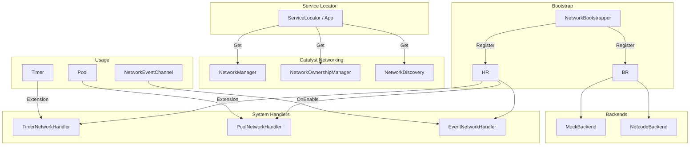
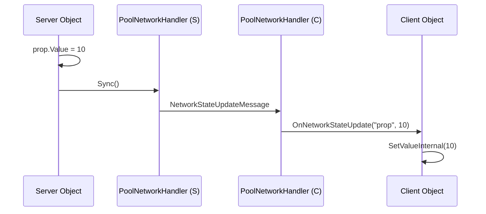
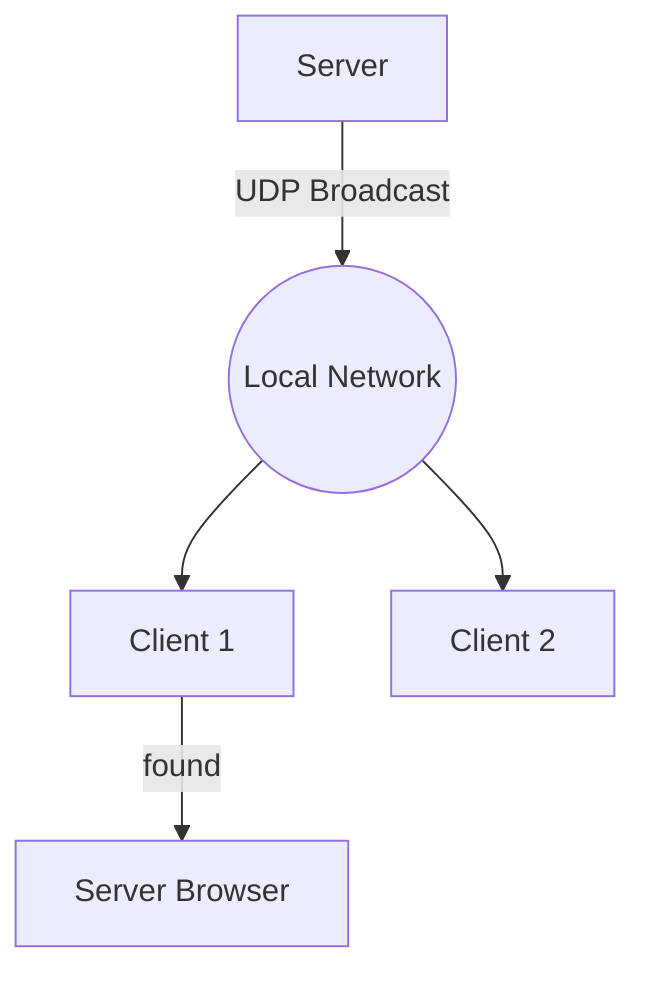
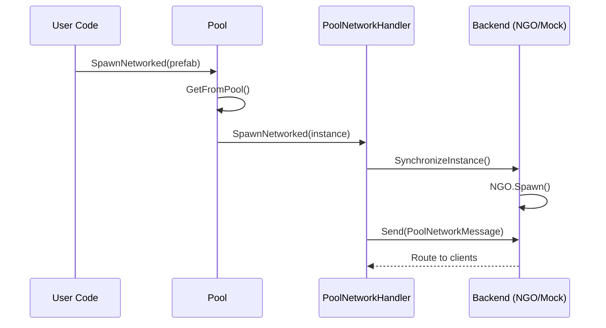
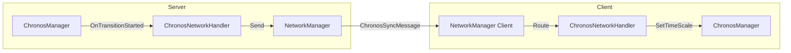

# Networking System

Unified, extensible networking abstraction with auto-registration.

## Architecture



Everything is automatic! Configure in `PackageSettings` and use:

```csharp
// Timers
var timer = App.Get<Timer>();
var handle = timer.CreateTimer<CountdownTimer>(10f);
handle.MakeNetworked();
timer.Start(handle);
TimerNetworkExtensions.BroadcastTimerSync();

// Pool - Unified (GameObjects & C# Classes)
var pool = App.Get<Pool>();
var (h1, id1) = pool.SpawnNetworked(prefab, pos, rot);  // Local spawn + network sync
h1.DespawnNetworked();                                 // Local despawn + network sync

var (h2, id2) = pool.GetFromPoolNetworked<MyData>();   // C# class sync
h2.DespawnNetworked();

// Events - with target selection
myNetworkChannel.Raise();                    // Use default target
myNetworkChannel.Raise(NetworkTarget.Server); // Send to server only
myNetworkChannel.RaiseLocal();               // Local only
```

---

## Configuration

### PackageSettings

| Setting | Values | Description |
|---------|--------|-------------|
| **Backend ID** | `mock`, `netcode`, custom | **Backends**: Choice between `Mock` (testing) and `Netcode` (production).
| **Handler Mode** | `Auto`, `Manual` | **Manual Control**: Proxy methods for starting/stopping the network.
| **Debug Mode** | bool | **Authority**: Built-in support for Server and Client authoritative models.

---

## Setup for Netcode (NGO)

When using the `Netcode` backend, minimal setup is required in the Unity Editor:

1.  **NetworkManager**: Create a GameObject in your bootstrapper scene and add the `NetworkManager` component.
2.  **UnityTransport**: On the same GameObject, add the `UnityTransport` component.
3.  **Catalyst Config**: Go to `Edit > Project Settings > Catalyst` and ensure the **Default Backend** is set to `netcode`.
4.  **Network Prefabs**: Any object spawned via the `Pool` system over the network must be registered in the `NetworkManager`'s "Network Prefabs" list.

---

## API Overview

## NetworkTarget

```csharp
public enum NetworkTarget
{
    All,      // Server + all clients
    Others,   // Everyone except sender
    Server,   // Server only
    Clients   // All clients only
}
```

## Lifecycle Management

You can manually start and stop the networking system using the `NetworkManager` facade. This requires the active backend to implement `INetworkLifecycle`.

```csharp
var nm = App.Get<NetworkManager>();

// Start as Server (UDP by default)
nm.StartServer(7777, NetworkTransportType.UDP);

// Start as Client (TCP example)
nm.StartClient("127.0.0.1", 7777, NetworkTransportType.TCP);

// Start as Host (WebSocket example)
nm.StartHost(7777, NetworkTransportType.WebSocket);

// Stop everything
nm.Stop();
```

### Connection Events
Monitor when clients connect or disconnect:

```csharp
nm.OnClientConnected += (id) => Debug.Log($"Client {id} joined!");
nm.OnClientDisconnected += (id) => Debug.Log($"Client {id} left.");
```

---

## Authority & Ownership

The system uses `AuthorityMode` to determine who is allowed to trigger or modify state.

| Mode | Description |
|------|-------------|
| **ServerAuthoritative** | Only the server can broadcast changes. Client requests are ignored or validated. |
| **ClientAuthoritative** | The owner of the object (or any client for global events) can broadcast changes. |

### Ownership Tracking
The `NetworkOwnershipManager` tracks which client owns specific networked objects.

```csharp
var ownership = App.Get<NetworkOwnershipManager>();
bool iAmOwner = ownership.IsOwner(networkId);
```

---

## Message Reliability

You can specify the delivery guarantee for any message:

```csharp
nm.Send(new MyMessage(), NetworkTarget.All, NetworkDelivery.ReliableSequenced);
```

| Mode | Description |
|------|-------------|
| **Unreliable** | Best for high-frequency data (positions, rotations). No ordering or delivery guarantee. |
| **Reliable** | Guaranteed delivery and order. Best for one-time events (Game Started). |
| **UnreliableSequenced** | Best for health updates. Newer packets discard older ones if they arrive out of order. |
| **ReliableSequenced** | Standard reliable stream. Guaranteed delivery and exact order. |

---

## State Synchronization (C# Classes)

For non-GameObject pooled objects, you can use `NetworkProperty<T>` for automatic state sync.



**Usage:**

```csharp
public class MyRemoteData : INetworkPoolable, INetworkStateSyncable
{
    private NetworkProperty<int> _score;
    public int Score => _score.Value;

    public void OnNetworkSpawn(byte[] data)
    {
        uint id = this.GetNetworkId(); // Extension method
        _score = new NetworkProperty<int>("Score", id, 0);
    }

    public void OnNetworkStateUpdate(string name, byte[] data)
    {
        if (name == "Score") _score.SetValueInternal(NetworkSerializer.DeserializeValue<int>(data));
    }
}
```

---

## Network Discovery

Find and join games on the local network using UDP broadcast.



**Usage:**

```csharp
var discovery = App.Get<NetworkDiscovery>();

// Server: Start advertising
discovery.StartAdvertising("My Epic Room", 7777);

// Client: Scan for games
discovery.OnServerFound += (info) => {
    Debug.Log($"Found {info.Name} at {info.Address}:{info.Port}");
    nm.StartClient(info.Address, info.Port);
};
discovery.StartScanning();
```

---

## Client-Specific Targeting

Send messages to specific clients (server only):

```csharp
var nm = App.Get<NetworkManager>();

// SERVER: Send to one specific client
nm.SendToClient(new MyMessage { Data = 42 }, clientId);

// SERVER: Send to multiple specific clients
nm.SendToClients(new MyMessage { Data = 42 }, clientA, clientB, clientC);

// SERVER: Send to array of clients
ulong[] teamMembers = GetTeamMembers();
nm.SendToClients(new TeamUpdate { Score = 100 }, teamMembers);

// Get local client ID
ulong myId = nm.LocalClientId;
```

> [!NOTE]
> These methods are server-only. Clients send to server with `SendToServer`, then the server relays.

---

## Extension Methods

### Timer

```csharp
// SERVER: Create and network a timer
var timer = App.Get<Timer>();
var handle = timer.CreateTimer<CountdownTimer>(5f);
handle.MakeNetworked(AuthorityMode.ServerAuthoritative);
timer.Start(handle);

// SERVER: Sync all timers to clients
TimerNetworkExtensions.BroadcastTimerSync();

// Cleanup
handle.RemoveNetworking();
handle.GetNetworkId();
```

### Pool (Unified)

The pooling system is backend-agnostic and supports both **GameObjects** and **C# Classes**.

```csharp
var pool = App.Get<Pool>();

// 1. Spawning a GameObject (NGO uses NetworkManager settings)
var (goHandle, goId) = pool.SpawnNetworked(playerPrefab, position);

// 2. Spawning a C# Class (Synchronized by Catalyst)
var (dataHandle, dataId) = pool.GetFromPoolNetworked<PlayerData>();

// Despawn (Unified)
goHandle.DespawnNetworked();
dataHandle.DespawnNetworked();
```



> [!IMPORTANT]
> - GameObjects MUST have a `NetworkObject` component for backends like NGO to sync them.
> - C# Classes should implement `INetworkPoolable` to receive `OnNetworkSpawn(byte[] data)`.

### Events

```csharp
// Use default target from inspector
myNetworkChannel.Raise();

// Override target at runtime
myNetworkChannel.Raise(NetworkTarget.Server);
myNetworkChannel.Raise(NetworkTarget.Others);

// Local only
myNetworkChannel.RaiseLocal();
```

### Chronos Synchronization

Time scale transitions on the server are automatically replicated to all clients via the [Chronos Manager](../Core/ChronosManager.md).



**Usage (Server only):**
```csharp
var chronos = App.Get<ChronosManager>();
// This will smoothly slow down the "World" channel on all clients
chronos.SetTimeScale("World", 0.1f, 2.0f, EasingType.CubicInOut);
```

---

## Custom Backend

```csharp
public class MyBackend : INetworkBackend
{
    public bool IsServer => ...;
    public bool IsClient => ...;
    public bool IsConnected => ...;
    
    public void Initialize() { }
    public void Shutdown() { }
    public void RegisterHandler(ushort msgType, Action<byte[], ulong> h) { }
    public void UnregisterHandler(ushort msgType) { }
}

public class MyLifecycleBackend : MyBackend, INetworkLifecycle
{
    public bool StartServer(ushort port) { /* Logic */ return true; }
    public bool StartClient(string addr, ushort port) { /* Logic */ return true; }
    public bool StartHost(ushort port) { /* Logic */ return true; }
    public void Stop() { /* Logic */ }
}

public class MyFactory : INetworkBackendFactory
{
    public string Id => "mybackend";
    public string DisplayName => "My Backend";
    public bool IsAvailable => true;
    public bool OnInitialize()
    {
        App.Get<NetworkManager>().SetBackendById(Id);
        return true;
    }
    public INetworkBackend Create() => new MyBackend();
}
```

---

## Custom Message

```csharp
var nm = App.Get<NetworkManager>();
nm.Send(new MyMessage { Data = 42 }, NetworkTarget.All);
nm.On<MyMessage>(msg => Debug.Log(msg.Data));
```

---

## File Structure

```
Runtime/Networking/
├── Core/            NetworkManager, NetworkSerializer
├── Registries/      BackendRegistry, MessageRouter, HandlerRegistry
├── Bootstrap/       NetworkBootstrapper
├── Backends/
│   ├── Mock/
│   └── Netcode/
└── Messages/

Runtime/Timers/Features/   TimerNetworkHandler, Extensions
Runtime/Pooling/Features/  PoolNetworkHandler, Extensions
Runtime/Events/Network/    EventNetworkHandler, NetworkEventChannel
```
