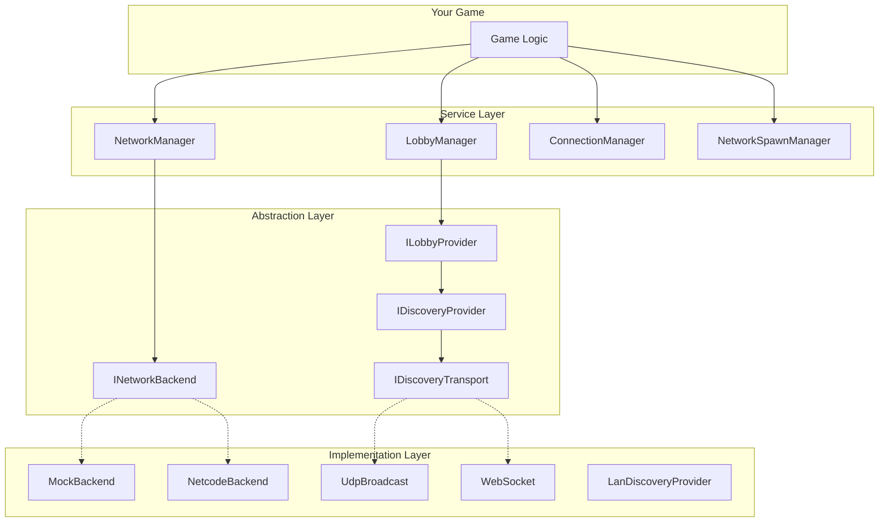
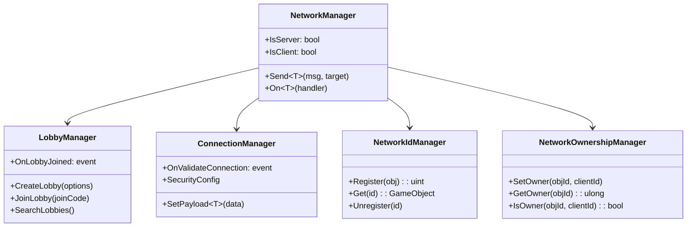
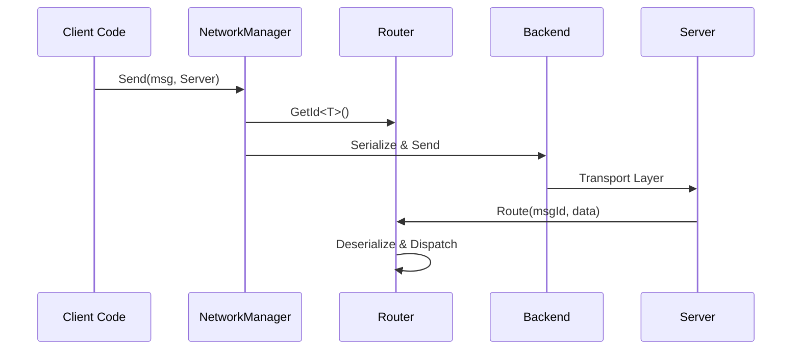
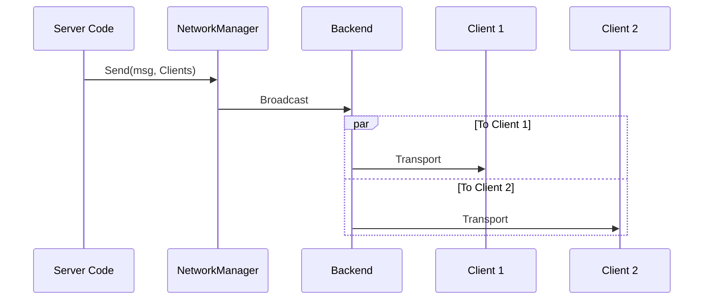
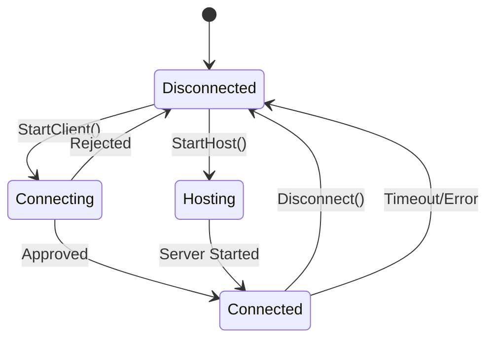

# Architecture

System design and component relationships.

---

## Overview

The networking system uses a **layered architecture** with clear abstraction boundaries:



---

## Design Principles

### 1. Backend Agnostic

All game code interacts with **interfaces**, not implementations:

```csharp
// ✅ Good - uses abstraction
var network = App.Get<NetworkManager>();
network.Send(message, target);

// ❌ Bad - couples to specific backend
var ngo = FindObjectOfType<NetworkManager>();
ngo.NetworkingConfig.SendMessage(...);
```

### 2. Provider Pattern

Swappable components for different scenarios:

| Interface | Default | Alternatives |
|-----------|---------|--------------|
| `INetworkBackend` | NetcodeBackend | MockBackend, Custom |
| `IDiscoveryTransport` | UdpBroadcast | WebSocket, Mock |
| `ILobbyProvider` | LanLobbyProvider | SteamProvider, Custom |

### 3. Security by Default

Security features are **opt-out**, not opt-in:

- Secure connections enabled by default
- Rate limiting available via attribute
- Message validation utilities included

---

## Service Hierarchy



---

## Message Flow

### Client → Server



### Server → All Clients



---

## Connection Lifecycle



---

## File Structure

```
Runtime/Networking/
├── Core/
│   ├── NetworkManager.cs
│   ├── NetworkIdManager.cs
│   ├── NetworkOwnershipManager.cs
│   ├── NetworkProperty.cs
│   └── NetworkSerializer.cs
├── Features/
│   ├── Connection/
│   ├── Discovery/
│   ├── Lobby/
│   ├── Spawn/
│   └── ...
├── Interfaces/
│   ├── INetworkBackend.cs
│   ├── IDiscoveryTransport.cs
│   └── ...
├── Backends/
│   ├── Mock/
│   └── Netcode/
└── Transports/
    ├── UdpBroadcastTransport.cs
    └── WebSocketDiscoveryTransport.cs
```

---

## Next

- [Core Services](./03-CoreServices.md) - Deep dive into each service
