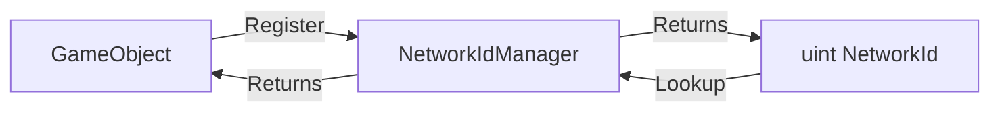
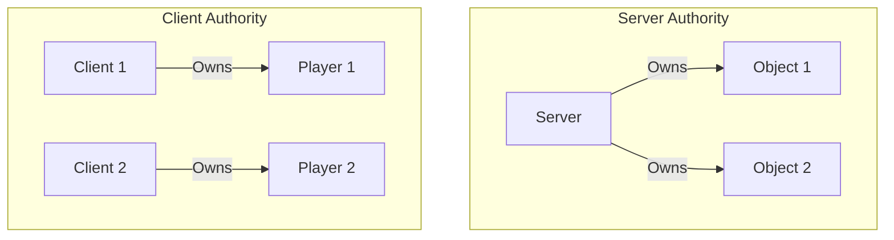
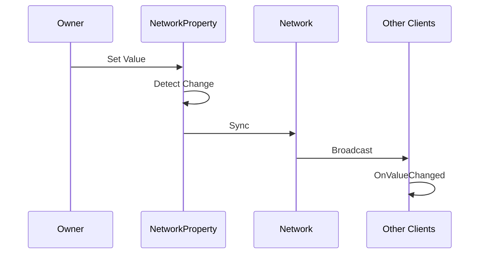

# Core Services

The fundamental services that power networking.

---

## NetworkManager

Central hub for all networking operations.

### Properties

| Property | Type | Description |
|----------|------|-------------|
| `IsServer` | `bool` | True if hosting |
| `IsClient` | `bool` | True if connected as client |
| `IsConnected` | `bool` | True if network is active |
| `LocalClientId` | `ulong` | This client's unique ID |
| `ServerClientId` | `ulong` | The server's client ID |

### Methods

```csharp
// Send a message
void Send<T>(T message, NetworkTarget target) where T : struct, INetworkMessage;

// Send to specific client (server only)
void SendTo<T>(ulong clientId, T message) where T : struct, INetworkMessage;

// Register message handler
void On<T>(Action<T> handler) where T : struct, INetworkMessage;

// Unregister handler
void Off<T>(Action<T> handler) where T : struct, INetworkMessage;
```

### Events

| Event | When |
|-------|------|
| `OnConnected` | Connection established |
| `OnDisconnected` | Connection lost |
| `OnClientConnected` | Client joined (server) |
| `OnClientDisconnected` | Client left (server) |

### Example

```csharp
var network = App.Get<NetworkManager>();

// Check state
if (network.IsServer)
{
    Debug.Log($"Hosting as {network.LocalClientId}");
}

// Send message
network.Send(new MyMessage { Value = 42 }, NetworkTarget.Server);

// Handle messages
network.On<MyMessage>(msg => Debug.Log($"Received: {msg.Value}"));
```

---

## NetworkIdManager

Assigns and tracks unique IDs for networked objects.



### Methods

| Method | Description |
|--------|-------------|
| `Register(id, obj)` | Map ID to instance |
| `GetObject<T>(id)` | Get object by ID |
| `UnregisterId(id)` | Remove by ID |
| `Unregister(obj)` | Remove by instance |
| `GetId(obj)` | Get ID from instance |

### Example

```csharp
var idManager = App.Get<NetworkIdManager>();

// Register object
idManager.Register(networkId, myGameObject);

// Later, find it
var obj = idManager.GetObject<GameObject>(networkId);

// Cleanup
idManager.UnregisterId(networkId);
```

---

## NetworkOwnershipManager

Controls who has authority over networked objects.



### Methods

| Method | Description |
|--------|-------------|
| `SetOwner(objId, clientId)` | Assign owner (Server only) |
| `RemoveOwner(objId)` | Clear ownership tracking |

| Mode | Description |
|------|-------------|
| `ServerAuthoritative` | Only server can modify. Clients are proxies. |
| `ClientAuthoritative` | Owner can modify. Server relays to others. |

### Example

```csharp
var ownership = App.Get<NetworkOwnershipManager>();

// On server: give player ownership of their character
ownership.SetOwner(characterId, playerId);

// Check before modifying
if (ownership.IsOwner(objectId, network.LocalClientId))
{
    // We can modify this object
    transform.position = newPosition;
}
```

---

## NetworkProperty<T>

Automatically synchronized values with change detection.



### Usage

```csharp
public class Player : MonoBehaviour
{
    private NetworkProperty<int> _health = new(100);
    private NetworkProperty<Vector3> _position = new();
    private NetworkProperty<string> _name = new("Unknown");

    void Start()
    {
        // Subscribe to changes
        _health.OnValueChanged += (newVal) => 
        {
            Debug.Log($"Health is now: {newVal}");
            UpdateHealthUI(newVal);
        };
    }

    void Update()
    {
        if (IsOwner)
        {
            // Changes automatically sync
            _position.Value = transform.position;
        }
        else
        {
            // Apply synced values
            transform.position = _position.Value;
        }
    }

    public void TakeDamage(int amount)
    {
        if (IsServer)
        {
            _health.Value -= amount;
        }
    }
}
```

### Supported Types

- Primitives: `int`, `float`, `bool`, `string`
- Unity: `Vector3`, `Quaternion`
- Custom: Any `INetworkMessage`

---

## Next

- [Communication](./04-Communication.md) - Messages and handlers
