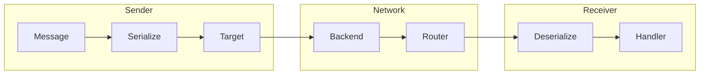
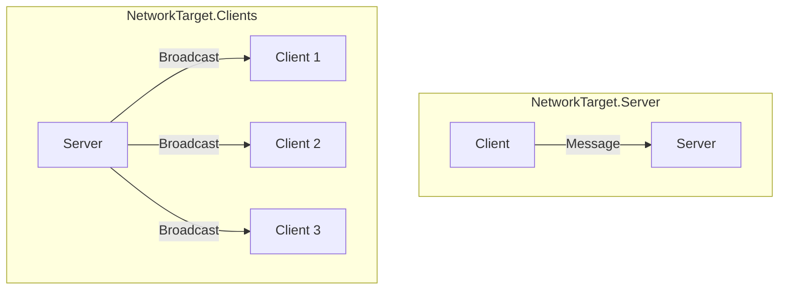
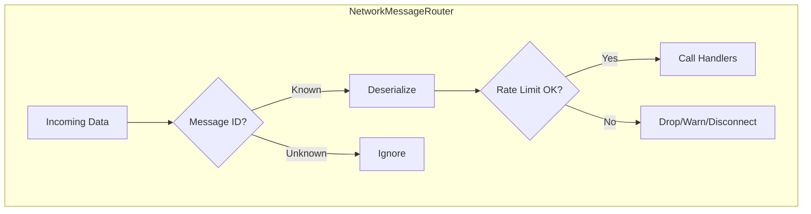

# Communication

Sending and receiving networked messages.

---

## Overview



---

## Defining Messages

Messages must implement `INetworkMessage`:

```csharp
using System.IO;
using Eraflo.Catalyst.Networking;

public struct ChatMessage : INetworkMessage
{
    public string Text;
    public ulong SenderId;
    public float Timestamp;

    public void Serialize(BinaryWriter writer)
    {
        writer.Write(Text ?? "");
        writer.Write(SenderId);
        writer.Write(Timestamp);
    }

    public void Deserialize(BinaryReader reader)
    {
        Text = reader.ReadString();
        SenderId = reader.ReadUInt64();
        Timestamp = reader.ReadSingle();
    }
}
```

### With Security Attributes

```csharp
public struct SecureChatMessage : INetworkMessage
{
    [MaxLength(256)]  // Limit string size
    public string Text;
    
    public ulong SenderId;

    public void Serialize(BinaryWriter writer)
    {
        writer.Write(Text ?? "");
        writer.Write(SenderId);
    }

    public void Deserialize(BinaryReader reader)
    {
        // Use safe deserialization
        Text = reader.ReadSafeString(256);
        SenderId = reader.ReadUInt64();
    }
}
```

---

## Targets

| Target | Description | Who Can Use |
|--------|-------------|-------------|
| `All` | Send to everyone including self | Anyone |
| `Others` | Send to everyone except self | Anyone |
| `Server` | Send to server only (from client) | Clients |
| `Clients` | Send to all clients (from server) | Server |



---

## Sending Messages

### Manual Registration

```csharp
network.Handlers.Register(new MyHandler());
```

> [!TIP]
> **Auto-Discovery**: By default, the `NetworkBootstrapper` automatically finds all classes implementing `INetworkMessageHandler` and registers them at startup. You don't need to manually register handlers unless they require custom constructor arguments.

### Basic Send

```csharp
var network = App.Get<NetworkManager>();

// To server
network.Send(new ChatMessage { Text = "Hello" }, NetworkTarget.Server);

// To all clients (server only)
network.Send(new ChatMessage { Text = "Welcome!" }, NetworkTarget.Clients);
```

### To Specific Client

```csharp
// Server only
network.SendTo(clientId, new PrivateMessage { Text = "Secret" });

// To multiple clients
network.SendToClients(new ulong[] { client1, client2 }, message);
```

### Delivery Options

```csharp
// Reliable (default) - guaranteed delivery, ordered
network.Send(message, target, NetworkDelivery.Reliable);

// Unreliable - fast, no guarantee (good for position updates)
network.Send(positionUpdate, target, NetworkDelivery.Unreliable);
```

| Delivery | Guaranteed | Ordered | Use Case |
|----------|------------|---------|----------|
| `Unreliable` | ❌ | ❌ | Position, rotation |
| `Reliable` | ✅ | ✅ | Events, spawn |
| `UnreliableSequenced`| ❌ | ✅ | High frequency (newer drops older) |
| `ReliableSequenced` | ✅ | ✅ | Strict order streams |
| `ReliableFragmented` | ✅ | ❌ | Large data where order doesn't matter |

---

## Handling Messages

### Lambda Handler

```csharp
network.On<ChatMessage>(msg => 
{
    Debug.Log($"[{msg.SenderId}]: {msg.Text}");
});
```

### Unsubscribe

```csharp
Action<ChatMessage> handler = msg => Debug.Log(msg.Text);

network.On<ChatMessage>(handler);    // Subscribe
network.Off<ChatMessage>(handler);   // Unsubscribe
```

### Class Handler with Rate Limiting

```csharp
[RateLimit(maxMessages: 5, windowSeconds: 1.0f, Action = RateLimitAction.Warn)]
public class ChatHandler : INetworkMessageHandler<ChatMessage>
{
    public void Handle(ChatMessage msg)
    {
        Debug.Log($"[{msg.SenderId}]: {msg.Text}");
    }
}
```

---

## Message Router

The router handles message dispatch:



### Events

| Event | Description |
|-------|-------------|
| `OnTypeRegistered` | New message type registered |
| `OnTypeUnregistered` | Message type removed |
| `OnClientViolation` | Client exceeded rate limit |

---

## Actions (RPC-like)

For simpler use cases, use `NetworkActionManager`:

```csharp
var actions = App.Get<NetworkActionManager>();

// 1. Register
actions.RegisterAction("PlayEffect", payload =>
{
    var values = NetworkSerializer.DeserializeValues(payload);
    EffectManager.PlayAt("Explosion", (Vector3)values[0]);
});

// 2. Trigger
actions.Trigger("PlayEffect", transform.position);
```

---

## Best Practices

1. **Use `[MaxLength]`** for all strings
2. **Use `ReadSafeString()`** in Deserialize
3. **Apply `[RateLimit]`** to prevent spam
4. **Use `Unreliable`** for frequent updates
5. **Keep messages small** - serialize only what's needed

---

## Next

- [State Sync](./05-StateSync.md) - Automatic synchronization
