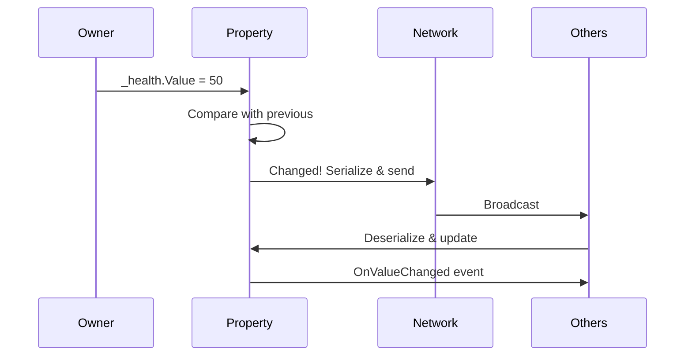
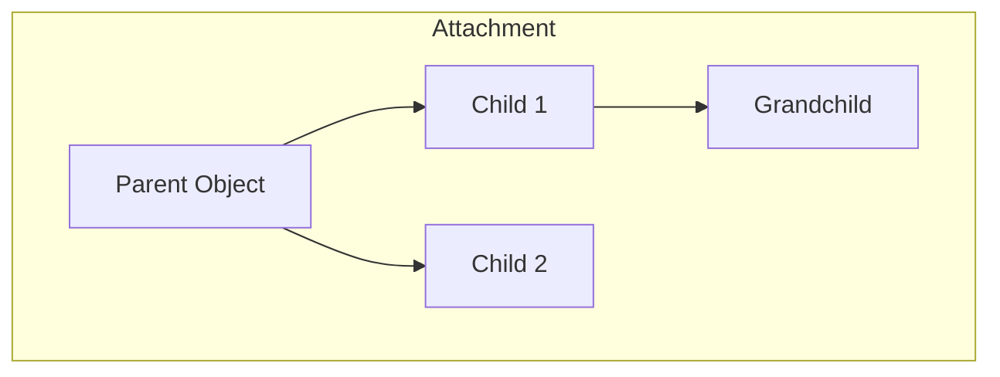

# State Synchronization

Automatic data replication across the network.

---

## NetworkProperty<T>

Single values that automatically sync.

### Declaration

```csharp
public class Player : MonoBehaviour
{
    // With initial value
    private NetworkProperty<int> _health = new(100);
    
    // Default value
    private NetworkProperty<Vector3> _position = new();
    
    // With change callback
    private NetworkProperty<string> _name = new("Unknown");
}
```

### Change Detection

```csharp
void Start()
{
    _health.OnValueChanged += (oldValue, newValue) =>
    {
        Debug.Log($"Health changed: {oldValue} → {newValue}");
        
        if (newValue <= 0)
            Die();
    };
}
```

### Sync Flow



---

## Network Collections

Synchronized collection types.

### NetworkList<T>

```csharp
private NetworkList<string> _inventory = new();

void AddItem(string item)
{
    _inventory.Add(item);        // Syncs automatically
}

void RemoveItem(int index)
{
    _inventory.RemoveAt(index);  // Syncs automatically
}

// Subscribe to changes
_inventory.OnItemAdded += (item) => Debug.Log($"Added: {item}");
_inventory.OnItemRemoved += (index, item) => Debug.Log($"Removed: {item} at {index}");
_inventory.OnChanged += () => Debug.Log("Inventory updated");
```

### NetworkDictionary<K,V>

```csharp
private NetworkDictionary<string, int> _scores = new();

void UpdateScore(string player, int score)
{
    _scores[player] = score;    // Syncs automatically
}

// Check value
if (_scores.TryGetValue("Alice", out int score))
{
    Debug.Log($"Alice: {score}");
}
```

### NetworkHashSet<T>

```csharp
private NetworkHashSet<ulong> _readyPlayers = new();

void SetReady(ulong playerId)
{
    _readyPlayers.Add(playerId);
}

bool IsReady(ulong playerId) => _readyPlayers.Contains(playerId);

bool AllReady => _readyPlayers.Count == expectedPlayerCount;
```

### NetworkQueue<T> / NetworkStack<T>

```csharp
// Queue (FIFO)
private NetworkQueue<Command> _commandQueue = new();
_commandQueue.Enqueue(new Command());
var next = _commandQueue.Dequeue();

// Stack (LIFO)
private NetworkStack<UndoAction> _undoStack = new();
_undoStack.Push(new UndoAction());
var last = _undoStack.Pop();
```

---

## Comparison

| Collection | Use Case | Order |
|------------|----------|-------|
| `NetworkList` | Ordered items, inventory | Indexed |
| `NetworkDictionary` | Key-value pairs, scores | Unordered |
| `NetworkHashSet` | Unique items, flags | Unordered |
| `NetworkQueue` | Task queue, events | FIFO |
| `NetworkStack` | Undo history | LIFO |

---

## Attachment System

Parent/child relationships that sync across the network.



### Usage

```csharp
var attachment = App.Get<NetworkAttachmentManager>();

// Attach object to parent
attachment.RequestAttach(childId, parentId, localPosition: localOffset);

// Attach with rotation
attachment.RequestAttach(childId, parentId, localPosition, localRotation);

// Detach
attachment.RequestDetach(childId);

// Check attachment
if (attachment.IsAttached(objectId))
{
    var parentId = attachment.GetParent(objectId);
}
```

### Example: Weapon Pickup

```csharp
public void PickupWeapon(uint weaponId, uint playerId)
{
    var attachment = App.Get<NetworkAttachmentManager>();
    
    // Attach weapon to player's hand
    attachment.RequestAttach(
        weaponId, 
        playerId, 
        localPosition: new Vector3(0.5f, 0, 0),
        localRotation: Quaternion.identity
    );
    
    // Transfer ownership
    var ownership = App.Get<NetworkOwnershipManager>();
    ownership.SetOwner(weaponId, network.GetOwner(playerId));
}
```

---

## Best Practices

1. **Use properties for simple values** - health, score, name
2. **Use collections for groups** - inventory, players list
3. **Subscribe early** - Set up `OnValueChanged` in `Start()`
4. **Only owner modifies** - Check ownership before changing
5. **Batch changes** - Modify multiple values together when possible

---

## Next

- [Discovery & Lobbies](./06-DiscoveryLobbies.md) - Finding and joining games
