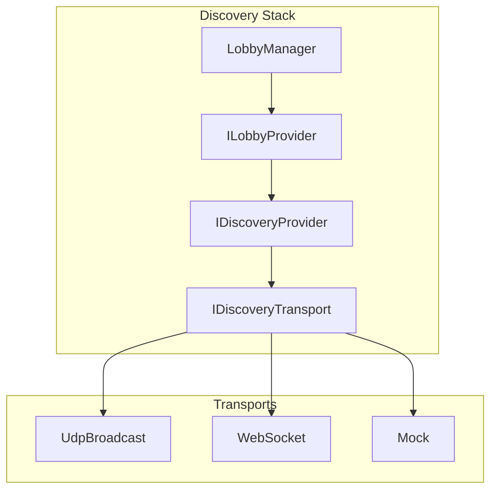
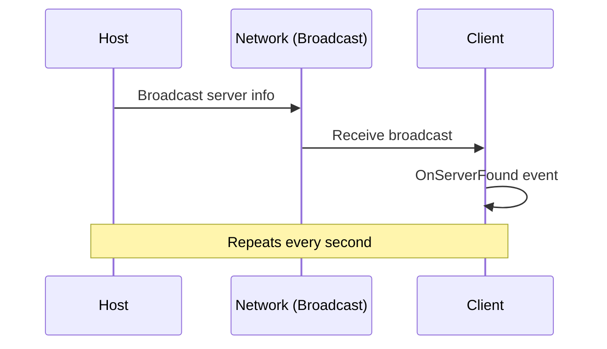
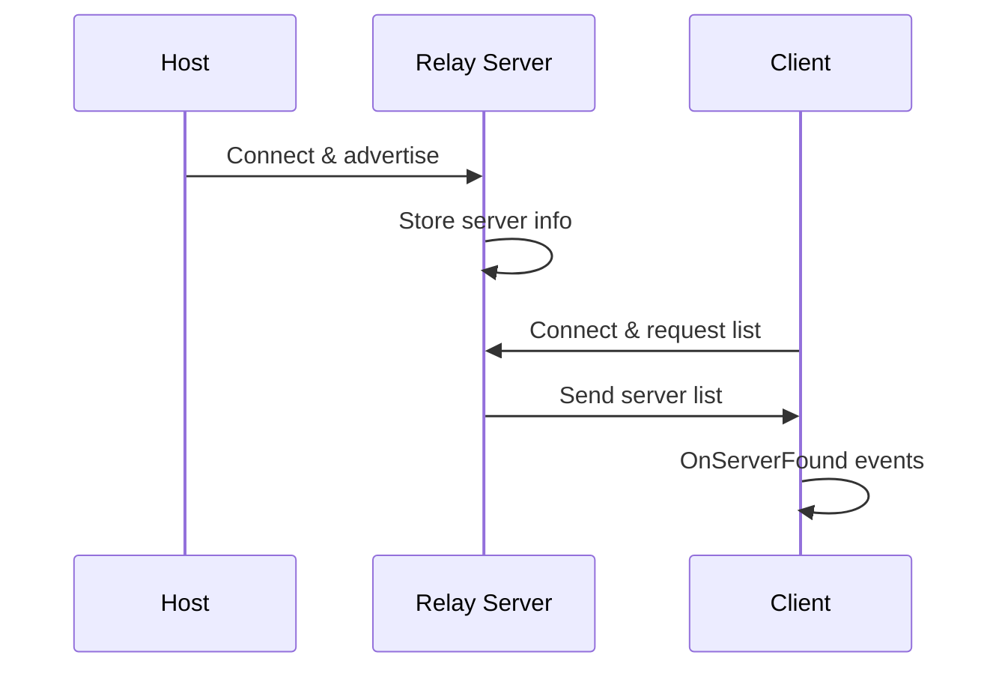

# Discovery & Lobbies

Finding and joining multiplayer games.

---

## Architecture



---

## Transport Types

| Transport | Use Case | Requirements |
|-----------|----------|--------------|
| `UdpBroadcast` | LAN games | Same network/subnet |
| `WebSocket` | Internet | Relay server URL |
| `Mock` | Testing | None |

### Configuring in PackageSettings

```
Tools > Catalyst > Settings

Discovery Transport:
├── Transport Type: [UdpBroadcast ▼]
├── Discovery Port: 47777
└── Relay URL: (for WebSocket only)
```

### Programmatic Override

```csharp
// Override transport per-instance
var transport = new WebSocketDiscoveryTransport("wss://relay.example.com");
var provider = new LanDiscoveryProvider(transport);

// Or use factory
var transport = DiscoveryTransportFactory.Create(DiscoveryTransportType.WebSocket);
```

---

## UDP Broadcast (LAN)

How it works:



**Limitations:**
- Same network only
- May be blocked by firewalls
- Not for internet play

---

## WebSocket Relay (Internet)

For internet matchmaking:



**Requirements:**
- WebSocket relay server
- URL configured in settings (e.g., `wss://relay.example.com`)

---

## LobbyManager

### Creating a Lobby

```csharp
var lobby = App.Get<LobbyManager>();

await lobby.CreateLobby(new LobbyOptions
{
    Name = "My Awesome Game",
    MaxPlayers = 4,
    Password = null,              // No password
    IsDedicatedServer = false     // Host plays too
});
```

### With Password

```csharp
await lobby.CreateLobby(new LobbyOptions
{
    Name = "Private Game",
    MaxPlayers = 4,
    Password = "secret123"  // Hashed automatically
});
```

### Dedicated Server Mode

```csharp
await lobby.CreateLobby(new LobbyOptions
{
    Name = "Game Server #1",
    MaxPlayers = 32,
    Port = 7777,
    IsDedicatedServer = true  // Server-only mode
});
```

---

## Finding Lobbies

### Search

```csharp
// Search for available lobbies
List<LobbyInfo> lobbies = await lobby.SearchLobbies();
foreach (var info in lobbies)
{
    Debug.Log($"Found lobby: {info.Name} ({info.CurrentPlayers}/{info.MaxPlayers})");
}
```

### Handle Results

```csharp
private void JoinLobby(LobbyInfo info)
{
    Debug.Log($"Joining lobby: {info.Name} with code: {info.JoinCode}");
    _lobby.JoinLobby(info.JoinCode);
}
```

### DiscoveryInfo Properties

| Property | Type | Description |
|----------|------|-------------|
| `Id` | `string` | Unique identifier |
| `Name` | `string` | Display name |
| `CurrentPlayers`| `int` | Connected players |
| `MaxPlayers` | `int` | Maximum capacity |
| `JoinCode` | `string` | Unique join code |
| `IsPasswordProtected` | `bool` | Requires password |

---

## Joining Lobbies

### Without Password

```csharp
var result = await lobby.JoinLobby(joinCode);

if (result.Success)
{
    Debug.Log("Connected!");
}
else
{
    Debug.LogError($"Failed: {result.Error}");
}
```

### With Password

```csharp
var result = await lobby.JoinLobby(joinCode, password: "secret123");
```

### With Timeout

```csharp
using var cts = new CancellationTokenSource(TimeSpan.FromSeconds(10));

try
{
    var result = await lobby.JoinLobby(joinCode, ct: cts.Token);
}
catch (OperationCanceledException)
{
    Debug.Log("Connection timed out");
}
```

---

## Complete Example

```csharp
public class LobbyUI : MonoBehaviour
{
    [SerializeField] private Transform _serverListContent;
    [SerializeField] private GameObject _serverItemPrefab;

    private LobbyManager _lobby;
    private List<DiscoveryInfo> _servers = new();

    void Start()
    {
        _lobby = App.Get<LobbyManager>();
        _lobby.OnServerFound += AddServer;
    }

    public async void OnHostClicked()
    {
        await _lobby.CreateLobby(new LobbyOptions
        {
            Name = $"{PlayerName}'s Game",
            MaxPlayers = 4
        });
    }

    public async void OnRefreshClicked()
    {
        ClearServerList();
        var lobbies = await _lobby.SearchLobbies();
        foreach (var l in lobbies) AddServer(l);
    }

    public async void OnJoinClicked(int index)
    {
        var lobbyInfo = _lobbies[index];
        
        string password = lobbyInfo.IsPasswordProtected ? AskForPassword() : null;
        var result = await _lobby.JoinLobby(lobbyInfo.JoinCode, password);
        
        if (!result.Success)
            ShowError(result.Message);
    }

    private void AddServer(LobbyInfo info)
    {
        _lobbies.Add(info);
        var item = Instantiate(_serverItemPrefab, _serverListContent);
        item.GetComponent<ServerListItem>().Setup(info, _lobbies.Count - 1);
    }

    private void ClearServerList()
    {
        _servers.Clear();
        foreach (Transform child in _serverListContent)
            Destroy(child.gameObject);
    }
}
```

---

## Next

- [Connection Security](./07-ConnectionSecurity.md) - Secure connections
