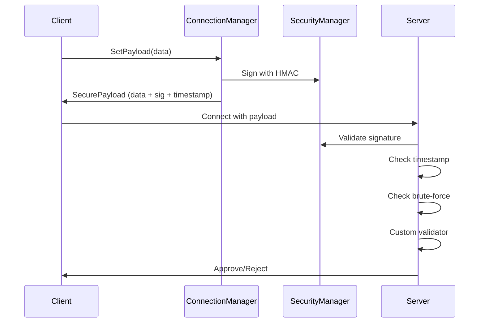
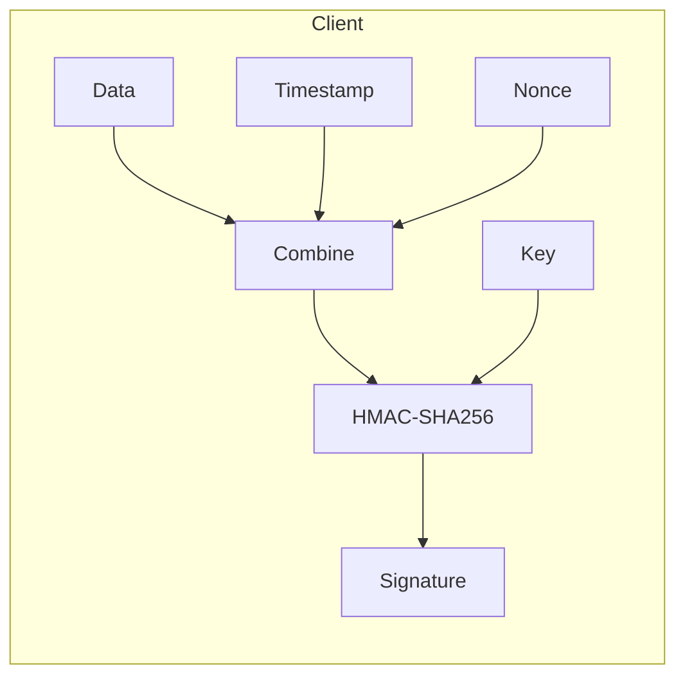
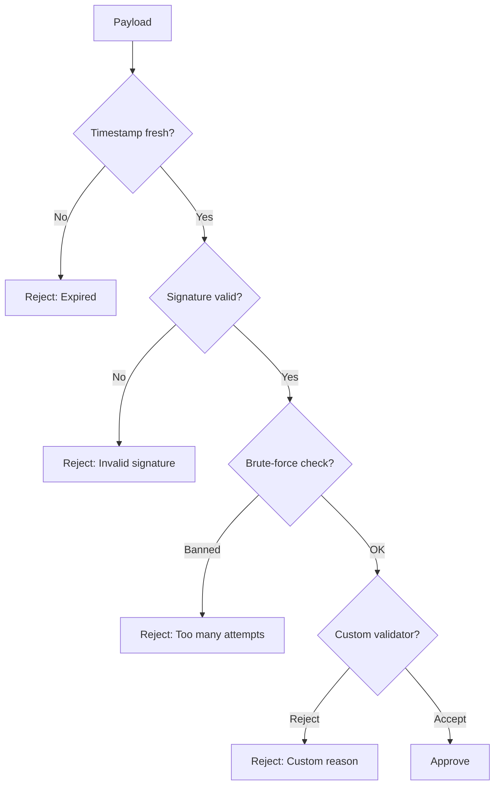
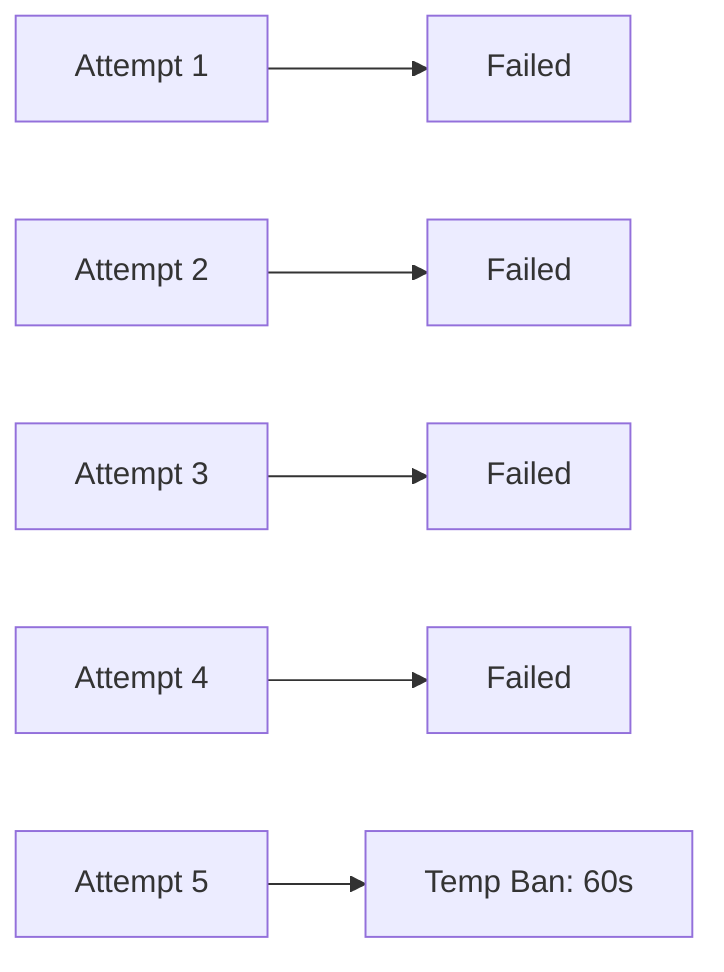

# Connection Security

Secure client connections with validation and protection.

---

## Overview

The connection system provides:

1. **Payload Signing** - HMAC signatures prevent forgery
2. **Replay Protection** - Timestamps prevent reuse
3. **Brute-Force Protection** - Automatic banning
4. **Custom Validation** - Your own approval logic



---

## Configuration

In PackageSettings:

| Setting | Default | Description |
|---------|---------|-------------|
| Enable Secure Connections | ✅ | Sign payloads with HMAC |
| Max Payload Age (sec) | 30 | Reject older payloads |
| Max Attempts/min | 5 | Before temp ban |
| Ban Duration (sec) | 60 | Temp ban length |

---

## Client: Setting Payload

```csharp
var connection = App.Get<ConnectionManager>();

// With automatic serialization
connection.SetPayload(new PlayerInfo 
{ 
    Name = "Alice",
    AuthToken = "abc123"
});

// Or raw bytes
connection.SetRawPayload(byteArray);
```

The payload is automatically signed when security is enabled.

---

## Server: Validating Connections

```csharp
var connection = App.Get<ConnectionManager>();

connection.OnValidateConnection += request =>
{
    // Deserialize payload
    var info = request.GetPayload<PlayerInfo>();
    
    // Check name
    if (string.IsNullOrEmpty(info.Name))
        return ConnectionResponse.Reject("Name required");
    
    // Check auth token
    if (!ValidateAuthToken(info.AuthToken))
        return ConnectionResponse.Reject("Invalid token");
    
    // Check if banned
    if (IsBanned(request.ClientId))
        return ConnectionResponse.Reject("You are banned");
    
    // All good!
    return ConnectionResponse.Success();
};
```

### ConnectionRequest

| Property | Type | Description |
|----------|------|-------------|
| `ClientId` | `ulong` | Client's network ID |
| `Payload` | `byte[]` | Raw payload data |
| `GetPayload<T>()` | `T` | Deserialize payload |

### ConnectionResponse

```csharp
// Approve with default spawn
ConnectionResponse.Success();

// Approve with custom spawn
ConnectionResponse.Success(position, rotation);

// Reject
ConnectionResponse.Reject("Reason shown to client");
```

---

## Secure Payloads Deep Dive

### SecureConnectionPayload Structure

```csharp
public struct SecureConnectionPayload
{
    public byte[] Data;       // Actual payload
    public byte[] Signature;  // HMAC-SHA256
    public long Timestamp;    // Unix seconds
    public byte[] Nonce;      // Random 16 bytes
}
```

### How Signing Works



### Validation Process



---

## Brute-Force Protection

Automatically tracks failed attempts:



**Per-IP tracking** - One bad client doesn't affect others.

---

## Disabling Security (Dev Only)

For development without security:

```csharp
// In PackageSettings
EnableSecureConnections = false
```

Or programmatically:

```csharp
var connection = App.Get<ConnectionManager>();
connection.SecurityConfig.EnableSecurePayloads = false;
```

> [!WARNING]
> Never disable in production!

---

## Complete Example: Auth System

```csharp
// Shared payload type (client & server)
public struct AuthPayload : INetworkMessage
{
    [MaxLength(64)]
    public string Username;
    
    [MaxLength(256)]
    public string AuthToken;

    public void Serialize(BinaryWriter writer)
    {
        writer.Write(Username ?? "");
        writer.Write(AuthToken ?? "");
    }

    public void Deserialize(BinaryReader reader)
    {
        Username = reader.ReadSafeString(64);
        AuthToken = reader.ReadSafeString(256);
    }
}

// Client: Before connecting
public void SetupAuth(string username, string token)
{
    var connection = App.Get<ConnectionManager>();
    connection.SetPayload(new AuthPayload
    {
        Username = username,
        AuthToken = token
    });
}

// Server: Validation
void Start()
{
    var connection = App.Get<ConnectionManager>();
    connection.OnValidateConnection += ValidateAuth;
}

ConnectionResponse ValidateAuth(ConnectionRequest request)
{
    var auth = request.GetPayload<AuthPayload>();
    
    // Validate with your auth service
    if (!AuthService.ValidateToken(auth.Username, auth.AuthToken))
    {
        return ConnectionResponse.Reject("Authentication failed");
    }
    
    // Store for later
    PlayerData.SetUsername(request.ClientId, auth.Username);
    
    return ConnectionResponse.Success();
}
```

---

## Next

- [Spawning](./08-Spawning.md) - Player and object spawning
