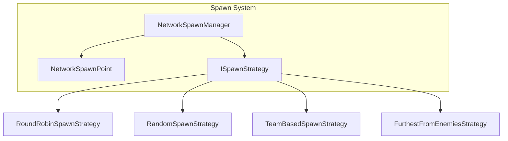

# Spawning

Player and object spawning systems.

---

## Overview



---

## NetworkSpawnManager

Central service for spawn operations.

### Methods

| Method | Description |
|--------|-------------|
| `SpawnPlayerForClient(id)` | Spawns player for client |
| `DespawnPlayer(id)` | Despawns client player |
| `RegisterSpawnPoint(point)` | Add spawn point |
| `UnregisterSpawnPoint(point)` | Remove spawn point |
| `RefreshSpawnPoints()` | Find all points in scene |

### Basic Usage

```csharp
var spawnManager = App.Get<NetworkSpawnManager>();

// Set strategy
spawnManager.Strategy = new RoundRobinSpawnStrategy();

// Spawn player (Server only)
spawnManager.SpawnPlayerForClient(clientId);
```

---

## NetworkSpawnPoint Component

Add to GameObjects to mark them as spawn locations.

```csharp
// Attach to empty GameObjects in your scene
public class NetworkSpawnPoint : MonoBehaviour
{
    [SerializeField] private int _priority = 0;   // Higher = preferred
    [SerializeField] private int _teamId = -1;     // -1 = any team
    [SerializeField] private string _spawnTag = "";// Custom filtering
    
    public int Priority => _priority;
    public int TeamId => _teamId;
    public string SpawnTag => _spawnTag;
    public Vector3 Position => transform.position;
}
```

### Inspector Setup

1. Create empty GameObjects at spawn locations
2. Add `NetworkSpawnPoint` component
3. Configure weight and team as needed

```
Scene Hierarchy:
├── SpawnPoints
│   ├── SpawnPoint_A  (NetworkSpawnPoint, Weight: 1, Team: 0)
│   ├── SpawnPoint_B  (NetworkSpawnPoint, Weight: 1, Team: 0)
│   ├── SpawnPoint_C  (NetworkSpawnPoint, Weight: 2, Team: 1)
│   └── SpawnPoint_D  (NetworkSpawnPoint, Weight: 1, Team: 1)
```

---

### TeamBasedSpawnStrategy
Matches spawn points by `TeamId`.

### FurthestFromEnemiesStrategy
Selects the point furthest from players on other teams.

### RoundRobinSpawnStrategy
Cycles through points sequentially.

### RandomSpawnStrategy
Random selection from valid points.

---

## Spawn Payloads
Clients can send extra data (like character class) with their connection request:

```csharp
public struct SpawnPayload
{
    public string PrefabKey; // "Tank", "Healer", etc.
    public int TeamId;
    public string SpawnTag;
}
```

---

## Custom Spawn Strategy

Implement your own:

```csharp
public class SafeZoneSpawnStrategy : ISpawnStrategy
{
    public NetworkSpawnPoint SelectSpawnPoint(
        IReadOnlyList<NetworkSpawnPoint> points,
        Vector3? hint = null)
    {
        // Find spawn point farthest from any enemy
        return points
            .OrderByDescending(p => DistanceToNearestEnemy(p.Position))
            .FirstOrDefault();
    }

    private float DistanceToNearestEnemy(Vector3 position)
    {
        var enemies = FindObjectsOfType<Enemy>();
        return enemies.Length == 0 
            ? float.MaxValue 
            : enemies.Min(e => Vector3.Distance(position, e.transform.position));
    }
}

// Set custom strategy
spawnManager.Strategy = new MyCustomStrategy();
```

---

## Complete Example

```csharp
public class PlayerSpawnSystem : MonoBehaviour
{
    [SerializeField] private GameObject _playerPrefab;

    private NetworkManager _network;
    private NetworkSpawnManager _spawnManager;
    private ConnectionManager _connection;

    void Start()
    {
        _network = App.Get<NetworkManager>();
        _spawnManager = App.Get<NetworkSpawnManager>();
        _connection = App.Get<ConnectionManager>();

        // Setup spawn logic during connection
        _connection.OnValidateConnection += OnValidate;
        
        // Handle when local player should spawn
        _network.OnConnected += OnConnected;
    }

    private ConnectionResponse OnValidate(ConnectionRequest request)
    {
        // Determine spawn based on player count
        var strategy = _network.ConnectedClientCount < 2 
            ? SpawnStrategy.RoundRobin 
            : SpawnStrategy.Random;
        
        var spawnPoint = _spawnManager.GetSpawnPoint(strategy);
        
        return ConnectionResponse.Success(
            spawnPoint.Position, 
            spawnPoint.Rotation
        );
    }

    private void OnConnected()
    {
        Debug.Log("Connected! Player will spawn at approved position.");
    }
}
```

---

## Next

- [Advanced Features](./09-AdvancedFeatures.md) - Culling, voice, diagnostics
