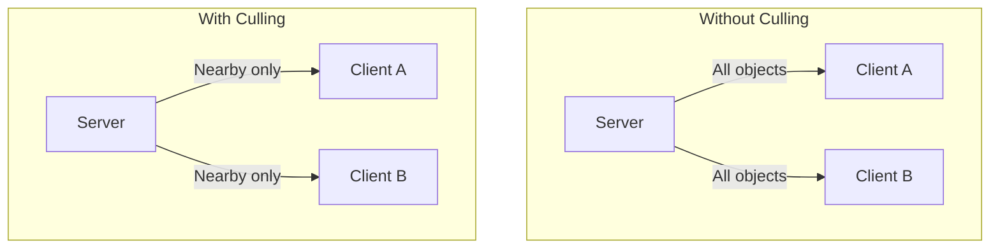
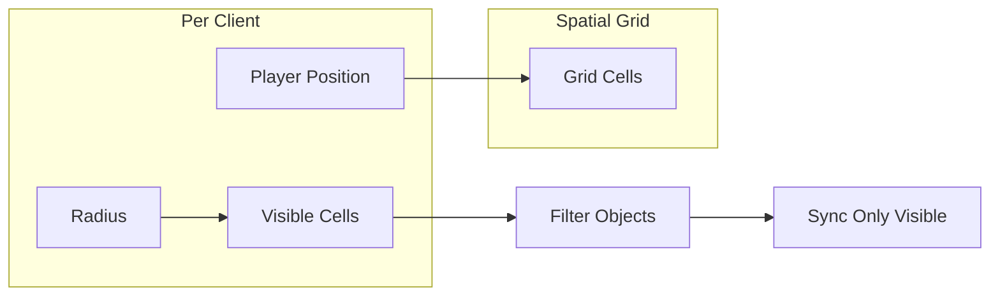
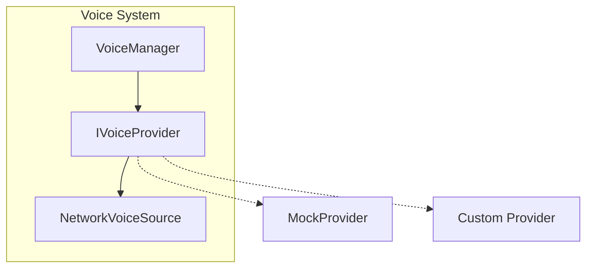

# Advanced Features

Culling, voice chat, diagnostics, and simulation.

---

## Interest Management (Culling)

Only sync objects that matter to each player.



### Configuration

In PackageSettings:
- **Culling Cell Size**: Spatial grid cell size
- **Culling Clients Per Frame**: Batch updates
- **Culling Hysteresis**: Buffer zone

### NetworkCullingArea Component

```csharp
// Add to player objects
public class NetworkCullingArea : MonoBehaviour
{
    [SerializeField] private float _radius = 50f;
    
    public float Radius => _radius;
}
```

### Usage

```csharp
var culling = App.Get<NetworkCullingManager>();

// Register player's interest area (area is a component on player)
culling.RegisterCullingArea(clientId, cullingArea);

// Update manually (usually handled by the component)
culling.UpdateCullablePosition(cullableObject);
```

### How It Works



---

## Voice Chat

Spatial voice communication.

### Architecture



### IVoiceProvider Interface

```csharp
public interface IVoiceProvider
{
    // Properties
    bool IsInitialized { get; }
    bool IsInChannel { get; }
    string CurrentChannel { get; }
    bool IsMuted { get; }
    bool IsSpeaking { get; }

    // Events
    event Action<bool> OnSpeakingStateChanged;
    event Action<ulong, bool> OnRemoteSpeakingChanged;
    event Action<bool, string> OnChannelJoined;
    event Action OnChannelLeft;

    // Methods
    void Initialize();
    void Shutdown();
    void JoinChannel(string name, bool is3D);
    void LeaveChannel();
    void SetMuted(bool muted);
    void SetMicEnabled(bool enabled);
    void SetMicrophoneVolume(float volume);
    void SetSpeakerVolume(float volume);
    void UpdateListenerPosition(Vector3 pos, Vector3 forward, Vector3 up);
    void SetParticipantMuted(ulong id, bool muted);
}
```

### Usage

```csharp
var voice = App.Get<VoiceManager>();

// Set provider
voice.SetProvider(new MyVoiceProvider());

// Push-to-talk
if (Input.GetKeyDown(KeyCode.V))
    voice.SetMuted(false);
    
if (Input.GetKeyUp(KeyCode.V))
    voice.SetMuted(true);

// Mute player
voice.SetPlayerMuted(annoyingPlayerId, true);

// Adjust volumes
voice.MicrophoneVolume = 0.8f;
voice.SpeakerVolume = 1.0f;
```

### NetworkVoiceSource Component

Attach to player prefabs for spatial audio:

```csharp
public class NetworkVoiceSource : MonoBehaviour
{
    [SerializeField] private AudioSource _audioSource;
    [SerializeField] private float _maxDistance = 20f;
    
    // Automatically manages spatial audio
}
```

---

## Diagnostics

Network performance monitoring.

### NetworkDiagnostics Service

```csharp
var diagnostics = App.Get<NetworkDiagnostics>();

Debug.Log($"RTT: {diagnostics.RTT}ms");
Debug.Log($"Bandwidth In: {diagnostics.BandwidthIn} KB/s");
Debug.Log($"Bandwidth Out: {diagnostics.BandwidthOut} KB/s");
Debug.Log($"Loss: {diagnostics.PacketLoss}%");
```

### Properties

| Property | Type | Description |
|----------|------|-------------|
| `RTT` | `float` | Ping in ms |
| `BandwidthIn` | `float` | Inbound KB/s |
| `BandwidthOut` | `float` | Outbound KB/s |
| `PacketLoss` | `float` | Loss percentage |
| `IsSimulationActive` | `bool` | True if sim active |

### Debug Overlay

Enable in PackageSettings:

```
Tools > Catalyst > Settings
├── Enable Debug Overlay: ✅
```

Or runtime:

```csharp
var overlay = FindObjectOfType<NetworkDiagnosticsOverlay>();
overlay.enabled = true;
```

---

## Network Simulation

Test under poor network conditions.

### Configuration

In PackageSettings:
- **Simulate Latency (ms)**: Added delay
- **Simulate Packet Loss (%)**: Random drops
- **Simulate Jitter (ms)**: Latency variance

### Use Cases

| Scenario | Latency | Loss | Jitter |
|----------|---------|------|--------|
| LAN | 0 | 0% | 0 |
| Good WiFi | 20 | 0.5% | 5 |
| Mobile | 80 | 2% | 30 |
| Poor | 200 | 5% | 50 |
| Terrible | 500 | 10% | 100 |

### Runtime Toggle

```csharp
var backend = network.Backend as ISimulationBackend;
if (backend != null)
{
    // Apply latency, loss, and jitter
    backend.ApplySimulationParameters(latencyMs: 100, packetLoss: 5f, jitterMs: 20);
}
```

> [!NOTE]
> Simulation only works in Editor/Development builds.

---

## Actions (RPC-like)

Simplified remote method calls.

```csharp
var actions = App.Get<NetworkActionManager>();

// 1. Register an action
actions.RegisterAction("PlayEffect", payload =>
{
    var values = NetworkSerializer.DeserializeValues(payload);
    var position = (Vector3)values[0];
    EffectManager.PlayAt("Explosion", position); // This doesn't exist, just an example
});

// 2. Trigger on OTHERS only (e.g. for local-only actions on other clients)
actions.Trigger("PlayEffect", transform.position);

// 3. Trigger on ALL (including self) - Best for gameplay requests or synced visuals
actions.TriggerToTarget("PlayEffect", NetworkTarget.All, transform.position);

// 4. Request something from the SERVER
actions.TriggerToTarget("RequestSpawn", NetworkTarget.Server, spawnPos, "Zombie");
```

---

## Next

- [Backends](./10-Backends.md) - Network backend implementations
