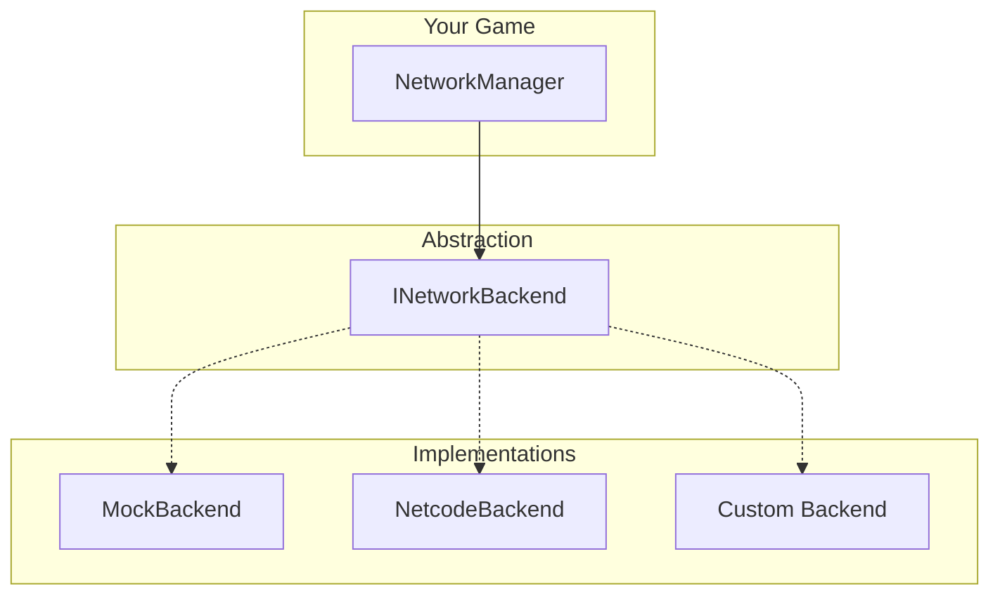

# Backends

Network transport implementations.

---

## Overview



---

## Built-in Backends

### MockBackend

For unit testing. Simulates network locally.

```csharp
// Configuration
NetworkBackendId = "mock"

// Or programmatic
network.SetBackend(new MockBackend());
```

**Features:**
- ✅ All message types
- ✅ Connection events
- ✅ No actual network
- ✅ Fast for tests

### NetcodeBackend

Production backend using Unity NGO.

```csharp
// Configuration
NetworkBackendId = "netcode"
```

> [!IMPORTANT]
> **Scene Setup**: Netcode requires a `NetworkManager` component in your scene configured with `CatalystTransport`.

**Requirements:**
- Unity Netcode for GameObjects package
- NetworkManager in scene

---

## INetworkBackend Interface

```csharp
public interface INetworkBackend
{
    // State
    bool IsServer { get; }
    bool IsClient { get; }
    bool IsConnected { get; }
    ulong LocalClientId { get; }
    ulong ServerClientId { get; }
    
    // Messaging
    void Send(ushort msgType, byte[] data, NetworkTarget target, NetworkDelivery delivery = NetworkDelivery.Reliable);
    void SendToClient(ushort msgType, byte[] data, ulong clientId, NetworkDelivery delivery = NetworkDelivery.Reliable);
    void SendToClients(ushort msgType, byte[] data, ulong[] clientIds, NetworkDelivery delivery = NetworkDelivery.Reliable);
    
    // Handlers
    void RegisterHandler(ushort msgType, Action<byte[], ulong> handler);
    void UnregisterHandler(ushort msgType);
    
    // Features
    bool SupportsNativeGameObjectReplication { get; }
    GameObject SpawnPlayer(ulong clientId, Vector3? position = null, Quaternion? rotation = null);
    ulong GetOwner(GameObject go);
    IDiscoveryProvider DiscoveryProvider { get; } // Optional
}
```

---

## Creating a Custom Backend

### Step 1: Implement Interface

```csharp
public class PhotonBackend : INetworkBackend
{
    public bool IsServer => PhotonNetwork.IsMasterClient;
    public bool IsClient => PhotonNetwork.IsConnected;
    public bool IsConnected => PhotonNetwork.InRoom;
    public ulong LocalClientId => (ulong)PhotonNetwork.LocalPlayer.ActorNumber;
    public ulong ServerClientId => (ulong)PhotonNetwork.MasterClient.ActorNumber;
    
    public bool SupportsNativeGameObjectReplication => true;
    public IDiscoveryProvider DiscoveryProvider => null;

    private Dictionary<ushort, Action<byte[], ulong>> _handlers = new();

    public void Initialize()
    {
        PhotonNetwork.AddCallbackTarget(this);
    }

    public void Shutdown()
    {
        PhotonNetwork.RemoveCallbackTarget(this);
        PhotonNetwork.Disconnect();
    }

    public void Send(ushort msgType, byte[] data, NetworkTarget target, NetworkDelivery delivery)
    {
        var receivers = target switch
        {
            NetworkTarget.Server => ReceiverGroup.MasterClient,
            NetworkTarget.Clients => ReceiverGroup.Others,
            _ => ReceiverGroup.All
        };
        
        PhotonNetwork.RaiseEvent(msgType, data, new RaiseEventOptions 
        { 
            Receivers = receivers 
        }, 
        GetSendOptions(delivery));
    }

    public void RegisterHandler(ushort msgType, Action<byte[], ulong> handler)
    {
        _handlers[msgType] = handler;
    }

    // ... implement remaining methods
}
```

### Step 2: Register Factory

```csharp
// In your initialization code
NetworkBackendRegistry.Register("photon", () => new PhotonBackend());
```

### Step 3: Configure

```csharp
// In PackageSettings
NetworkBackendId = "photon"
```

---

## Backend Comparison

| Feature | Mock | Netcode | Custom |
|---------|------|---------|--------|
| Testing | ✅ | ❌ | ? |
| Production | ❌ | ✅ | ✅ |
| Setup | None | Package | Varies |
| Performance | N/A | Good | Varies |
| Relay Support | ❌ | ✅ | ? |

---

## Backend Factory

Register and create backends:

```csharp
// Register
NetworkBackendRegistry.Register("steam", () => new SteamBackend());
NetworkBackendRegistry.Register("mirror", () => new MirrorBackend());

// Create from ID
var backend = NetworkBackendFactory.Create("steam");
network.SetBackend(backend);

// List available
foreach (var id in NetworkBackendRegistry.RegisteredIds)
{
    Debug.Log($"Available: {id}");
}
```

---

## Testing with MockBackend

```csharp
[Test]
public void MessageDelivery_WorksLocally()
{
    // Setup
    App.Initialize();
    var network = App.Get<NetworkManager>();
    network.SetBackend(new MockBackend());
    
    // Subscribe
    bool received = false;
    network.On<TestMessage>(msg => received = true);
    
    // Send
    network.Send(new TestMessage(), NetworkTarget.Self);
    
    // Verify
    Assert.IsTrue(received);
    
    // Cleanup
    App.Shutdown();
}
```

---

## Next

- [Security Guide](./11-SecurityGuide.md) - Threat model and best practices
