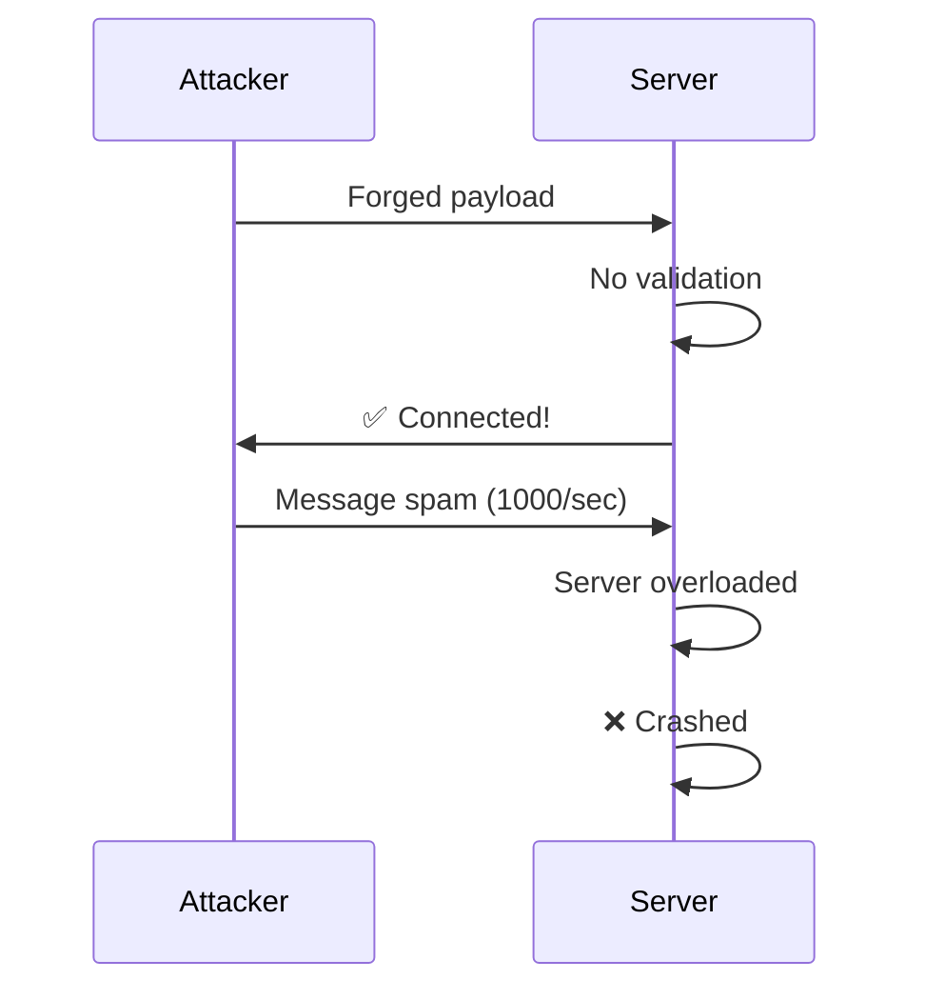
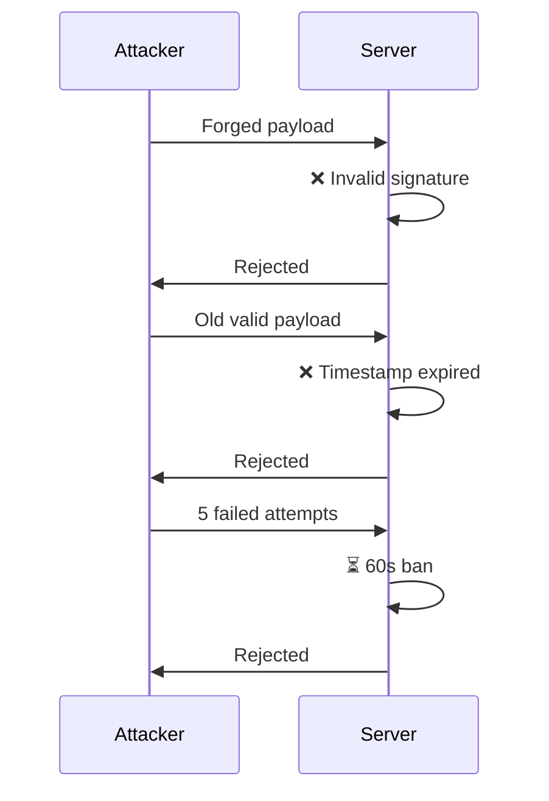
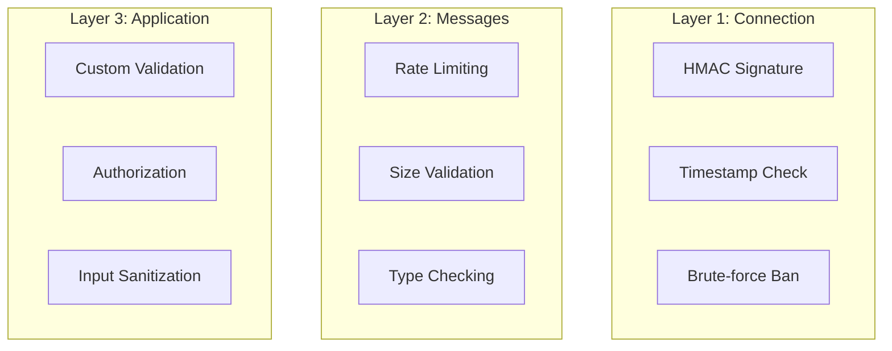
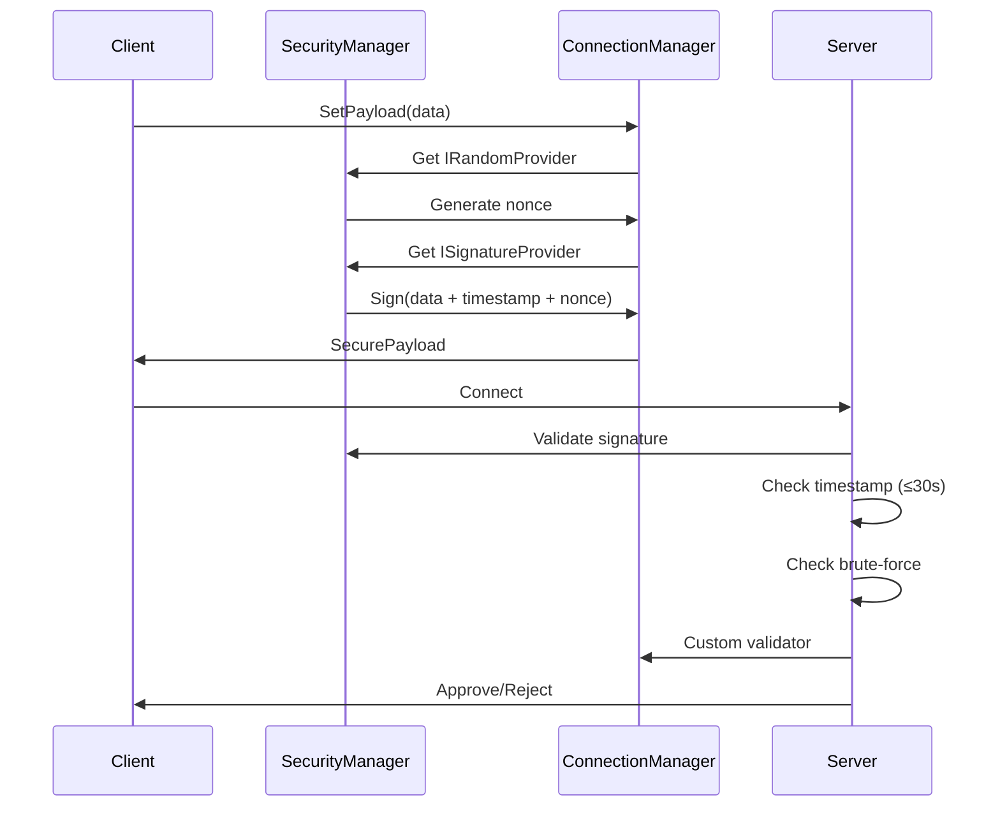

# Security Guide

Threat model and best practices for secure multiplayer.

---

## Threat Model

### Common Attacks

| Attack | Description | Mitigation |
|--------|-------------|------------|
| **Payload Forgery** | Fake connection data | HMAC signatures |
| **Replay Attack** | Reuse old payloads | Timestamp + nonce |
| **Brute Force** | Connection spam | Attempt limiting |
| **Message Spam** | DoS via messages | Rate limiting |
| **Buffer Overflow** | Huge strings/arrays | Size limits |
| **Timing Attack** | Guess secrets | Constant-time compare |

### Attack Flow Without Protection



### Attack Flow With Protection



---

## Defense Layers



---

## Connection Security

### Secure Connection Flow



### Configuration

```csharp
// PackageSettings
EnableSecureConnections = true      // HMAC validation
MaxConnectionPayloadAge = 30        // Seconds
MaxConnectionAttemptsPerMinute = 5  // Before ban
ConnectionBanDurationSeconds = 60   // Ban length
```

---

## Message Security

### Rate Limiting

```csharp
[RateLimit(maxMessages: 5, windowSeconds: 1.0f)]
public struct ChatMessage : INetworkMessage
{
    // Max 5 messages per second per client
}
```

### Actions on Violation

| Action | Behavior |
|--------|----------|
| `Reject` | Silently drop message |
| `Warn` | Log warning + drop |
| `Disconnect` | Boot the client |

### Size Limits

```csharp
public struct UserData : INetworkMessage
{
    [MaxLength(64)]   // Max 64 characters
    public string Name;
    
    [MaxSize(1024)]   // Max 1KB
    public byte[] Avatar;
    
    public void Deserialize(BinaryReader reader)
    {
        Name = reader.ReadSafeString(64);
        Avatar = reader.ReadSafeBytes(1024);
    }
}
```

---

## Best Practices

### ✅ Do

1. **Enable secure connections** in production
2. **Apply rate limits** to all message types
3. **Validate sizes** in all deserialize methods
4. **Use constant-time comparison** for secrets
5. **Log security events** for monitoring
6. **Hash passwords** via SecurityManager

### ❌ Don't

1. **Trust client data** - always validate server-side
2. **Disable security** in production
3. **Use string comparison** for secrets
4. **Allow unlimited strings/arrays**
5. **Ignore failed connection attempts**

---

## Checklist

Before deploying:

- [ ] `EnableSecureConnections = true`
- [ ] All messages have `[RateLimit]`
- [ ] All strings have `[MaxLength]`
- [ ] All arrays have `[MaxSize]`
- [ ] Custom validator implemented
- [ ] Password hashing via SecurityManager
- [ ] WebSocket uses `wss://` (TLS)
- [ ] Logging for security events

---

## Integration with Security Module

```csharp
var security = App.Get<SecurityManager>();

// Hash passwords
string hash = security.Hash.HashToHex(password);

// Generate tokens
string roomCode = security.GenerateRoomCode(6);

// Sign data
byte[] signature = security.Signature.Sign(data, key);

// Encrypt sensitive data
byte[] encrypted = security.EncryptWithSession(data);
```

See [Security Module](../Security.md) for full documentation.

---

## Next

- [API Reference](./12-API.md) - Complete API documentation
