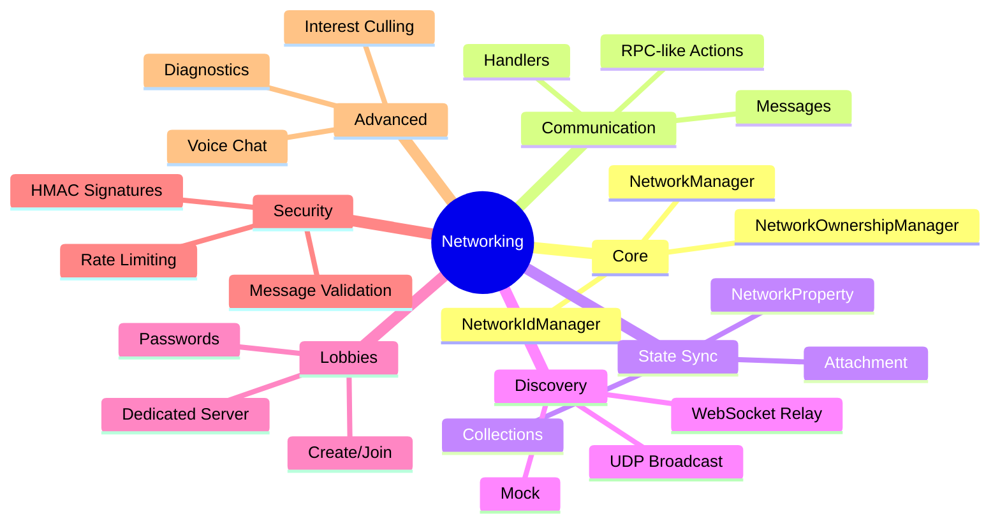

# Networking Module

Backend-agnostic multiplayer networking for Unity.

## Documentation Index

| Document | Description |
|----------|-------------|
| [Quick Start](./01-QuickStart.md) | 5-minute setup guide |
| [Architecture](./02-Architecture.md) | System design & diagrams |
| [Core Services](./03-CoreServices.md) | NetworkManager, Ids, Ownership |
| [Communication](./04-Communication.md) | Messages, handlers, sending |
| [State Sync](./05-StateSync.md) | Properties, collections |
| [Discovery & Lobbies](./06-DiscoveryLobbies.md) | Server finding, transport types |
| [Connection Security](./07-ConnectionSecurity.md) | Approval, payloads, HMAC |
| [Spawning](./08-Spawning.md) | Player spawn, strategies |
| [Advanced Features](./09-AdvancedFeatures.md) | Culling, voice, diagnostics |
| [Backends](./10-Backends.md) | Mock, Netcode, custom |
| [Security Guide](./11-SecurityGuide.md) | Threat model, best practices |
| [API Reference](./12-API.md) | Complete API |
| [Tutorials](./13-Tutorials.md) | Step-by-step guides |

## Feature Overview



## Quick Example

```csharp
using Eraflo.Catalyst;
using Eraflo.Catalyst.Networking;

public class MultiplayerGame : MonoBehaviour
{
    private LobbyManager _lobby;

    void Start()
    {
        _lobby = App.Get<LobbyManager>();
        _lobby.OnServerFound += info => Debug.Log($"Found: {info.Name}");
    }

    public async void Host() => await _lobby.CreateLobby(new LobbyOptions 
    { 
        Name = "My Game", 
        MaxPlayers = 4 
    });

    public void Search() => _lobby.SearchForLobbies();
}
```

## See Also

- [Security Module](../Security.md)
- [PackageSettings](../../Infrastructure/PackageSettings.md)
