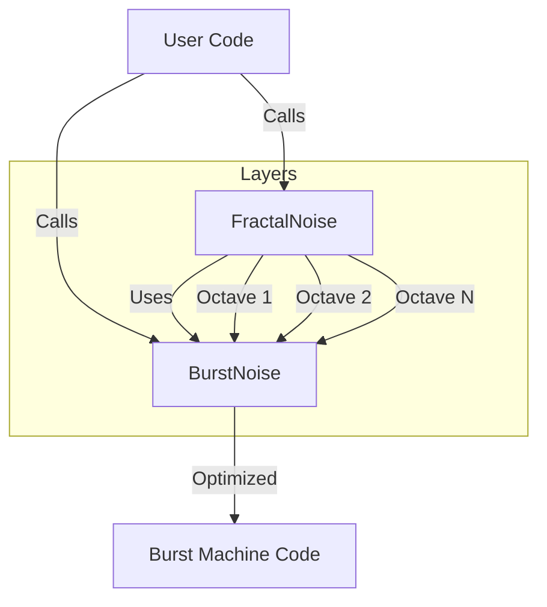

# Noise Module

The **Noise** module provides high-performance, Burst-compatible noise generation for procedural generation, VFX, and gameplay logic. It implements Simplex Noise in 2D, 3D, and 4D, along with Fractal Brownian Motion (FBM) for complex, layered noise.

---

## Table of Contents

1. [Features](#1-features)
2. [Quick Start](#2-quick-start)
3. [Architecture](#3-architecture)
4. [Simplex Noise](#4-simplex-noise)
5. [Fractal Noise (FBM)](#5-fractal-noise-fbm)
6. [API Reference](#6-api-reference)

---

## 1. Features

- **High Performance**: Optimized using `Unity.Burst` and `ReadOnlySpan` tables.
- **Allocation Free**: No GC allocations during sampling.
- **Multi-Dimensional**: Support for 2D, 3D, and 4D noise.
- **Fractal Generation**: Built-in support for Fractal Brownian Motion (FBM).
- **Time Animation**: Easy 4D-based time animation for 3D noise fields.

---

## 2. Quick Start

### 2.1 Basic Simplex Noise

```csharp
using Unity.Mathematics;
using Eraflo.Catalyst.Noise;

public class NoiseExample : MonoBehaviour
{
    void Update()
    {
        // Sample 2D noise at coordinates (x, y)
        float value = BurstNoise.Sample2D(transform.position.x, transform.position.y);
        
        // Sample 3D noise
        float val3D = BurstNoise.Sample3D(transform.position);
    }
}
```

### 2.2 Animated Fractal Noise

```csharp
using Unity.Mathematics;
using Eraflo.Catalyst.Noise;

public class CloudNoise : MonoBehaviour
{
    void Update()
    {
        float time = Time.time;
        float3 pos = (float3)transform.position;
        
        // Sample detailed FBM noise animated over time
        // Uses 4 octaves by default
        float density = FractalNoise.SampleAnimated3D(pos, time, timeScale: 0.5f);
        
        Debug.Log($"Cloud Density: {density}");
    }
}
```

---

## 3. Architecture

The system is split into two static classes: `BurstNoise` for raw Simplex noise, and `FractalNoise` for layered noise.



---

## 4. Simplex Noise

`BurstNoise` provides the raw Simplex noise implementation. Simplex noise is generally faster and has fewer artifacts than Perlin noise, especially in higher dimensions.

### Usage

```csharp
// 2D
float n2 = BurstNoise.Sample2D(x, y);

// 3D
float n3 = BurstNoise.Sample3D(x, y, z);

// 4D (Great for time-variant 3D noise)
float n4 = BurstNoise.Sample4D(x, y, z, time);
```

---

## 5. Fractal Noise (FBM)

`FractalNoise` layers multiple frequencies of Simplex noise to create more natural, detailed textures (like terrain, clouds, or marble).

### 5.1 Configuration

Shape the noise using `FractalSettings`:

```csharp
var settings = new FractalSettings
{
    Octaves = 6,          // Detail layers
    Lacunarity = 2.0f,    // Frequency jump per layer
    Persistence = 0.5f,   // Amplitude decay per layer
    Frequency = 0.01f,    // Base frequency
    Amplitude = 1.0f      // Base amplitude
};

float value = FractalNoise.Sample3D(position, settings);
```

### 5.2 Animated 3D Noise

A common use case for 4D noise is animating a 3D volume. `FractalNoise` provides a helper for this:

```csharp
// Smoothly animates the noise field over time
float val = FractalNoise.SampleAnimated3D(position, Time.time, timeScale: 1f);
```

---

## 6. API Reference

### BurstNoise

| Method | Description |
|--------|-------------|
| `Sample2D(float2)` | Sample 2D Simplex noise |
| `Sample3D(float3)` | Sample 3D Simplex noise |
| `Sample4D(float4)` | Sample 4D Simplex noise |

### FractalNoise

| Method | Description |
|--------|-------------|
| `Sample2D(float2, settings)` | Sample 2D FBM noise |
| `Sample3D(float3, settings)` | Sample 3D FBM noise |
| `Sample4D(float4, settings)` | Sample 4D FBM noise |
| `SampleAnimated3D(float3, time, ...)` | Sample 3D FBM using time as 4th dimension |

### FractalSettings

| Field | Description | Default |
|-------|-------------|---------|
| `Octaves` | Number of noise layers | 4 |
| `Lacunarity` | Frequency multiplier per layer | 2.0 |
| `Persistence` | Amplitude multiplier per layer | 0.5 |
| `Frequency` | Base coordinate scale | 1.0 |
| `Amplitude` | Base output scale | 1.0 |
