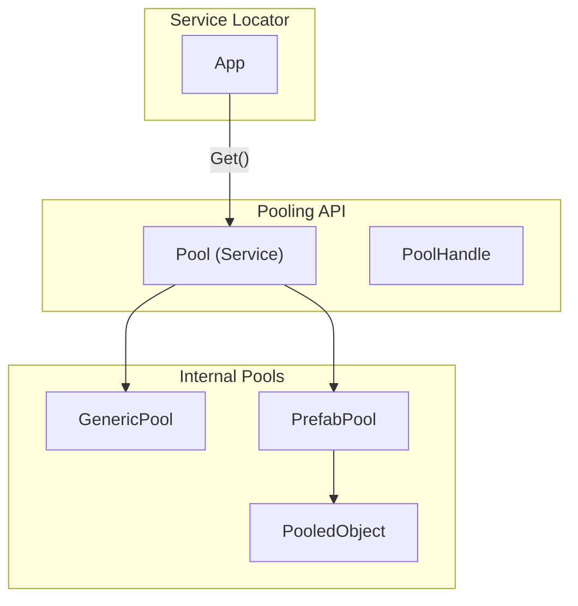

# Object Pooling System

A generic, thread-safe, and network-ready object pooling system. Seamlessly handles both C# classes and Unity Prefabs with automatic lifecycle management and sync.

---

## Table of Contents

1. [Features](#1-features)
2. [Quick Start](#2-quick-start)
3. [Architecture](#3-architecture)
4. [Generic Pooling (C# Classes)](#4-generic-pooling-c-classes)
5. [Prefab Pooling (GameObjects)](#5-prefab-pooling-gameobjects)
6. [Lifecycle Callbacks (IPoolable)](#6-lifecycle-callbacks-ipoolable)
7. [Networking](#7-networking)
8. [Performance & Metrics](#8-performance--metrics)
9. [API Reference](#9-api-reference)

---

## 1. Features

- **Consolidated API**: One service (`Pool`) for all pool types
- **Thread-Safe**: Safe for multi-threaded access (via `GenericPool`)
- **Prefab Support**: Automated `GameObject` activation/deactivation
- **Timer Integration**: Built-in methods for time-based despawning
- **Pre-allocation**: Warmup pools to avoid runtime spikes
- **Network Sync**: Synchronize spawns/despawns across clients
- **Real-time Metrics**: Track active, peak, and total counts

---

## 2. Quick Start

### 2.1 Basic Usage

```csharp
using UnityEngine;
using Eraflo.Catalyst;
using Eraflo.Catalyst.Pooling;

public class SpawnerExample : MonoBehaviour
{
    [SerializeField] private GameObject _prefab;
    
    private Pool _pool;
    
    void Start()
    {
        _pool = App.Get<Pool>();
        
        // Warmup for performance
        _pool.WarmupObject(_prefab, 10);
    }
    
    void Update()
    {
        if (Input.GetKeyDown(KeyCode.Space))
        {
            // Spawn from pool
            var handle = _pool.SpawnObject(_prefab, transform.position, Quaternion.identity);
            
            // Auto-despawn after 2 seconds
            _pool.DespawnObject(handle, 2f); 
        }
    }
}
```

---

## 3. Architecture



---

## 4. Generic Pooling (C# Classes)

Pool any C# class with a parameterless constructor.

```csharp
using Eraflo.Catalyst;
using Eraflo.Catalyst.Pooling;

public class DataSystem
{
    public void Process()
    {
        Pool pool = App.Get<Pool>();
        
        // Get handle from pool
        PoolHandle<MyData> handle = pool.GetFromPool<MyData>();
        
        // Use instance
        handle.Instance.Reset();
        handle.Instance.Value = 42;
        
        // Return to pool when done
        pool.ReleaseToPool(handle);
    }
}

public class MyData { public int Value; public void Reset() => Value = 0; }
```

---

## 5. Prefab Pooling (GameObjects)

Optimized for Unity GameObjects and Components.

### 5.1 Spawning and Despawning

```csharp
// Simple spawn
var handle = pool.SpawnObject(prefab, pos, rot);

// Spawn and auto-despawn
pool.SpawnObjectTimed(prefab, pos, 3f);

// Despawn manually
pool.DespawnObject(handle);
```

### 5.2 Component Access

```csharp
// Get directly as a component type
PoolHandle<Bullet> handle = pool.SpawnObject<Bullet>(bulletPrefab, pos, rot);
handle.Instance.Initialize();
```

---

## 6. Lifecycle Callbacks (IPoolable)

Implement `IPoolable` to receive callbacks when an object enters or leaves the pool.

```csharp
using UnityEngine;
using Eraflo.Catalyst.Pooling;

public class PooledVFX : MonoBehaviour, IPoolable
{
    [SerializeField] private ParticleSystem _particles;
    
    public void OnSpawn()
    {
        // Reset state and play
        _particles.Play();
    }
    
    public void OnDespawn()
    {
        // Stop and cleanup
        _particles.Stop();
        _particles.Clear();
    }
}
```

---

## 7. Networking

Sync pool operations across the network with `PoolNetworkHandler`.

### 7.1 Synchronized Spawning

```csharp
using Eraflo.Catalyst;
using Eraflo.Catalyst.Pooling;
using Eraflo.Catalyst.Networking;

// On Server
var handle = pool.SpawnNetworked(prefab, pos, rot);

// On Clients
// Handled automatically via PoolNetworkHandler!
```

### 7.2 Universal Network ID deconstruction

```csharp
// Easily get the network ID from a pool handle
var (handle, networkId) = pool.SpawnNetworked(prefab, pos, rot);
```

---

## 8. Performance & Metrics

### 8.1 Warmup

Avoid frame drops by pre-allocating objects during loading or scene start.

```csharp
pool.Warmup<MyData>(50);          // Pre-allocate 50 C# objects
pool.WarmupObject(bulletPrefab, 100); // Pre-allocate 100 prefabs
```

### 8.2 Monitoring

```csharp
var info = pool.GetDebugInfo();
foreach (var poolInfo in info)
{
    Debug.Log($"Pool: {poolInfo.Name} | Active: {poolInfo.ActiveCount} | Available: {poolInfo.AvailableCount}");
}
```

---

## 9. API Reference

### Pool (Service)

| Method | Description |
|--------|-------------|
| `GetFromPool<T>()` | Get C# object from pool |
| `ReleaseToPool<T>(handle)` | Return C# object to pool |
| `SpawnObject(prefab, pos, rot)` | Spawn GameObject from pool |
| `SpawnObjectTimed(prefab, pos, duration)` | Spawn with auto-timer |
| `DespawnObject(handle, [delay])` | Return to pool (optional delay) |
| `Warmup<T>(count)` | Pre-allocate C# objects |
| `WarmupObject(prefab, count)` | Pre-allocate prefab instances |
| `ClearAllPools()` | Full cleanup of all pools |

### PoolHandle<T>

| Property | Description |
|----------|-------------|
| `Id` | Unique instance ID |
| `Instance` | The pooled object |
| `IsValid` | Whether the handle is active |
| `SpawnTime` | Realtime timestamp of spawn |

### PooledObject (Component)

| Property/Method | Description |
|-----------------|-------------|
| `IsSpawned` | Current pooling state |
| `TimeSinceSpawn`| Elapsed time since activation |
| `Despawn()` | Manual despawn via component |
| `DespawnAfter(t)` | Scheduled despawn |

---

## See Also

- [Asset Management](AssetManagement.md): Loading prefabs for pooling
- [Chronos Manager](../Core/ChronosManager.md): Time scaling for timed despawns
- [Networking](Networking.md): Network sync details
