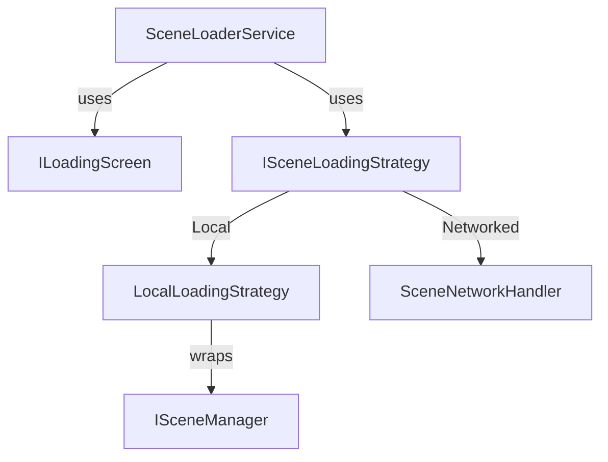
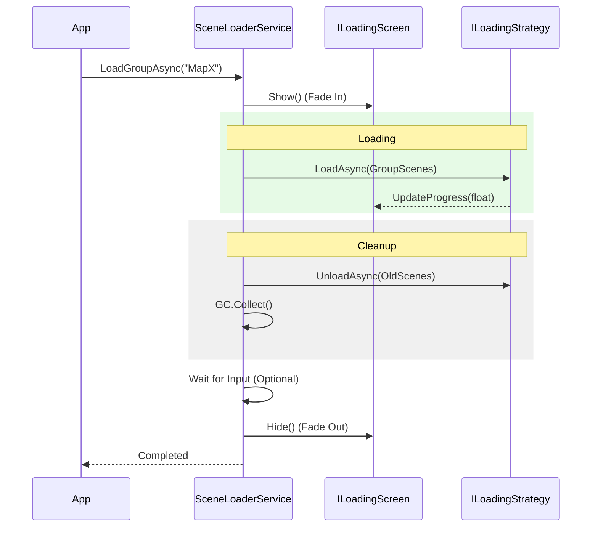

# Scene Flow Manager

A robust system for orchestrating complex scene transitions. Supports additive loading, loading screen integration, memory management, and network synchronization.

---

## Table of Contents

1. [Features](#1-features)
2. [Quick Start](#2-quick-start)
3. [Architecture](#3-architecture)
4. [Scene Groups](#4-scene-groups)
5. [Loading Screens](#5-loading-screens)
6. [Transition Flow](#6-transition-flow)
7. [Networking](#7-networking)
8. [Advanced Configuration](#8-advanced-configuration)
9. [API Reference](#9-api-reference)

---

## 1. Features

- **Scene Groups**: Define related scenes (e.g., Gameplay + HUD + Environment) as a single unit.
- **Automated Lifecycle**: Handles Fade In -> Load New -> Unload Old -> Memory Cleanup -> Set Active -> Fade Out.
- **Loading Screen Abstraction**: Works with any UI via the `ILoadingScreen` interface.
- **Memory Optimized**: Automatic `Resources.UnloadUnusedAssets()` and `GC.Collect()` during transitions.
- **Strategy Pattern**: Swap loading logic (Local vs. Networked) seamlessly.
- **Event-Driven**: Hook into transitions via `SceneTransitionChannel`.

---

## 2. Quick Start

### 2.1 Basic Scene Loading

```csharp
using UnityEngine;
using Eraflo.Catalyst;
using System.Collections.Generic;
using System.Threading.Tasks;

public class GameFlow : MonoBehaviour
{
    private SceneLoaderService _sceneLoader;

    void Start()
    {
        _sceneLoader = App.Get<SceneLoaderService>();

        // 1. Define a scene group
        var mainLevel = new SceneGroup
        {
            Name = "Level_1",
            Scenes = new List<string> { "Environment_GreenHill", "UI_HUD", "Gameplay_Systems" },
            ActiveScene = "Gameplay_Systems"
        };

        // 2. Register it
        _sceneLoader.RegisterGroup(mainLevel);
    }

    public async void GoToLevel1()
    {
        // 3. Load with transition
        await _sceneLoader.LoadGroupAsync("Level_1", showLoadingScreen: true, waitForInput: false);
    }
}
```

---

## 3. Architecture

The system uses a strategy-based approach to decouple the transition logic from the underlying loading mechanism.



---

## 4. Scene Groups

A `SceneGroup` allows you to load multiple scenes additively.

- **Name**: Unique identifier for the group.
- **Scenes**: List of scene names (must be in Build Settings).
- **ActiveScene**: The scene that will be set as `SceneManager.SetActiveScene` after all scenes are loaded.

> [!TIP]
> Use Scene Groups to split your game into "Core Gameplay", "EnvironmentAssets", and "DynamicUI" for better lighting and memory control.

---

## 5. Loading Screens

Implement `ILoadingScreen` to create custom transitions.

```csharp
using UnityEngine;
using UnityEngine.UI;
using System.Threading.Tasks;
using Eraflo.Catalyst;

public class MyLoadingScreen : MonoBehaviour, ILoadingScreen
{
    [SerializeField] private CanvasGroup _canvas;
    [SerializeField] private Slider _progressBar;

    // Required: Register the UI and make it persistent
    void Awake()
    {
        DontDestroyOnLoad(gameObject);
        App.Register<ILoadingScreen>(this);
    }

    public async Task Show()
    {
        // Perform Fade In
        _canvas.alpha = 1f;
        _canvas.blocksRaycasts = true;
        await Task.Delay(500); // Optional wait for animation
    }

    public async Task Hide()
    {
        // Perform Fade Out
        _canvas.alpha = 0f;
        _canvas.blocksRaycasts = false;
        await Task.CompletedTask;
    }

    public void UpdateProgress(float value)
    {
        _progressBar.value = value;
    }

    // Required for IGameService though usually empty for UI
    public void Initialize() { }
    public void Shutdown() { }
}
```

---

## 6. Transition Flow



---

## 7. Networking

The `SceneNetworkHandler` synchronizes scene loading across the network.

### 7.1 Server Usage

On the server, simply set the strategy to `SceneNetworkHandler`.

```csharp
using Eraflo.Catalyst;
using Eraflo.Catalyst.Scenes.Networking;

public class NetworkFlow : MonoBehaviour
{
    void Start()
    {
        if (App.Get<NetworkManager>().IsServer)
        {
            App.Get<SceneLoaderService>().SetStrategy(new SceneNetworkHandler());
        }
    }
}
```

### 7.2 How it works
1. **Server** starts local loading.
2. **Backend** (e.g., NGO) broadcasts scene load commands to clients.
3. **Clients** auto-trigger their `SceneLoaderService` (if using a networked backend).
4. **Synchronization**: The server can wait for all clients to finish loading before hiding the loading screen.

---

## 8. Advanced Configuration

### 8.1 Events
Subscribe to `SceneTransitionChannel` in your `PackageSettings` to trigger global logic (e.g., stop music, reset pooling).

```csharp
using Eraflo.Catalyst.Events;

public class GameObserver : MonoBehaviour
{
    [SerializeField] private SceneTransitionChannel _onTransition;

    void OnEnable() => _onTransition.OnEventRaised += HandleTransition;
    void OnDisable() => _onTransition.OnEventRaised -= HandleTransition;

    private void HandleTransition(string groupName)
    {
        Debug.Log($"Loading group: {groupName}");
    }
}
```

---

## 9. API Reference

### SceneLoaderService (Service)

| Member | Description |
|--------|-------------|
| `RegisterGroup(group)` | Add a scene group to the registry |
| `LoadGroupAsync(name, showUI, wait)` | Main entry point for transitions |
| `SetStrategy(strategy)` | Swap between Local or Networked loading |
| `SetLoadingScreen(ui)` | Force a specific loading screen instance |
| `UnloadUnusedAssetsAsync()`| Manual memory cleanup helper |

### ILoadingScreen (Interface)

| Member | Description |
|--------|-------------|
| `Show()` | Called at start (Async Fade In) |
| `Hide()` | Called at end (Async Fade Out) |
| `UpdateProgress(f)`| Called during the load phase (0.0 to 1.0) |

### SceneGroup (Class)

| Field | Description |
|-------|-------------|
| `Name` | Unique identifier used for loading |
| `Scenes` | List of scene path names |
| `ActiveScene` | Scene to set active after loading |

---

## See Also

- [Networking](Networking.md): Network backend details
- [Asset Management](AssetManagement.md): Dynamic scene loading tips
- [Event Bus](EventBus.