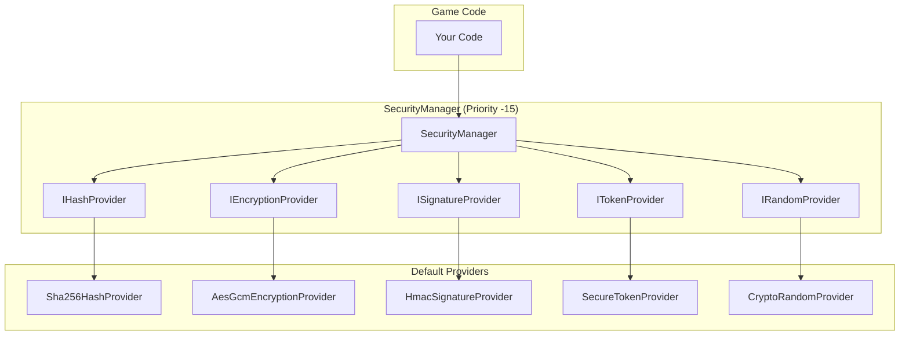

# Security System

Eraflo.Catalyst provides a **provider-based** security module for cryptographic operations.

---

## Table of Contents

1. [Architecture](#1-architecture)
2. [Quick Start](#2-quick-start)
3. [Providers Deep Dive](#3-providers-deep-dive)
4. [Custom Providers](#4-custom-providers)
5. [Integration with Networking](#5-integration-with-networking)
6. [API Reference](#6-api-reference)

---

## 1. Architecture



---

## 2. Quick Start

### Password Hashing

```csharp
var security = App.Get<SecurityManager>();

// Hash password
string hash = security.Hash.HashToHex("myPassword");

// Verify password
bool valid = security.Hash.Verify("myPassword", hash);
```

### Token Generation

```csharp
// Room code: "A3B7X9"
string roomCode = security.GenerateRoomCode(6);

// Session token: 32 alphanumeric characters
string token = security.Token.GenerateAlphanumeric(32);

// PIN: 6 digits
string pin = security.Token.GenerateNumeric(6);
```

### Data Encryption

```csharp
byte[] data = Encoding.UTF8.GetBytes("secret data");

// Encrypt with session key
byte[] encrypted = security.EncryptWithSession(data);

// Decrypt
byte[] decrypted = security.DecryptWithSession(encrypted);
```

---

## 3. Providers Deep Dive

### 3.1 Hash Provider (SHA-256)

| Property | Value |
|----------|-------|
| Algorithm | SHA-256 |
| Output | 256 bits (32 bytes, 64 hex chars) |
| Speed | Fast |
| Reversible | No |

**When to use:**
- Data integrity verification
- Creating unique identifiers
- Quick comparisons

**When NOT to use:**
- Long-term password storage (use Argon2/bcrypt)

---

### 3.2 Encryption Provider (AES-GCM)

| Property | Value |
|----------|-------|
| Algorithm | AES-256-GCM |
| Key Size | 256 bits (32 bytes) |
| Nonce | 96 bits (12 bytes, auto-generated) |
| Auth Tag | 128 bits (16 bytes) |

**Output format:**
```
[12-byte nonce][ciphertext][16-byte authentication tag]
```

**When to use:**
- Encrypting save files
- Secure network payloads
- Protecting sensitive data

---

### 3.3 Signature Provider (HMAC-SHA256)

| Property | Value |
|----------|-------|
| Algorithm | HMAC-SHA256 |
| Output | 256 bits (32 bytes) |
| Verification | Constant-time comparison |

**When to use:**
- API request signing
- Anti-tampering protection
- Message authentication

---

### 3.4 Token Provider

| Format | Characters | Bits/char | Example |
|--------|------------|-----------|---------|
| Base64 | 64 | 6 | `dGhpcyBpcw==` |
| Alphanumeric | 62 | ~6 | `A3b7X9kLm2` |
| Numeric | 10 | ~3.3 | `847291` |

**Recommended lengths:**
- Room codes: 6 alphanumeric (68B combinations)
- Session tokens: 32 alphanumeric (190 bits entropy)
- PINs: 6 numeric (1M combinations)

---

### 3.5 Random Provider (CSPRNG)

| Comparison | System.Random | CryptoRandomProvider |
|------------|---------------|---------------------|
| Speed | Fast | ~10x slower |
| Predictable | Yes (if seed known) | No |
| Thread-safe | No | Yes |
| Use case | Game mechanics | Security |

---

## 4. Custom Providers

### Example: Argon2 Password Hashing

```csharp
public class Argon2HashProvider : IHashProvider
{
    public string Name => "Argon2";
    
    public byte[] Hash(byte[] data)
    {
        // Use Argon2 library for password-grade hashing
        return Argon2.Hash(data, salt, iterations: 3, memory: 65536);
    }
    
    // Implement remaining interface methods...
}

// Usage
security.SetHashProvider(new Argon2HashProvider());
```

---

## 5. Integration with Networking

### Password-Protected Lobbies

```csharp
// Create lobby with password
await lobby.CreateLobby(new LobbyOptions 
{ 
    Name = "Secret Game",
    MaxPlayers = 4,
    Password = "secret123"  // Hashed via SecurityManager
});

// Join with password
await lobby.JoinLobby("192.168.1.1:7777", password: "secret123");
```

### Discovery Signatures (Anti-Spoofing)

```csharp
// Sign discovery messages to prevent server spoofing
var signature = security.Signature.Sign(discoveryData, sharedSecret);
```

---

## 6. API Reference

### SecurityManager

| Property | Type | Description |
|----------|------|-------------|
| `Hash` | `IHashProvider` | Hash operations |
| `Encryption` | `IEncryptionProvider` | Encryption operations |
| `Signature` | `ISignatureProvider` | Signature operations |
| `Token` | `ITokenProvider` | Token generation |
| `Random` | `IRandomProvider` | Secure random |

| Method | Description |
|--------|-------------|
| `EncryptWithSession(data)` | Encrypt with session key |
| `DecryptWithSession(data)` | Decrypt with session key |
| `GenerateRoomCode(length)` | Generate room code |
| `SetHashProvider(p)` | Swap hash provider |
| `SetEncryptionProvider(p)` | Swap encryption provider |

---

## See Also

- [Networking](./Networking.md) - Lobby password integration
- [Service Locator](../Core/ServiceLocator.md) - `App.Get<SecurityManager>()`
