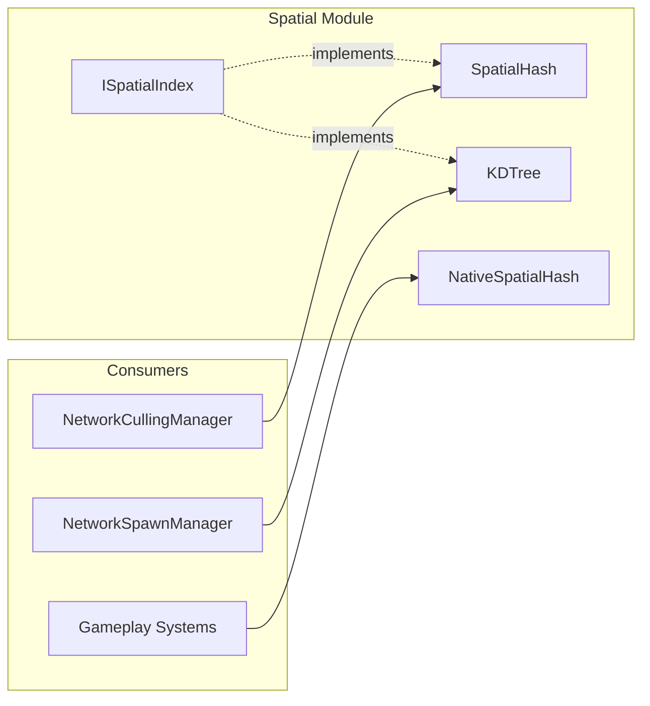
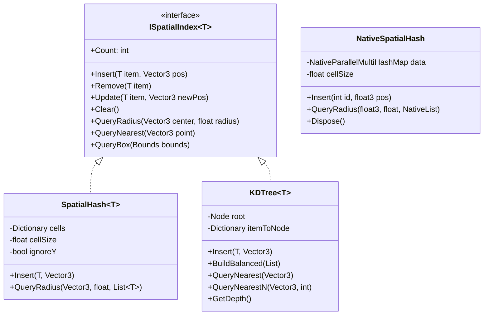
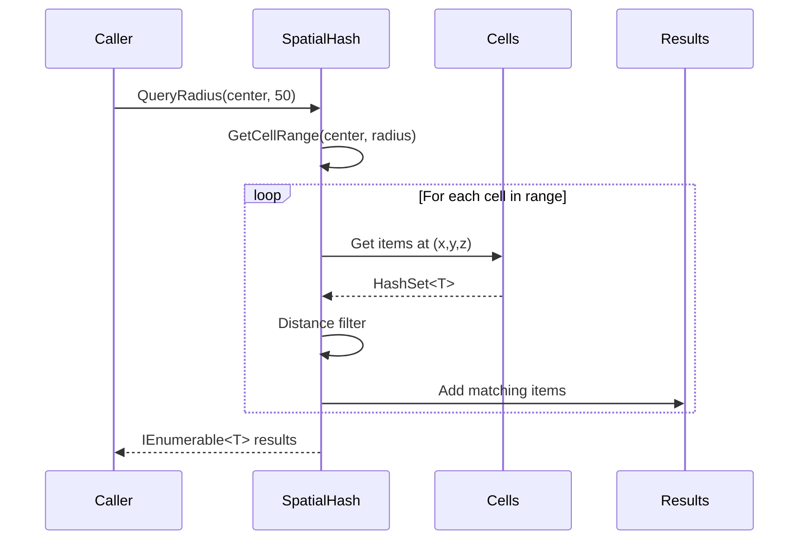
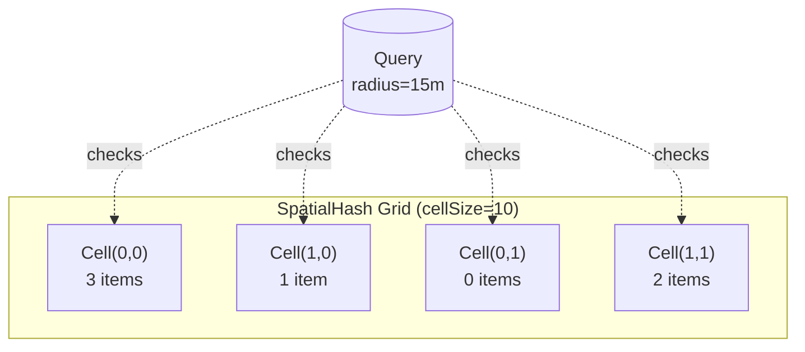
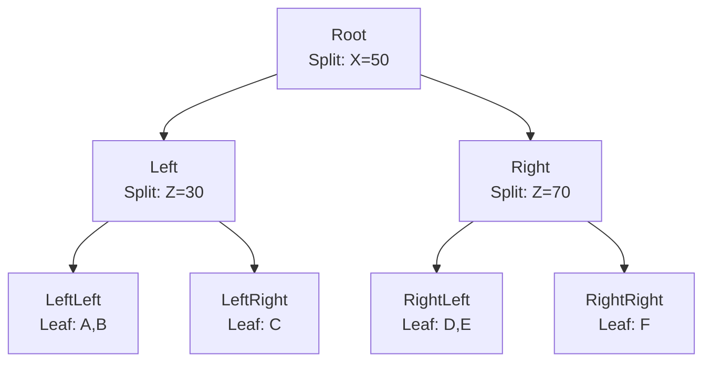
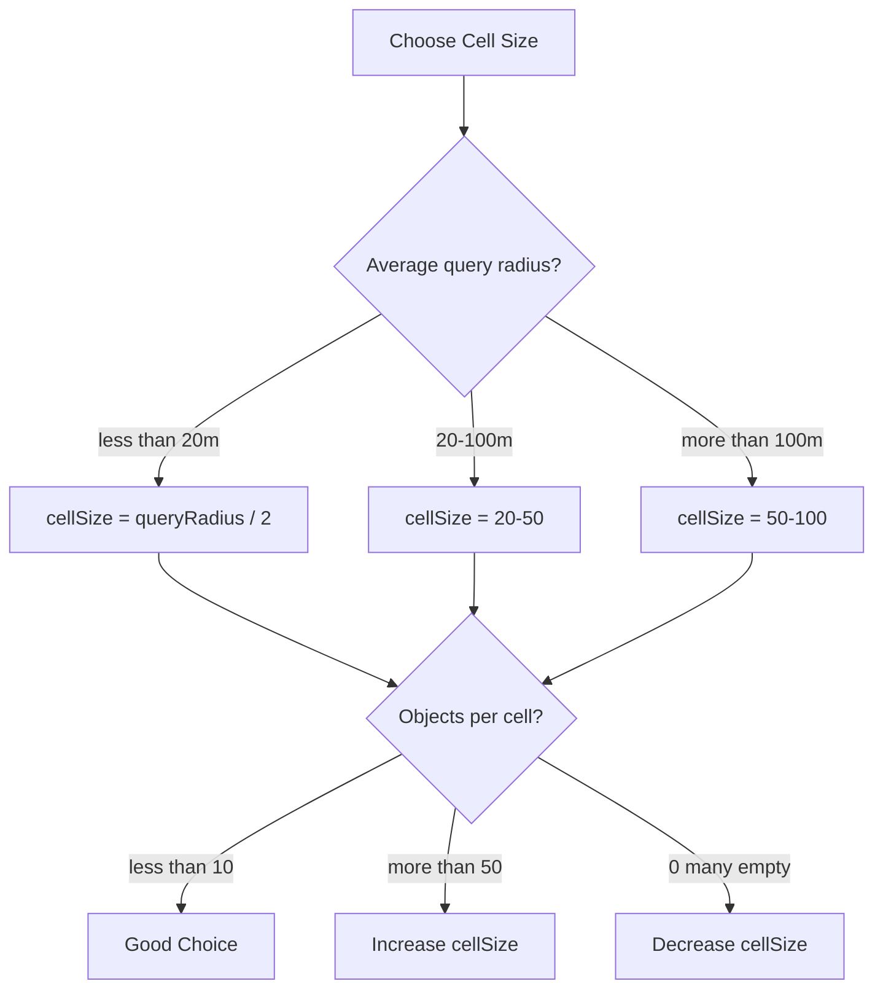

# Spatial Data Structures

High-performance spatial indexing for network culling, spawn selection, and proximity queries.

---

## Table of Contents

1. [Overview](#1-overview)
2. [Architecture](#2-architecture)
3. [Quick Start](#3-quick-start)
4. [SpatialHash](#4-spatialhash)
5. [KDTree](#5-kdtree)
6. [NativeSpatialHash (Burst)](#6-nativespatialhash-burst)
7. [Performance](#7-performance)
8. [API Reference](#8-api-reference)

---

## 1. Overview

The Spatial module provides three spatial indexing structures optimized for different use cases:

| Structure | Complexity | Best For |
|-----------|-----------|----------|
| `SpatialHash<T>` | O(1) insert/query | Dense distributions, culling |
| `KDTree<T>` | O(log n) query | Nearest neighbor, spawn selection |
| `NativeSpatialHash` | O(1) + Burst | Jobs, thousands of objects |



---

## 2. Architecture

### 2.1 Class Diagram



### 2.2 Query Flow



---

## 3. Quick Start

### 3.1 Basic Culling with SpatialHash

```csharp
using Eraflo.Catalyst.Spatial;
using UnityEngine;

public class CullingExample : MonoBehaviour
{
    private SpatialHash<GameObject> _hash;
    
    void Start()
    {
        // Create with 10m cells, ignore Y axis (2D culling)
        _hash = new SpatialHash<GameObject>(cellSize: 10f, ignoreY: true);
        
        // Register all enemies
        foreach (var enemy in FindObjectsOfType<Enemy>())
        {
            _hash.Insert(enemy.gameObject, enemy.transform.position);
        }
    }
    
    void Update()
    {
        // Find enemies within 50m of player
        _results.Clear();
        _hash.QueryRadius(player.position, 50f, _results);
        
        foreach (var enemy in _results)
        {
            // Show to player...
        }
    }
    
    private readonly List<GameObject> _results = new();
}
```

### 3.2 Nearest Spawn Point with KDTree

```csharp
using Eraflo.Catalyst.Spatial;
using System.Collections.Generic;

public class SpawnExample
{
    private KDTree<SpawnPoint> _tree;
    
    public void Initialize(List<SpawnPoint> points)
    {
        _tree = new KDTree<SpawnPoint>();
        
        // Build balanced tree for optimal queries
        var items = points.ConvertAll(p => (p, p.Position));
        _tree.BuildBalanced(items);
    }
    
    public SpawnPoint GetNearestTo(Vector3 position)
    {
        return _tree.QueryNearest(position);
    }
    
    public IEnumerable<SpawnPoint> GetClosest3(Vector3 position)
    {
        return _tree.QueryNearestN(position, 3);
    }
}
```

---

## 4. SpatialHash

Grid-based spatial partitioning with O(1) cell lookup.

### 4.1 Cell Visualization



### 4.2 Configuration

| Parameter | Default | Description |
|-----------|---------|-------------|
| `cellSize` | Required | Grid cell size in world units |
| `ignoreY` | `false` | Use 2D grid (ignore vertical) |

### 4.3 When to Use

✅ Dense object distributions  
✅ Frequent position updates  
✅ Large query radii  
✅ Interest management / culling  

❌ Nearest neighbor queries  
❌ Sparse distributions  

---

## 5. KDTree

K-dimensional tree for efficient nearest neighbor queries.

### 5.1 Tree Structure



### 5.2 Build Balanced

For optimal query performance, use `BuildBalanced()`:

```csharp
var items = new List<(SpawnPoint, Vector3)>();
foreach (var point in spawnPoints)
    items.Add((point, point.Position));

_tree.BuildBalanced(items);

// Tree depth will be ~log2(n)
Debug.Log($"Depth: {_tree.GetDepth()}");
```

### 5.3 When to Use

✅ Nearest neighbor queries
✅ K-nearest queries
✅ Spawn point selection
✅ Static or rarely-updated data

❌ Frequent insertions/deletions
❌ Large radius queries

> [!NOTE]
> The KDTree automatically triggers `BuildBalanced()` when ghost nodes (lazy-deleted entries) exceed 50% of total nodes. This prevents query degradation over time in heavily-updated trees without requiring manual rebuilds.

---

## 6. NativeSpatialHash (Burst)

Burst-compatible spatial hash using `NativeParallelMultiHashMap` for job-based queries.

### 6.1 Job Example

```csharp
using Unity.Burst;
using Unity.Collections;
using Unity.Jobs;
using Unity.Mathematics;

[BurstCompile]
public struct CullingJob : IJobParallelFor
{
    [ReadOnly] public NativeSpatialHash SpatialHash;
    [ReadOnly] public NativeArray<float3> PlayerPositions;
    public NativeArray<int> VisibleCounts;
    
    public void Execute(int index)
    {
        var results = new NativeList<int>(64, Allocator.Temp);
        SpatialHash.QueryRadius(PlayerPositions[index], 50f, results);
        VisibleCounts[index] = results.Length;
        results.Dispose();
    }
}
```

### 6.2 Lifecycle

```csharp
// Create
var hash = new NativeSpatialHash(cellSize: 10f, Allocator.Persistent);

// Populate
hash.Insert(networkId, position);

// Query in job
var job = new CullingJob { SpatialHash = hash, ... };
job.Schedule(playerCount, 32).Complete();

// MUST dispose
hash.Dispose();
```

> [!CAUTION]
> Always call `Dispose()` to prevent memory leaks. Use `Allocator.TempJob` for single-frame usage.

---

## 7. Performance

### 7.1 Complexity Comparison

| Operation | SpatialHash | KDTree |
|-----------|-------------|--------|
| Insert | O(1) | O(log n) |
| Remove | O(1) | O(log n)* |
| Update | O(1) | O(log n) |
| QueryRadius | O(k) | O(√n + k) |
| QueryNearest | O(n) | O(log n) |
| QueryNearestN | O(n log n) | O(n log k) |

*KDTree uses lazy deletion

### 7.2 Memory Optimization

- **SpatialHash**: Uses pooled `HashSet<T>` for cells, lazy cell removal
- **KDTree**: Uses node pooling to reduce allocations
- **NativeSpatialHash**: Zero GC, native memory only

### 7.3 Choosing Cell Size



---

## 8. API Reference

### ISpatialIndex<T>

| Method | Description |
|--------|-------------|
| `Insert(T item, Vector3 pos)` | Add item at position |
| `Remove(T item)` | Remove item |
| `Update(T item, Vector3 newPos)` | Update item position |
| `Clear()` | Remove all items |
| `QueryRadius(Vector3, float)` | Find items in radius (allocating) |
| `QueryRadius(Vector3, float, List<T>)` | Find items (non-allocating) |
| `QueryNearest(Vector3)` | Find closest item |
| `QueryNearestN(Vector3, int)` | Find N closest items |
| `QueryBox(Bounds)` | Find items in bounds |
| `Count` | Number of items |

### SpatialHash<T> Constructor

```csharp
public SpatialHash(float cellSize, bool ignoreY = false)
```

### KDTree<T> Extra Methods

```csharp
public void BuildBalanced(IList<(T, Vector3)> items);
public int GetDepth();
public bool TryGetPosition(T item, out Vector3 position);
```

### NativeSpatialHash

```csharp
public NativeSpatialHash(float cellSize, Allocator allocator);
public void Insert(int id, float3 position);
public void Remove(int id);
public void QueryRadius(float3 center, float radius, NativeList<int> results);
public void Dispose();
```

---

## See Also

- [Networking](Networking.md#5-interest-management): NetworkCullingManager uses SpatialHash
- [Smart Spawn](Networking.md#2-smart-spawn): NetworkSpawnManager uses KDTree
