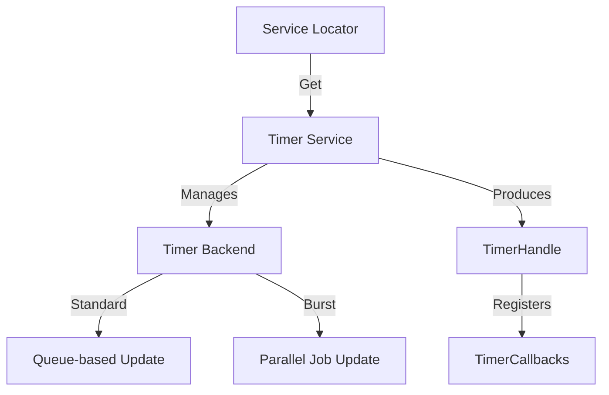

# Timer System

A high-performance, handle-based timer system with automatic backend selection. Supports unified C# callbacks, Burst-accelerated updates, fluid chaining, and network synchronization.

---

## Table of Contents

1. [Features](#1-features)
2. [Quick Start](#2-quick-start)
3. [Architecture](#3-architecture)
4. [Timer Types](#4-timer-types)
5. [Callbacks & Registry](#5-callbacks--registry)
6. [Chaining & Groups](#6-chaining--groups)
7. [Easing & Chronos](#7-easing--chronos)
8. [Persistence & Networking](#8-persistence--networking)
9. [API Reference](#9-api-reference)

---

## 1. Features

- **Handle-Based**: Opaque `TimerHandle` prevents stale references and allows pooling.
- **Burst Support**: Optional high-performance backend using Unity Job System.
- **Fluent Chining**: Orchestrate complex sequences with a readable DSL.
- **Extensible Callbacks**: Hook into any lifecycle event (Tick, Pause, Complete).
- **Time Scaling**: Integrated with `ChronosManager` for per-channel time scaling.
- **Persistence**: Save and restore active timers (including method-based callbacks).
- **Network Sync**: Synchronize timer progress across server and clients.

---

## 2. Quick Start

### 2.1 Basic Delay

```csharp
using UnityEngine;
using Eraflo.Catalyst;
using Eraflo.Catalyst.Timers;

public class SimpleTimer : MonoBehaviour
{
    void Start()
    {
        // One-shot delay
        App.Get<Timer>().CreateDelay(2.5f, () => 
        {
            Debug.Log("2.5 seconds elapsed!");
        });
    }
}
```

### 2.2 Manual Control

```csharp
var timer = App.Get<Timer>();
var handle = timer.CreateTimer<CountdownTimer>(10f);

timer.Pause(handle);
timer.Resume(handle);
timer.CancelTimer(handle);

float progress = timer.GetProgress(handle); // 0.0 to 1.0
```

---

## 3. Architecture



---

## 4. Timer Types

| Class | Usage | Behavior |
|-------|-------|----------|
| `CountdownTimer` | `CreateTimer<CountdownTimer>(t)` | Counts from T to 0. |
| `StopwatchTimer` | `CreateTimer<StopwatchTimer>()` | Counts up indefinitely. |
| `RepeatingTimer` | `CreateTimer<RepeatingTimer>(t)` | Loops every T seconds. |
| `FrequencyTimer` | `CreateTimer<FrequencyTimer>(f)` | Ticks F times per second. |
| `DelayTimer`     | `CreateDelay(t, action)` | Special one-shot countdown. |

---

## 5. Callbacks & Registry

The system uses a centralized `TimerCallbacks` registry. You can use standard events or custom marker structs.

### 5.1 Standard Callbacks

```csharp
var handle = timer.CreateTimer<CountdownTimer>(5f);

// On Complete
timer.On<OnComplete>(handle, () => Debug.Log("Finished"));

// On Every Frame
timer.On<OnTick, float>(handle, (deltaTime) => 
{
    Debug.Log($"Ticking with dt: {deltaTime}");
});

// Other: OnPause, OnResume, OnReset, OnCancel, OnRepeat
```

### 5.2 Custom Callbacks

```csharp
public struct OnCustomEvent : ITimerCallback { }

// In some system
timer.On<OnCustomEvent>(handle, MyMethod);
```

---

## 6. Chaining & Groups

### 6.1 Timer Chains (Fluent API)

```csharp
App.Get<Timer>().Chain()
    .Delay(1f)
    .Then(() => Debug.Log("Step 1"))
    .ThenDelay(2f, () => Debug.Log("Step 2 after delay"))
    .Loop(5, 0.5f, (index) => Debug.Log($"Iteration {index}"))
    .Start();
```

### 6.2 Timer Groups (Batch Control)

```csharp
var group = timer.CreateGroup("UI_Animations");

group.Add(timer.CreateDelay(1f, () => { }));
group.Create<CountdownTimer>(5f);

group.PauseAll();
group.SetTimeScaleAll(0.5f);
group.CancelAll();
```

---

## 7. Easing & Chronos

### 7.1 Easing Integration

Calculate values based on timer progress using the Easing module.

```csharp
float progress = timer.GetProgress(handle);
float easedValue = timer.Lerp(handle, 0f, 100f, EasingType.BounceOut);
Vector3 position = timer.Lerp(handle, startPos, endPos, EasingType.QuadInOut);
```

### 7.2 Chronos Scaling

Bind timers to specific time channels for localized slowdowns or speedups.

```csharp
// Created on "Enemies" channel
var config = TimerConfig.Create(10f, channel: "Enemies");
var handle = timer.CreateTimer<CountdownTimer>(config);

// Scaled automatically by App.Get<ChronosManager>().GetChannelScale("Enemies")
```

---

## 8. Persistence & Networking

### 8.1 Persistence

Save and restore active timers including their current progress and configurations.

```csharp
// Save
string data = TimerPersistence.SaveAll();

// Load
TimerPersistence.LoadAll(data);
```

> [!IMPORTANT]
> To persist callbacks, use **Method Names** (references) instead of anonymous lambdas, as lambdas cannot be serialized.

### 8.2 Networking

Sync timers using `TimerNetworkHandler`.

```csharp
using Eraflo.Catalyst.Timers;

// Server: Make timer network-aware
var handle = timer.CreateTimer<CountdownTimer>(30f);
handle.MakeNetworked(AuthorityMode.ServerAuthoritative);

// Broadcasting sync (usually done in a manager/update)
TimerNetworkExtensions.BroadcastTimerSync();
```

---

## 9. API Reference

### Timer (Service)

| Method | Description |
|--------|-------------|
| `CreateTimer<T>(duration)` | Core creation method |
| `CreateDelay(time, action)` | Quick one-shot delay |
| `CreateFromPreset(name)` | Create using a named `TimerPreset` |
| `Pause / Resume / Cancel` | Manual control methods |
| `GetProgress(handle)` | Returns normalized 0..1 value |
| `SetTimeScale(handle, s)` | Per-timer speed multiplier |
| `SetChannel(handle, name)` | Bind to a Chronos channel |

### TimerHandle (Struct)

| Property | Description |
|----------|-------------|
| `IsValid` | Check if handle refers to an existing timer |
| `None` | Represents a null/invalid handle |

### TimerChain (Fluent)

| Method | Description |
|--------|-------------|
| `Delay(t)` | Wait for T seconds |
| `Then(action)` | Execute code immediately |
| `Loop(n, t, action)` | Repeat N times with T interval |
| `Start()` | Run the chain |

---

## See Also

- [Chronos Manager](../Core/ChronosManager.md): Detailed time scaling documentation
- [Easing Module](Easing.md): List of available easing types
- [Networking](Networking.md): Low-level sync messages
