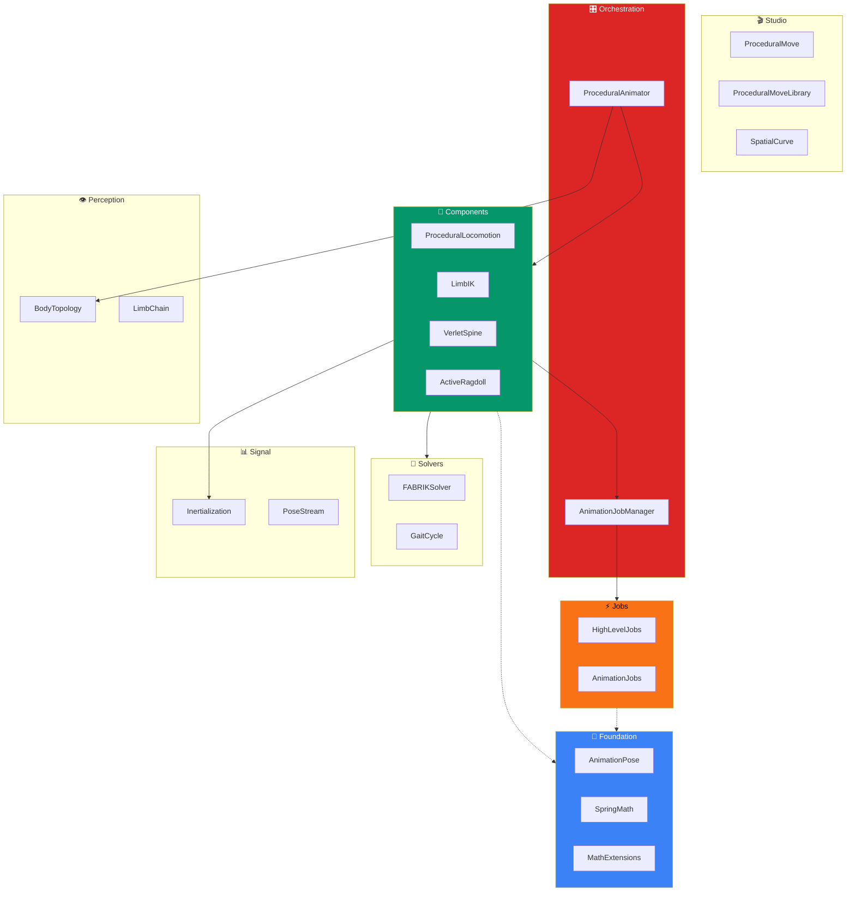
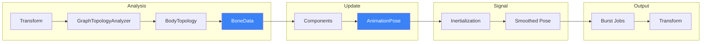
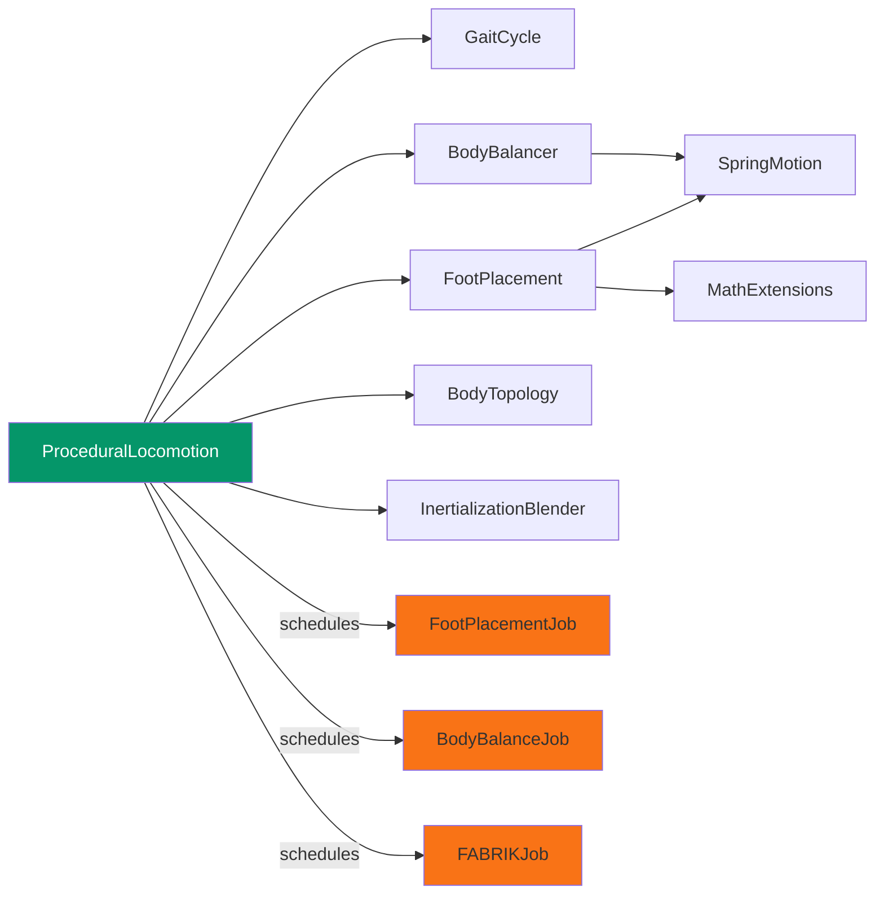
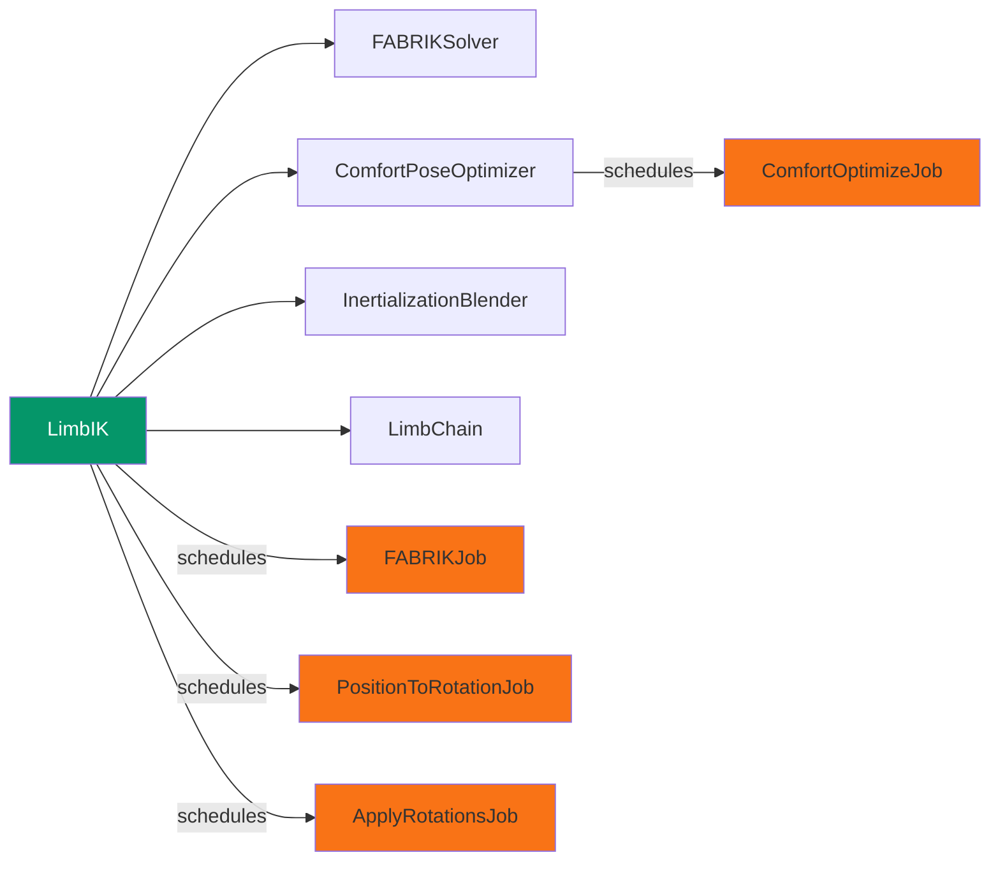
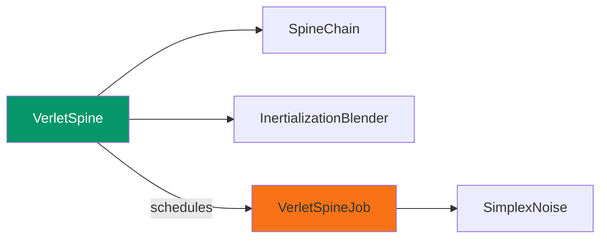
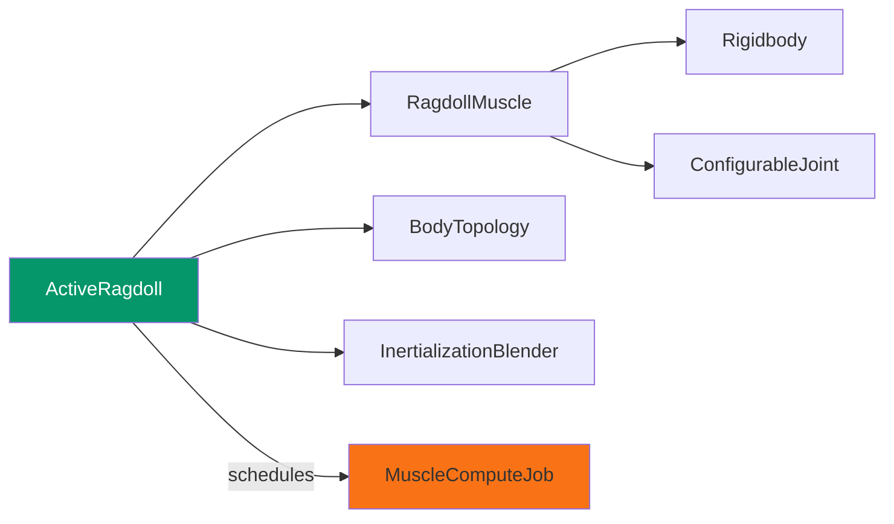
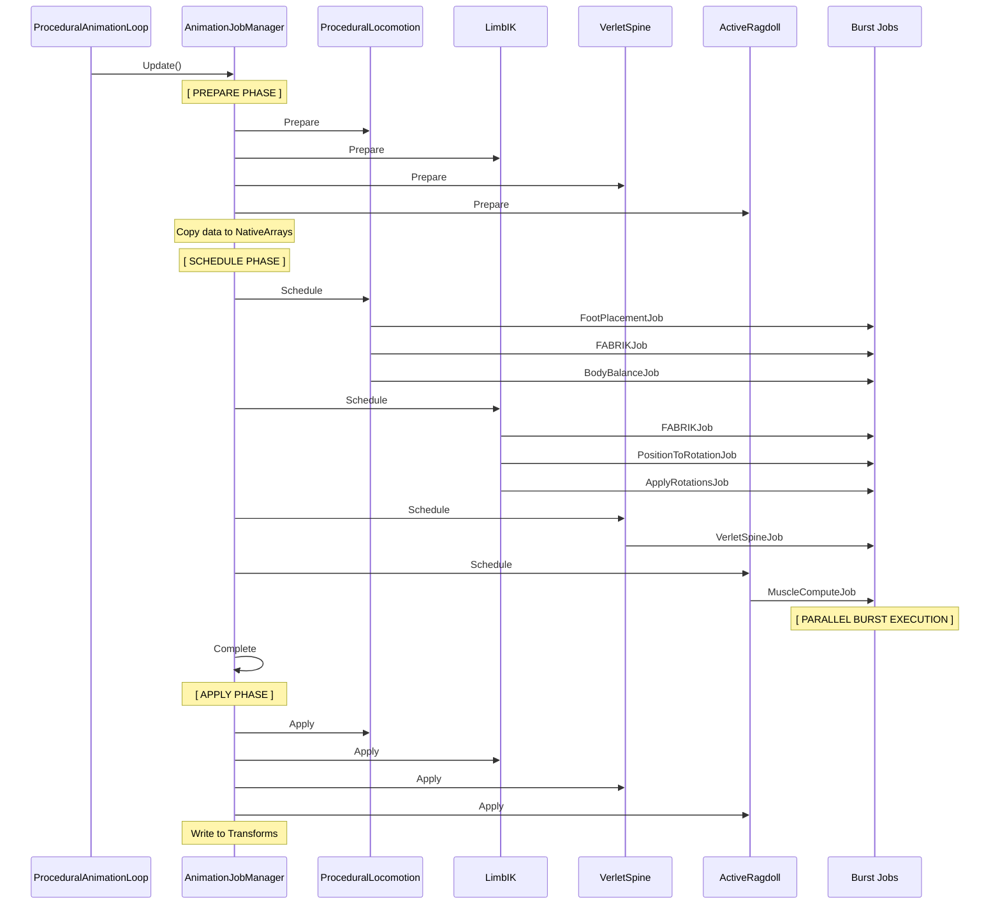
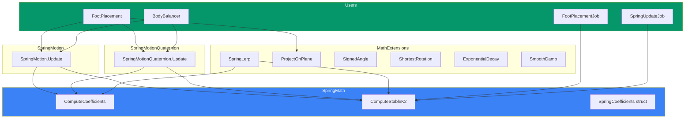

# 🎭 Procedural Animation System

> **Animate any creature automatically** — No keyframes, no animator needed.

---

## What is this?

This module lets you create **realistic animations at runtime** without manually animating anything. Drop it on any rigged character and watch it walk, balance, react to physics, and move naturally.

### Before vs After

| Without This Module | With This Module |
|---------------------|------------------|
| Manually animate walk cycles | Legs move automatically based on velocity |
| Create blend trees for terrain | Feet adapt to slopes and stairs in real-time |
| Rig IK targets by hand | Auto-detects limbs and sets up IK |
| Static ragdolls | Active ragdolls that try to stay upright |
| Tail/cape needs physics bones | Verlet simulation with one component |

---

## Who is this for?

- **Game Developers** who want believable locomotion without an animator
- **Procedural Generation** projects with endless creature variations
- **Prototypers** who need quick, functional movement
- **Anyone** tired of creating walk cycles for every new character

---

## Quick Start (5 minutes)

### Step 1: Zero-Setup — Add Everything Automatically

```csharp
// Add the main orchestrator
var animator = character.AddComponent<ProceduralAnimator>();

// Auto-setup: analyzes skeleton, adds locomotion, IK, spines
animator.SetupAll();
```

Your character now:
- ✅ Walks when you move it
- ✅ Lifts feet over obstacles
- ✅ Arms have IK ready
- ✅ Tails/tentacles wiggle naturally

### Step 2: Control Movement

```csharp
var locomotion = character.GetComponent<ProceduralLocomotion>();
locomotion.MovementInput = new Vector3(1, 0, 0);  // Move right
locomotion.Speed = 3f;  // Meters per second
```

### Step 3: Make Hands Reach for Things

```csharp
var ik = character.GetComponent<LimbIK>();
ik.SetTarget(doorHandle, transitionTime: 0.2f);  // Smooth transition
ik.Weight = 1f;  // 0 = ignore, 1 = fully reach
```

---

## Common Use Cases

### 🚶 "I want my character to walk realistically"

```csharp
var animator = character.AddComponent<ProceduralAnimator>();
animator.SetupLocomotion();  // Just locomotion

var locomotion = character.GetComponent<ProceduralLocomotion>();
locomotion.Speed = 2f;
locomotion.MovementInput = moveDirection;
```

The system uses `GaitCycle` to handle:
- Gait patterns (walk, trot, gallop)
- Ground detection
- Body balance
- Foot placement on uneven terrain

### 🦎 "I want a tail/tentacle that moves naturally"

```csharp
var spine = tailRoot.AddComponent<VerletSpine>();
spine.SetupFromChain(spineChain);  // Or use ProceduralAnimator.SetupSecondarySpines()

spine.Gravity = -2f;
spine.Damping = 0.1f;
spine.EnableNoise = true;
spine.NoiseAmplitude = 0.05f;
```

### 🎯 "I want limbs to reach targets (IK)"

```csharp
var ik = character.GetComponent<LimbIK>();
ik.SetTarget(doorHandle, transitionTime: 0.15f);  // Smooth with Inertialization
ik.Weight = 1f;
```

### 💥 "I want physics-based hit reactions"

```csharp
var animator = character.GetComponent<ProceduralAnimator>();
var ragdoll = animator.SetupRagdoll();

// When hit:
ragdoll.ApplyImpact(hitPoint, force, radius: 0.5f);
```

### ✨ "I want to create custom gestures/attacks"

```csharp
// Build a punch animation in code
var punch = new ProceduralMove()
    .Prepare(0.1f, recoil: -0.2f)  // Wind up
    .Strike(targetPos)             // Punch forward
    .Recover(0.7f);                // Return to rest

// Play it
transform.position = punch.Evaluate(time).Position;
```

---

## Component Overview

| Component | What it does | Menu Path |
|-----------|--------------|-----------|
| `ProceduralAnimator` | Entry point — orchestrates everything | `Catalyst > Procedural Animation > Procedural Animator` |
| `ProceduralLocomotion` | Auto walk/run based on velocity | `Catalyst > Procedural Animation > Procedural Locomotion` |
| `LimbIK` | Limb reaches target with IK | `Catalyst > Procedural Animation > Limb IK` |
| `VerletSpine` | Physics tail/rope/cape | `Catalyst > Procedural Animation > Verlet Spine` |
| `ActiveRagdoll` | Physics character that stays upright | `Catalyst > Procedural Animation > Active Ragdoll` |

---

## Editor Setup (No Code Required)

### Step 1: Add ProceduralAnimator

1. Select your character in the Hierarchy
2. Click **Add Component** > **Catalyst** > **Procedural Animation** > **Procedural Animator**
3. Click **Analyze Skeleton** in the Inspector
4. Click **Setup All** to auto-add locomotion, IK, and spines

### Step 2: Configure Locomotion

In the **Procedural Locomotion** component:
- **Speed**: Movement speed (m/s)
- **Gait Duration**: Time for one step cycle
- **Step Height**: How high feet lift during swing
- **Lean Angle**: Body tilt when moving

### Step 3: Configure IK (optional)

In each **Limb IK** component:
- **Target**: Drag a Transform to reach (hand target, etc.)
- **Pole**: Elbow/knee hint direction
- **Weight**: 0 = ignore, 1 = fully reach

### Step 4: Configure Tail/Cape (optional)

In each **Verlet Spine** component:
- **Damping**: How quickly motion settles
- **Gravity**: Downward pull strength
- **Enable Noise**: Adds organic wiggle

---

## Editor Tools

### 🎨 Curve Designer
`Window > Catalyst > Curve Designer`

Draw 3D trajectories for custom motion paths.

### 🎬 Animation Recorder
`Window > Catalyst > Animation Recorder`

Bake procedural animations to `.anim` clips.

---

## Architecture (for advanced users)

### Complete System Overview



**Key Internal Connections:**
- **Inertialization**: Used by all components for smooth state transitions.
- **AnimationPose**: The universal data container used throughout the pipeline.
- **SpringMath**: Drives all procedural movement (SpringMotion, Jobs).
- **BoneData/BodyTopology**: The structural backbone analyzed by `ProceduralAnimator`.

> [!NOTE]
> **PoseStream** and **ProceduralMoveLibrary** are currently **Utility Scripts**. 
> - `ProceduralMoveLibrary` provides presets for players to use in code.
> - `PoseStream` provides buffering/sampling logic for custom systems (e.g., recording) but is not required by the core Locomotion/IK components.

---

### Skeleton & Data Flow



---

### File Structure (Advanced)

| Layer | Status | Key Scripts |
|-------|--------|-------------|
| **Studio** | 🛠️ Tools | `ProceduralMove`, `ProceduralMoveLibrary` (Utility), `SpatialCurve` |
| **Orchestration** | ✅ Core | `ProceduralAnimator`, `AnimationJobManager` |
| **Components** | ✅ Core | `ProceduralLocomotion`, `LimbIK`, `VerletSpine`, `ActiveRagdoll` |
| **Solvers** | ✅ Core | `FABRIKSolver`, `GaitCycle` |
| **Signal** | ✅ Core | `Inertialization`, `PoseStream` (Utility) |
| **Perception** | ✅ Core | `BodyTopology`, `GraphTopologyAnalyzer` |
| **Foundation** | ✅ Core | `AnimationPose`, `BoneData`, `SpringMath`, `MathExtensions` |
| **Jobs** | ⚡ Burst | `HighLevelJobs`, `AnimationJobs` |

---

### Folder Overview

```
Runtime/ProceduralAnimation/
├── 🧱 Foundation/           # Core math & data types
│   ├── AnimationPose.cs     # Position + rotation + velocity
│   ├── BoneData.cs          # Per-bone info: mass, length, limits
│   ├── MathExtensions.cs    # SpringLerp, ProjectOnPlane, SignedAngle
│   ├── SpringMath.cs        # Centralized spring coefficient math
│   ├── SpringMotion.cs      # Second-order dynamics for float3
│   └── SpringMotionQuaternion.cs  # Second-order dynamics for rotations
│
├── 👁️ Perception/           # Skeleton analysis
│   ├── BodyTopology.cs      # Full skeleton representation
│   ├── GraphTopologyAnalyzer.cs  # Auto-detect limbs from hierarchy
│   ├── LimbChain.cs         # Arm/leg bone chain
│   ├── MorphologyRegistry.cs  # Biped, quadruped, spider definitions
│   └── VolumetricMassEstimator.cs  # Calculate mass from mesh bounds
│
├── 📊 Signal/               # Smooth transitions
│   ├── Inertialization.cs   # InertializationBlender, SkeletonInertializer
│   ├── PoseStream.cs        # Stream of animation poses (Utility)
│   └── SignalProcessingJobs.cs  # Burst jobs for signal processing
│
├── 🔧 Solvers/              # Core algorithms
│   ├── FABRIKSolver.cs      # Forward-And-Backward Reaching IK
│   ├── GaitCycle.cs         # Walk/trot/gallop timing
│   └── IKConstraints.cs     # Joint limits, angle constraints
│
├── 🧩 Components/           # User-facing MonoBehaviours
│   ├── IK/
│   │   ├── LimbIK.cs        # Full IK component with FABRIK
│   │   └── ComfortPoseOptimizer.cs  # Natural pose blending
│   ├── Locomotion/
│   │   ├── ProceduralLocomotion.cs  # Multi-leg locomotion
│   │   ├── FootPlacement.cs  # Ground detection & placement
│   │   ├── BodyBalancer.cs   # Center of mass adjustment
│   │   └── VerletSpine.cs    # Tail/cape physics
│   ├── Physics/
│   │   ├── ActiveRagdoll.cs  # Physics-driven character
│   │   └── RagdollMuscle.cs  # PD controller for joints
│   └── Demo/
│       ├── SpringFollower.cs  # Simple spring-follow example
│       └── NoiseMotion.cs     # Noise-based idle animation
│
├── 🎛️ Orchestration/        # High-level control
│   ├── ProceduralAnimator.cs  # Main entry point
│   ├── AnimationJobManager.cs  # Schedules all jobs
│   ├── ProceduralAnimationLoop.cs  # PlayerLoop integration
│   └── ProceduralAnimationSettings.cs  # Global settings
│
├── ⚡ Jobs/                  # Burst-compiled jobs
│   ├── AnimationJobs.cs     # IProceduralAnimationJob, SpringUpdateJob
│   ├── HighLevelJobs.cs     # FABRIKJob, FootPlacementJob, BodyBalanceJob
│   ├── ManagedJobs.cs       # ManagedSpringJob, ManagedNoiseJob
│   └── ExtensionJobs.cs     # Additional utility jobs
│
└── 🎬 Studio/               # Content creation
    ├── ProceduralMove.cs    # Fluent animation builder
    ├── SpatialCurve.cs      # 3D trajectory curves
    └── ProceduralMoveLibrary.cs  # Preset animations (Utility)
```

---

### Component Dependencies

#### ProceduralLocomotion


#### LimbIK


#### VerletSpine


#### ActiveRagdoll


---

### Job Execution Pipeline



---

### Foundation Layer (Math)



---

### All Jobs Reference

| Job | File | Used by | Purpose |
|-----|------|---------|---------|
| `FABRIKJob` | HighLevelJobs.cs | LimbIK, ProceduralLocomotion | IK solving |
| `PositionToRotationJob` | HighLevelJobs.cs | LimbIK, ProceduralLocomotion | Convert positions → rotations |
| `ApplyRotationsJob` | HighLevelJobs.cs | LimbIK | Write rotations to transforms |
| `FootPlacementJob` | HighLevelJobs.cs | ProceduralLocomotion | Animate feet with springs |
| `BodyBalanceJob` | HighLevelJobs.cs | ProceduralLocomotion | Body position/rotation |
| `MuscleComputeJob` | HighLevelJobs.cs | ActiveRagdoll | Ragdoll muscle forces |
| `VerletSpineJob` | HighLevelJobs.cs | VerletSpine | Tail/chain physics |
| `ComfortOptimizeJob` | HighLevelJobs.cs | ComfortPoseOptimizer | Natural pose blending |
| `SpringUpdateJob` | AnimationJobs.cs | (batch utility) | Parallel spring updates |
| `SpringTransformJob` | AnimationJobs.cs | (batch utility) | Spring updates on transforms |
| `ManagedSpringJob` | ManagedJobs.cs | (future) | High-level spring wrapper |
| `ManagedNoiseJob` | ManagedJobs.cs | (future) | High-level noise wrapper |

---

### Key Connections Summary

| From | To | Relationship |
|------|----|--------------|
| `ProceduralAnimator` | `BodyTopology` | Analyzes skeleton |
| `ProceduralAnimator` | `ProceduralLocomotion` | Creates & configures |
| `ProceduralAnimator` | `LimbIK` | Creates & configures |
| `ProceduralAnimator` | `VerletSpine` | Creates & configures |
| `ProceduralAnimator` | `ActiveRagdoll` | Creates & configures |
| `GaitCycle` | `ProceduralLocomotion` | Provides timing |
| `InertializationBlender` | `LimbIK`, `VerletSpine`, `ActiveRagdoll`, `ProceduralLocomotion` | Smooth transitions |
| `SpringMotion` | `FootPlacement`, `BodyBalancer`, `SpringFollower` | Smooth movement |
| `All Components` | `AnimationJobManager` | Register for job execution |


---

## Dependencies

| Package | Version |
|---------|---------|
| `com.unity.burst` | 1.8.12+ |
| `com.unity.collections` | 2.4.0+ |
| `com.unity.mathematics` | 1.3.2+ |

---

## Troubleshooting

### "My character slides instead of walking"
- Make sure you have a Rigidbody or CharacterController
- Check that `locomotion.AutoSetup()` found legs (check Console)

### "Feet go through the ground"
- Ensure ground has a Collider
- Set `locomotion.GroundLayer` to match your ground's layer

### "IK looks weird/hyperextended"
- Enable comfort pose: `ik.UseComfortPose = true`
- Adjust `ik.ComfortWeight` (0.3 is a good start)

### "Ragdoll is too floppy"
- Increase `ragdoll.TargetStrength` (try 0.9)
- Increase `ragdoll.AngularDrive` for stiffer joints

---

## API Quick Reference

### ProceduralAnimator (Entry Point)
```csharp
animator.SetupAll()          // Auto-setup everything
animator.SetupLocomotion()   // Just locomotion
animator.SetupRagdoll()      // Just ragdoll
animator.Topology            // Access detected skeleton
```

### ProceduralLocomotion
```csharp
.MovementInput = direction   // Set move direction
.Speed = 2f                  // Movement speed (m/s)
.StepHeight = 0.15f          // Foot lift height
.GaitDuration = 0.8f         // Step cycle duration
```

### VerletSpine
```csharp
.SetLeader(transform, 0.1f)  // Smooth leader change
.Gravity = -2f               // Downward pull
.Damping = 0.1f              // Motion damping
.EnableNoise = true          // Organic wiggle
.ApplyImpulse(force, index)  // Hit reaction
```

### LimbIK
```csharp
.SetTarget(transform, 0.2f)  // Smooth target change
.Target = transform          // Instant target change
.Pole = elbowHint            // Elbow/knee direction
.Weight = 1f                 // Blend amount
```

### ActiveRagdoll
```csharp
.GoLimp(0.2f)                // Smooth collapse
.Recover(0.3f)               // Smooth stand up
.MuscleStrength = 0.8f       // Global muscle power
.ApplyImpact(force, point)   // React to hit
```

### ProceduralMove (Animation Builder)
```csharp
new ProceduralMove()
    .Prepare(duration, recoil)   // Wind-up
    .Strike(target)              // Move to target
    .Arc(target, height)         // Curved motion
    .Recover(damping)            // Return to start
    .Evaluate(time)              // Get pose at time
```

---

# Extending the System

> Examples of common customizations without modifying the source code.

---

## Custom Gait Patterns

Control how legs move during locomotion:

```csharp
var locomotion = GetComponent<ProceduralLocomotion>();

// Bipedal walk (default) - legs alternate
locomotion.GaitDuration = 0.8f;
locomotion.StanceRatio = 0.6f;

// Fast trot - shorter cycles
locomotion.GaitDuration = 0.4f;
locomotion.StanceRatio = 0.5f;

// Slow creep - longer stance
locomotion.GaitDuration = 1.5f;
locomotion.StanceRatio = 0.75f;
```

---

## Custom IK Behavior

### Smooth Target Changes

```csharp
var ik = GetComponent<LimbIK>();

// Instant change (no smoothing)
ik.Target = newTarget;

// Smooth transition (uses Inertialization)
ik.SetTarget(newTarget, transitionTime: 0.2f);
```

### Dynamic Weight Control

```csharp
// Reach for object only when close
float dist = Vector3.Distance(hand.position, target.position);
ik.Weight = Mathf.Clamp01(1f - (dist / maxReachDistance));
```

---

## Runtime Locomotion Control

```csharp
var locomotion = GetComponent<ProceduralLocomotion>();

void Update()
{
    // Control via input
    Vector3 input = new Vector3(Input.GetAxis("Horizontal"), 0, Input.GetAxis("Vertical"));
    locomotion.MovementInput = input;
    
    // Dynamic speed based on terrain
    if (OnSlope())
        locomotion.Speed = 1f;  // Slow on slopes
    else
        locomotion.Speed = 3f;  // Normal speed
}
```

---

## Spine/Tail Reactions

```csharp
var spine = GetComponent<VerletSpine>();

// Wind effect
void ApplyWind(Vector3 windForce)
{
    for (int i = 0; i < spine.BoneCount; i++)
    {
        float factor = (float)i / spine.BoneCount;  // Tip moves more
        spine.ApplyImpulse(windForce * factor, i);
    }
}

// Hit reaction
void OnHit(Vector3 hitPoint, Vector3 force)
{
    int closestBone = FindClosestBone(hitPoint);
    spine.ApplyImpulse(force, closestBone);
}
```

---

## Ragdoll Control

### Gradual Transitions

```csharp
var ragdoll = GetComponent<ActiveRagdoll>();

// Smooth collapse (e.g., death animation)
ragdoll.GoLimp(transitionTime: 0.5f);

// Smooth recovery (e.g., getting up)
ragdoll.Recover(transitionTime: 1.0f);

// Quick stumble (e.g., hit reaction)
ragdoll.MuscleStrength = 0.3f;  // Temporarily weak
StartCoroutine(RecoverAfterDelay(0.5f));
```

### Localized Hits

```csharp
void OnBulletHit(Vector3 hitPoint, Vector3 bulletDirection)
{
    // Apply force at hit point
    ragdoll.ApplyImpact(bulletDirection * 100f, hitPoint);
}
```

---

## Combining Systems

### IK + Locomotion

```csharp
var locomotion = GetComponent<ProceduralLocomotion>();
var armIK = GetComponent<LimbIK>();

void Update()
{  
    // Arms reach for targets while walking
    if (carryingObject)
    {
        armIK.SetTarget(objectHoldPoint, 0.1f);
        armIK.Weight = 1f;
    }
    else
    {
        armIK.Weight = 0f;  // Arms free-swing with locomotion
    }
}
```

### Ragdoll + Locomotion

```csharp
// Switch from walking to ragdoll on big hit
void OnMassiveHit(Vector3 force)
{
    locomotion.enabled = false;
    ragdoll.enabled = true;
    ragdoll.GoLimp(0.1f);
    ragdoll.ApplyExplosion(hitPoint, force.magnitude, 2f);
}

// Recover and stand up
IEnumerator StandUp()
{
    yield return new WaitForSeconds(2f);
    ragdoll.Recover(0.5f);
    yield return new WaitForSeconds(0.5f);
    ragdoll.enabled = false;
    locomotion.enabled = true;
}
```

---

## Performance Tips

### LOD for Animation Quality

```csharp
void UpdateLOD()
{
    float dist = Vector3.Distance(Camera.main.transform.position, transform.position);
    
    if (dist > 30f)
    {
        ik.Iterations = 3;      // Fewer IK iterations
        locomotion.enabled = false;  // Disable procedural
    }
    else
    {
        ik.Iterations = 10;
        locomotion.enabled = true;
    }
}
```

### Disable When Invisible

```csharp
void OnBecameInvisible()
{
    locomotion.enabled = false;
    ik.enabled = false;
}

void OnBecameVisible()
{
    locomotion.enabled = true;
    ik.enabled = true;
}
```

---

## Full Class Reference

### Core

| Class | Namespace | Description |
|-------|-----------|-------------|
| `ProceduralAnimationLoop` | `Jobs` | PlayerLoop integration |
| `AnimationJobManager` | `Jobs` | Job orchestration singleton |
| `SpringMotion` | `Math` | Float3 spring dynamics |
| `SpringMotionQuaternion` | `Math` | Quaternion spring dynamics |
| `SpringMath` | `Math` | Centralized calculations |
| `SpringCoefficients` | `Math` | Blittable coefficient struct |

### Perception

| Class | Description |
|-------|-------------|
| `BodyTopology` | Skeleton analysis |
| `LimbChain` | Limb bone chain |
| `SpineChain` | Spine bone chain |
| `BoneData` | Per-bone information |
| `VolumetricMassEstimator` | Mass from mesh bounds |

### Locomotion

| Class | Description |
|-------|-------------|
| `ProceduralLocomotion` | Multi-legged locomotion |
| `FootPlacement` | Single foot controller |
| `BodyBalancer` | Body position/rotation |
| `GaitCycle` | Leg timing patterns |
| `VerletSpine` | Physics-based chains |

### IK

| Class | Description |
|-------|-------------|
| `LimbIK` | FABRIK solver |
| `ComfortPoseOptimizer` | Natural pose constraints |

### Physics

| Class | Description |
|-------|-------------|
| `ActiveRagdoll` | Muscle-controlled ragdoll |
| `RagdollMuscle` | Per-joint PD controller |

### Studio

| Class | Description |
|-------|-------------|
| `ProceduralMove` | Fluent animation builder |
| `SpatialCurve` | 3D trajectory curves |
| `ProceduralMoveLibrary` | Preset animations |
| `AnimationPose` | Position + rotation + velocity |
| `Curves` | Animation curve presets |

### Editor

| Class | Description |
|-------|-------------|
| `CurveDesignerWindow` | Visual curve editor |
| `AnimationRecorder` | Bake to .anim clips |
| `SpatialCurveAsset` | Curve ScriptableObject |

---

## License

MIT License. See [LICENSE](../LICENSE) for details.

---
